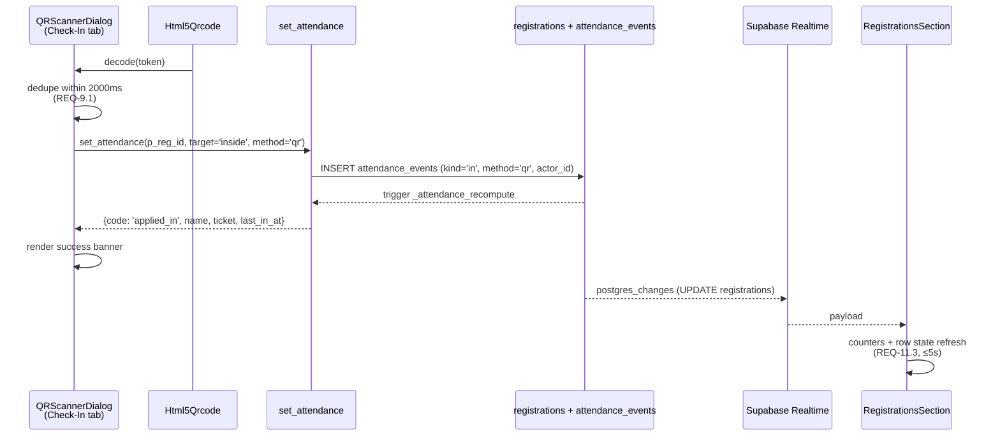
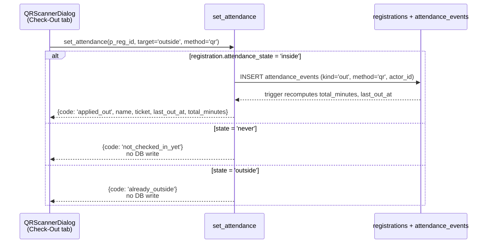
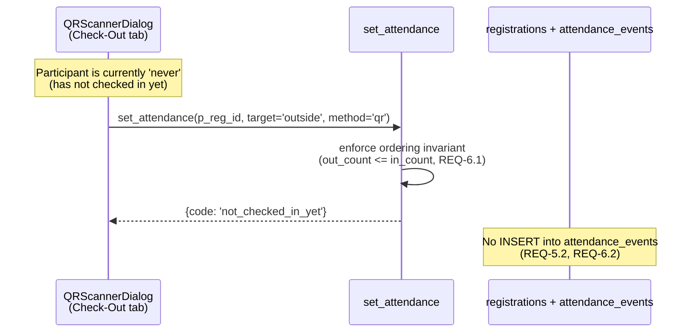
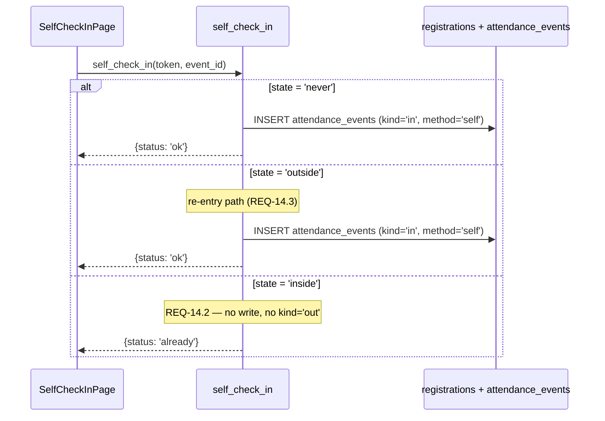

# Design Document

## Overview

This feature replaces the implicit toggle behavior of the organizer-facing QR scanner with two explicit, mutually-exclusive scanner modes — **Check-In** and **Check-Out** — surfaced as tabs inside the existing `QRScannerDialog`. Each tab scans the same per-participant QR code but performs only one kind of attendance state transition, eliminating the silent inversion that today's toggle allows.

The change is overwhelmingly UI-side. The data model already captures every state the new UI needs: `registrations.attendance_state` (`'never' | 'inside' | 'outside'`), `last_in_at`, `last_out_at`, `total_minutes`, plus the immutable `attendance_events` audit table (`kind in ('in','out','auto_out')`). No new `checked_out` boolean and no new tables are introduced. The backend changes are limited to:

1. A new per-row RPC `set_attendance(p_reg_id, p_target, p_method)` that mirrors the existing `bulk_set_attendance` but operates on one registration and returns a rich, code-tagged result row.
2. Tightening `bulk_set_attendance` to return per-row result codes so REQ-15.3 (per-registration result codes from bulk operations) is satisfiable.
3. A guard inside `self_check_in` so it can never insert an `'out'` `attendance_event`, regardless of the participant's current state — the public flow becomes check-in only by construction (REQ-14).
4. A shared internal helper `_apply_attendance(_reg_id, _target, _method, _actor)` invoked by both `set_attendance` and `bulk_set_attendance`, which enforces the cross-mode ordering invariant (REQ-6), the event tracking window (REQ-8), the registration status/approval guards (REQ-7), and the role-based authorization check (REQ-13).

The organizer-facing client (`RegistrationsSection.tsx`) keeps its existing entry point — the **Scan** button still opens `QRScannerDialog` — but the dialog now hosts a `Tabs` component with `Check-In` and `Check-Out` panels. The hook `useEventCheckinCounters` is extended to expose `currentlyInside` and `checkedOut` derived from `attendance_state` (REQ-11.5).

## Architecture

### Component Tree (after change)

```mermaid
flowchart TB
  RS[RegistrationsSection.tsx]
  QRD[QRScannerDialog.tsx]
  TABS[Tabs<br/>'check-in' &#124; 'check-out']
  CIP[CheckInPanel<br/>uses target='inside']
  COP[CheckOutPanel<br/>uses target='outside']
  CAM[CameraScanner<br/>shared]
  RPC[(Supabase RPC<br/>set_attendance)]
  BULK[(Supabase RPC<br/>bulk_set_attendance)]
  HOOK[useEventCheckinCounters]

  RS --> QRD
  RS --> HOOK
  RS --> BULK
  QRD --> TABS
  TABS --> CIP
  TABS --> COP
  CIP --> CAM
  COP --> CAM
  CIP --> RPC
  COP --> RPC
```



The `CameraScanner` sub-component is a single shared `Html5Qrcode` mount; switching tabs does not stop and restart the camera, but it does (a) clear any pending result banner, (b) reset the per-tab dedup buffer (REQ-9), and (c) flip the `target` value passed to the `set_attendance` RPC.

### Tab → RPC Mapping

| Active Tab | RPC | `p_target` | Permitted starting `attendance_state` | Result codes |
|---|---|---|---|---|
| Check-In | `set_attendance` | `'inside'` | `'never'`, `'outside'` | `applied_in`, `already_inside`, `cancelled`, `declined`, `pending_approval`, `wrong_event`, `not_found`, `tracking_closed`, `unauthorized`, `invalid` |
| Check-Out | `set_attendance` | `'outside'` | `'inside'` | `applied_out`, `not_checked_in_yet` (state=`'never'`), `already_outside`, `cancelled`, `declined`, `pending_approval`, `wrong_event`, `not_found`, `tracking_closed`, `unauthorized`, `invalid` |

The active tab is the **only** input that determines which side effect a scan can produce. The QR payload alone — even if it identifies an "inside" participant — cannot trigger a check-out from the Check-In tab and vice versa (REQ-5).

### Sequence Diagrams

**Organizer check-in scan (happy path)**



**Organizer check-out scan (happy path)**



**Organizer scans in the wrong tab (mode isolation)**



**Self-check-in re-entry (public page)**



> Note: The current `self_check_in` implementation inserts `kind='out'` when the participant is already `'inside'`. The design changes this branch to return `'already'` without writing, locking in REQ-14's invariant.

## Components and Interfaces

### `QRScannerDialog` (modified)

Replaces the single-purpose dialog with a tabbed dialog. Public props are unchanged in shape but the `onCheckIn` callback is generalised:

```ts
type ScannerTab = 'check-in' | 'check-out';

type ScanResultCode =
  | 'applied_in' | 'applied_out'
  | 'already_inside' | 'already_outside'
  | 'not_checked_in_yet'
  | 'cancelled' | 'declined' | 'pending_approval'
  | 'wrong_event' | 'not_found' | 'invalid'
  | 'tracking_closed' | 'unauthorized'
  | 'rpc_error' | 'timeout';

type ScanResult = {
  code: ScanResultCode;
  registrationId?: string;
  name?: string;
  ticketType?: string;
  occurredAt?: string;       // last_in_at OR last_out_at
  totalMinutes?: number;     // present for applied_out
  message?: string;          // free-form for rpc_error / timeout
};

interface QRScannerDialogProps {
  open: boolean;
  onOpenChange: (open: boolean) => void;
  registrations: Registration[];
  /**
   * Invoked AFTER a successful RPC. Implementations should refresh the
   * registrations list. Wired to `reload()` in RegistrationsSection.
   */
  onScanApplied: (result: ScanResult, tab: ScannerTab) => void;
  /** Optional initial tab. Default 'check-in' (REQ-1.2). */
  initialTab?: ScannerTab;
}
```

**Backwards compatibility note for the existing `onCheckIn` prop**: today the dialog calls `onCheckIn(reg)` once a check-in succeeds, and `RegistrationsSection` uses that callback only to optimistically mark the row as checked-in. With the new design the dialog itself owns RPC dispatch (so it knows which target to send), and the parent only needs to know "something changed → reload". `onCheckIn(reg)` is therefore replaced by `onScanApplied(result, tab)`. The parent already calls `reload()` from realtime; the new callback is purely for instant UX feedback (toasts, optimistic counter bumps).

**Internal state (per-tab)**

```ts
type DialogState = {
  activeTab: ScannerTab;
  scanning: boolean;          // shared across tabs (one camera)
  inFlight: boolean;          // REQ-9.3 — blocks new scans during RPC
  result: ScanResult | null;  // most recent banner
  recentDecodes: Map<string, number>; // token -> timestamp ms (REQ-9.1, 2s window)
};
```

**Behavioral rules**

- Initial tab = `'check-in'` (REQ-1.2).
- Tab title is rendered in the dialog header (REQ-1.3).
- Switching tabs sets `result = null`, `inFlight = false`, `recentDecodes = new Map()` (REQ-1.4).
- Decode handler: if `inFlight || result !== null`, ignore (REQ-9.2, REQ-9.3); else if `recentDecodes.get(token)` is within 2000ms, ignore (REQ-9.1); else set `inFlight = true`, dispatch RPC.
- RPC call wrapped in a 10s `Promise.race` timeout (REQ-10.2). On timeout → `result = { code: 'timeout' }`.
- Result banners are dismissable with a "Scan another" button which clears `result` and re-arms the scanner.

### `useEventCheckinCounters` (extended) — REQ-11.5

```ts
export type CheckinCounters = {
  total: number;
  checkedIn: number;       // existing — registrations.checked_in = true
  currentlyInside: number; // NEW — registrations.attendance_state = 'inside'
  checkedOut: number;      // NEW — registrations.attendance_state = 'outside'
  notArrived: number;      // NEW — derived: total - currentlyInside - checkedOut
};
```

Implementation: a single `select count` per state via four `head: true` count queries in parallel, kept fresh by the same realtime subscription on the `registrations` table that the hook already uses. The hook already debounces via React's batching; no extra debounce needed.

### `RegistrationsSection` (counters + filters)

The existing attendance segment tabs (`All / Inside now / Checked out / Not arrived`) and the four-card stats grid already compute their numbers from `allRows.attendance_state`. They keep working unchanged — REQ-11.1 and REQ-11.2 are already satisfied. The only edit is to swap the inline `useMemo` counts for `useEventCheckinCounters`'s new fields so a single source of truth is used.

A new "Live updates delayed" indicator (REQ-11.4) is rendered in the Registrations section header when the realtime subscription has not delivered a postgres_changes payload within 5000ms after a known-successful RPC. Implementation:

```ts
// Inside RegistrationsSection
const [liveLag, setLiveLag] = useState<{ regId: string; expiresAt: number } | null>(null);

const onScanApplied = (result: ScanResult, _tab: ScannerTab) => {
  if (result.code === 'applied_in' || result.code === 'applied_out') {
    setLiveLag({ regId: result.registrationId!, expiresAt: Date.now() + 5000 });
    // realtime listener clears liveLag when it observes the matching UPDATE
  }
};
```

If `liveLag.expiresAt < Date.now()` and the matching realtime update has not arrived, the indicator becomes visible and a `console.warn` is emitted ("UI sync failure"). The next successful realtime update clears it.

## Data Models

### No schema change

| Concern | Resolution |
|---|---|
| Track "checked out" state | Existing `registrations.attendance_state = 'outside'` plus `last_out_at` (no new boolean column) |
| Audit trail per scan | Existing `attendance_events` rows with `kind in ('in','out','auto_out')` and `method` text |
| Ordering invariant per registration | Enforced in `_apply_attendance` helper at insert time; no schema change |
| Counters | Derived from `attendance_state` across the four mutually-exclusive values |

The `registrations` table retains the legacy `checked_in boolean` and `checked_in_at timestamptz` columns. They are kept in sync by the existing `_attendance_recompute` trigger and remain the source for the legacy `useEventCheckinCounters.checkedIn` field. New code reads `attendance_state` exclusively.

### RPC surface (final shape)

**`set_attendance` (NEW, per-row)**

```sql
public.set_attendance(
  p_reg_id   uuid,
  p_target   text,    -- 'inside' | 'outside'
  p_method   text DEFAULT 'qr'
) RETURNS TABLE(
  code              text,        -- ScanResultCode
  registration_id   uuid,
  attendance_state  text,
  last_in_at        timestamptz,
  last_out_at       timestamptz,
  total_minutes     int,
  name              text,
  ticket_type       text
)
LANGUAGE plpgsql SECURITY DEFINER SET search_path = public
```

**`bulk_set_attendance` (TIGHTENED return shape)**

```sql
public.bulk_set_attendance(
  p_ids      uuid[],
  p_target   text,    -- 'inside' | 'outside'
  p_method   text DEFAULT 'bulk'
) RETURNS TABLE(
  registration_id uuid,
  code            text   -- same enum as set_attendance.code
)
LANGUAGE plpgsql SECURITY DEFINER SET search_path = public
```

> Migration note: the current `bulk_set_attendance` returns `int` (count of successful changes). Changing the return shape is a breaking change for the one caller in `RegistrationsSection.bulkCheckIn` / `bulkCheckOut`. The migration ships in lockstep with the client update, and the client treats the array result as a list of `{registration_id, code}` objects, surfacing per-row failures via toast (REQ-15.3).

**Internal helper `_apply_attendance` (NEW, private)**

```sql
public._apply_attendance(
  _reg_id  uuid,
  _target  text,           -- 'inside' | 'outside'
  _method  text,
  _actor   uuid             -- auth.uid() of caller
) RETURNS text                -- the result code; INSERTs the attendance_event when applicable
```

The helper is the single source of truth for transition rules. It performs, in order:

1. **Existence**: load the `registrations` row; if missing → `'not_found'`.
2. **Authorization** (REQ-13.2): if `_actor` is neither a platform admin nor an event owner of `_reg.event_id`, return `'unauthorized'`.
3. **Tracking window** (REQ-8.1): if `event_tracking_closed(_reg.event_id)`, return `'tracking_closed'`.
4. **Status / approval guards** (REQ-7):
   - `r.status = 'cancelled'` → `'cancelled'`
   - `r.approval_status = 'declined'` → `'declined'`
   - `r.approval_status in ('pending','waitlisted')` → `'pending_approval'`
5. **State machine** (REQ-3, REQ-4, REQ-5, REQ-6):
   - `_target = 'inside'`:
     - `r.attendance_state = 'inside'` → `'already_inside'` (no write)
     - else → INSERT `attendance_events(kind='in', method=_method, actor_id=_actor)` → `'applied_in'`
   - `_target = 'outside'`:
     - `r.attendance_state = 'never'` → `'not_checked_in_yet'` (no write — also enforces REQ-6.1 ordering invariant: cannot insert `'out'` before any `'in'`)
     - `r.attendance_state = 'outside'` → `'already_outside'` (no write)
     - `r.attendance_state = 'inside'` → INSERT `attendance_events(kind='out', method=_method, actor_id=_actor)` → `'applied_out'`

The existing `_attendance_recompute` AFTER-INSERT trigger keeps `registrations.attendance_state`, `last_in_at`, `last_out_at`, `total_minutes`, `checked_in`, and `checked_in_at` in sync. The helper does not touch those columns directly.

**`self_check_in` (PATCHED — REQ-14 invariant)**

The branch in the current function that inserts `kind='out'` when `r.attendance_state = 'inside'` is removed. New behavior:

| Pre-state | Action | Returned `status` |
|---|---|---|
| `'never'` | INSERT `kind='in', method='self'` | `'ok'` |
| `'outside'` | INSERT `kind='in', method='self'` (re-entry, REQ-14.3) | `'ok'` |
| `'inside'` | NO insert (REQ-14.2) | `'already'` |

The function's signature, grants (`anon, authenticated`), and column projection are unchanged; only the body is patched. This is the simpler of the two options the user raised — guarding the existing RPC rather than introducing a parallel `self_check_in_only`. The guard is a single-line condition and keeps the public URL contract stable, and `SelfCheckInPage` already handles `'already'` correctly.

**`toggle_attendance` (RETAINED)**

The legacy `toggle_attendance` per-row RPC is kept untouched because manual toggle buttons in `RegistrationsSection` (the row-level "check in / check out" pill) still rely on its toggle semantics. The new tabbed scanner does **not** call it.

### `attendance_events` ordering invariant — REQ-6.1

The invariant "for any registration, count(out) ≤ count(in) at every point in time" is enforced at the application layer (inside `_apply_attendance`) rather than as a CHECK constraint, because it is a temporal invariant over a multi-row aggregate. The helper rejects the only insertion path that could violate it (`target='outside'` while state `='never'`). The invariant is also covered by a property test (see Correctness Properties below).

## Correctness Pre-Work

Per the workflow, the following analysis was completed via the prework tool to inform the property set below.

(See "Correctness Properties" section for the resulting properties; the prework summary is reproduced here for traceability.)

| AC | Classification | Test Strategy |
|---|---|---|
| 1.1 — two tabs labeled Check-In / Check-Out | EXAMPLE | Render dialog, assert tab labels |
| 1.2 — initial active tab = Check-In | EXAMPLE | Render dialog, assert active tab |
| 1.3 — active tab name in header | EXAMPLE | Render dialog, switch tabs, assert header text |
| 1.4 — tab switch clears result/in-flight | PROPERTY | For any prior result and any decode in flight, switching tabs zeroes both |
| 1.5 — Check-In only invokes check-in | PROPERTY | For any state and any scan in Check-In tab, no `kind='out'` row is inserted |
| 1.6 — Check-Out only invokes check-out | PROPERTY | Mirror of 1.5 |
| 2.1 — accepted QR forms | PROPERTY | For any registration, every accepted QR form (id / qr_code / join_token / `speaker:UUID` / `sponsor_contact:UUID`) resolves to that registration |
| 2.2 — at most one registration per QR | PROPERTY | For any QR, the resolver returns 0 or 1 rows |
| 2.3 — unknown QR → not_found, no writes | PROPERTY | For any unknown token, RPC returns `not_found` and `attendance_events` count is unchanged |
| 2.4 — wrong-event QR → wrong_event, no writes | PROPERTY | For any registration whose event_id ≠ active event, RPC returns `wrong_event` and inserts nothing |
| 2.5 — invalid form → invalid, no writes | PROPERTY | For any malformed `speaker:`/`sponsor_contact:` token, RPC returns `invalid` and inserts nothing |
| 3.1 — never→inside | PROPERTY | Subsumed by 5.3 idempotence + 6.1 ordering: covered by combined property |
| 3.2 — outside→inside | PROPERTY | Subsumed by 5.3 |
| 3.3 — inside→inside is no-op | PROPERTY | Idempotence per tab |
| 3.4 — success surfaces name/ticket/timestamp | EXAMPLE | Single happy-path render assertion |
| 4.1 — inside→outside | PROPERTY | Subsumed by 5.4 + 6.1 |
| 4.2 — never→outside is no-op | PROPERTY | Subsumed by 6.1 ordering |
| 4.3 — outside→outside is no-op | PROPERTY | Idempotence per tab |
| 4.4 — success surfaces name/ticket/timestamp | EXAMPLE | Single happy-path render assertion |
| 5.1 — Check-In tab never inserts kind='out' | PROPERTY | Universal across all states and all sequences |
| 5.2 — Check-Out tab never inserts kind='in' | PROPERTY | Mirror of 5.1 |
| 5.3 — repeated Check-In leaves state=inside | PROPERTY | Idempotence |
| 5.4 — repeated Check-Out leaves state=outside | PROPERTY | Idempotence |
| 6.1 — count(out) ≤ count(in) always | PROPERTY | Ordering invariant under any sequence of mixed-tab scans |
| 6.2 — violating check-out rejected with `not_checked_in_yet` | PROPERTY | Subsumed by 6.1 + return-code check |
| 7.1 — cancelled rejected | PROPERTY | For any cancelled registration, RPC returns `cancelled` and writes nothing |
| 7.2 — declined rejected | PROPERTY | Same shape as 7.1 |
| 7.3 — pending/waitlisted rejected | PROPERTY | Same shape as 7.1 |
| 8.1 — tracking-closed rejected | PROPERTY | For any registration whose event ended >2h ago, RPC returns `tracking_closed` and writes nothing |
| 9.1 — same-token decode within 2000ms ignored | PROPERTY | For any token and any pair of decodes <2000ms apart, only one RPC call is made |
| 9.2 — no new transition while result shown | EXAMPLE | UI behavior, single test |
| 9.3 — no new transition while in flight | PROPERTY | For any decode arriving during a pending RPC, no second RPC is dispatched |
| 10.1 — RPC error surfaces and leaves DB unchanged | PROPERTY | For any error response, attendance_events count is unchanged |
| 10.2 — 10s timeout surfaces and leaves DB unchanged | EXAMPLE | Hard to property-test deterministically; one mocked timeout test |
| 10.3 — retry without restarting camera | EXAMPLE | UI behavior |
| 11.1 — list shows state + last_in_at + last_out_at | EXAMPLE | Render assertion |
| 11.2 — counters Inside now / Checked out / Not arrived | PROPERTY | For any registration set, the three counts equal the partition by attendance_state |
| 11.3 — list reflects within 5000ms | EXAMPLE / INTEGRATION | Realtime SLA — covered by integration test, not PBT |
| 11.4 — "Live updates delayed" fallback | EXAMPLE | UI behavior under simulated lag |
| 11.5 — hook exposes currentlyInside + checkedOut | PROPERTY | For any registration set, hook output partitions match attendance_state counts |
| 12.1 / 12.2 — exactly one event per successful scan | PROPERTY | For any successful scan, attendance_events row count grows by exactly 1 with correct kind/method/actor |
| 12.3 — no modify/delete of existing events | PROPERTY | For any sequence of scanner-initiated transitions, prior attendance_events rows are unchanged |
| 13.1 — gated by dashboard auth | EXAMPLE | Routing test |
| 13.2 — non-owner non-admin requests rejected | PROPERTY | For any non-authorized actor, RPC returns `unauthorized` and writes nothing |
| 14.1 — self-check-in only invokes check-in | PROPERTY | For any state and any scan via `self_check_in`, no `kind='out'` row is inserted |
| 14.2 — self-check-in inside → already, no write | PROPERTY | Subsumed by 14.1 + idempotence |
| 14.3 — self-check-in outside → re-entry | PROPERTY | Round-trip: outside + self-check-in → inside |
| 14.4 — UI exposes no check-out control | EXAMPLE | Snapshot of SelfCheckInPage |
| 15.1 / 15.2 — bulk uses same rules as scanner | PROPERTY | For any selected set, the result codes match what per-row `set_attendance` would have returned |
| 15.3 — per-row results from bulk | PROPERTY | For any input set, the bulk result array has length = input length and each entry is a valid code |

### Property reflection (consolidation)

Many of the per-tab transition acceptance criteria collapse into a small number of high-leverage properties:

- 5.1 + 5.2 + 6.1 form a single **mode-and-ordering invariant**: across any sequence of (tab, scan) events, `count(out) ≤ count(in)` AND `kind` always equals the active tab's expected kind.
- 5.3 + 5.4 collapse into one **per-tab idempotence** property: scanning the same QR repeatedly in the same tab is a no-op after the first applied scan.
- 3.1 + 3.2 + 4.1 are subsumed by the **state-transition correctness** property: after a successful scan with target T, the state equals T.
- 7.1 + 7.2 + 7.3 collapse into one **registration-status guard** property parameterised over the rejecting condition.
- 15.1 + 15.2 + 15.3 collapse into one **bulk equivalence** property: for any selected set, `bulk_set_attendance(ids, target)` returns the same per-row codes as calling `set_attendance(id, target)` once per id in the same order.
- 14.1 + 14.2 are unified by the **self-check-in invariant**: the `self_check_in` RPC never inserts `kind='out'`.

The reduced property set follows.

## Correctness Properties

*A property is a characteristic or behavior that should hold true across all valid executions of a system — essentially, a formal statement about what the system should do. Properties serve as the bridge between human-readable specifications and machine-verifiable correctness guarantees.*

### Property 1: State-transition correctness

*For any* registration `r` whose pre-scan `attendance_state` is `S ∈ {never, inside, outside}` and whose status / approval guards permit the transition, scanning its QR in the tab whose `target = T` results in:
- if `(S, T)` matches a permitted transition (`(never|outside, inside)` or `(inside, outside)`), the post-scan `attendance_state` equals `T` and exactly one new `attendance_events` row exists with `kind = T==='inside' ? 'in' : 'out'`, `method = 'qr'`, `actor_id = auth.uid()`;
- otherwise the post-scan `attendance_state` equals `S` and the count of `attendance_events` rows for `r` is unchanged.

**Validates: Requirements 3.1, 3.2, 3.3, 4.1, 4.2, 4.3, 12.1, 12.2**

### Property 2: Mode-and-ordering invariant

*For any* registration `r` and *for any* finite sequence of scanner-initiated scans `((tab_1, qr_1), …, (tab_n, qr_n))` against `r`, the resulting `attendance_events` rows for `r` satisfy both:
- every inserted row's `kind` equals `'in'` if its originating `tab_i = check-in` and `'out'` if its originating `tab_i = check-out`; and
- at every prefix of the sequence, `count(kind='out') ≤ count(kind='in')`.

**Validates: Requirements 5.1, 5.2, 6.1, 6.2**

### Property 3: Per-tab idempotence

*For any* registration `r` and *for any* tab `T ∈ {check-in, check-out}`, applying two scans of the same QR in tab `T` back-to-back produces the same final `attendance_state` and the same set of `attendance_events` rows as applying that scan once. (Equivalent to: the second scan returns `'already_inside'` or `'already_outside'` and writes nothing.)

**Validates: Requirements 5.3, 5.4**

### Property 4: QR resolution is total and unique

*For any* registration `r`, every one of `r.id`, `r.qr_code`, `r.join_token`, and (for speaker/sponsor virtual rows) the literal `speaker:<r.id>` or `sponsor_contact:<r.id>` resolves to exactly `r` and to no other registration. *For any* token that does not match any of these forms, resolution returns zero rows.

**Validates: Requirements 2.1, 2.2, 2.3, 2.5**

### Property 5: Cross-event QR rejection

*For any* registration `r` and *for any* event id `E ≠ r.event_id`, calling `set_attendance` for `r` while the dashboard is scoped to `E` returns `code = 'wrong_event'` and the count of `attendance_events` rows for `r` is unchanged.

**Validates: Requirements 2.4**

### Property 6: Registration-status guard

*For any* registration `r` whose `(status, approval_status)` falls into the rejecting set (`status = 'cancelled'` → `'cancelled'`; `approval_status = 'declined'` → `'declined'`; `approval_status ∈ {'pending','waitlisted'}` → `'pending_approval'`), and *for any* `target ∈ {'inside','outside'}`, calling `set_attendance` returns the corresponding rejection code and the count of `attendance_events` rows for `r` is unchanged.

**Validates: Requirements 7.1, 7.2, 7.3**

### Property 7: Tracking-window guard

*For any* registration `r` whose event `end_date` (or `date` when `end_date` is null) is more than 2 hours before `now()`, and *for any* `target ∈ {'inside','outside'}`, calling `set_attendance` returns `code = 'tracking_closed'` and the count of `attendance_events` rows for `r` is unchanged.

**Validates: Requirements 8.1**

### Property 8: Authorization guard

*For any* registration `r` and *for any* actor `a` who is neither a platform admin nor an owner of `r.event_id`, calling `set_attendance` (or `bulk_set_attendance` containing `r.id`) as `a` returns `code = 'unauthorized'` for `r` and the count of `attendance_events` rows for `r` is unchanged.

**Validates: Requirements 13.2**

### Property 9: Rapid-scan dedup

*For any* token `t` and *for any* pair of decode events for `t` that arrive at the dialog within 2000 ms of each other while the active tab is unchanged, exactly one RPC dispatch occurs.

**Validates: Requirements 9.1, 9.3**

### Property 10: Counter partition correctness

*For any* set of registrations `R` belonging to a single event, the value of `useEventCheckinCounters` satisfies:
- `total = |R|`
- `currentlyInside = |{r ∈ R : r.attendance_state = 'inside'}|`
- `checkedOut = |{r ∈ R : r.attendance_state = 'outside'}|`
- `notArrived = |{r ∈ R : r.attendance_state = 'never'}|`
- `currentlyInside + checkedOut + notArrived = total`

**Validates: Requirements 11.2, 11.5**

### Property 11: Audit-trail immutability

*For any* sequence of scanner-initiated `set_attendance` calls against a registration `r`, the set of `attendance_events` rows existing before the call is a subset of the set existing after the call (no row is modified or deleted by scanner-initiated transitions).

**Validates: Requirements 12.3**

### Property 12: Bulk equivalence

*For any* array of registration ids `[id_1, …, id_n]` and *for any* `target ∈ {'inside','outside'}`, the result of `bulk_set_attendance(ids, target)` is the array `[(id_i, c_i)]` where each `c_i` equals the `code` that `set_attendance(id_i, target)` would return when called as the same actor at the same instant.

**Validates: Requirements 15.1, 15.2, 15.3**

### Property 13: Self-check-in invariant

*For any* registration `r` and *for any* invocation of `self_check_in(token, event_id)` that resolves to `r`, no `attendance_events` row with `kind = 'out'` is inserted as a result of the call. Additionally, when `r.attendance_state = 'outside'` immediately before the call, the post-call `attendance_state` equals `'inside'` (re-entry).

**Validates: Requirements 14.1, 14.2, 14.3**

## Error Handling

The following table maps every error-producing acceptance criterion to a specific UI message and RPC code. The dialog renders banners using three colour categories: `success` (green), `warn` (amber), and `error` (red).

| Trigger | RPC code | Banner kind | UI title | UI body |
|---|---|---|---|---|
| Scan in Check-In tab, state already `inside` | `already_inside` | warn | "Already checked in" | "{name} is already inside ({last_in_at})." |
| Scan in Check-In tab, state was `never` | `applied_in` | success | "Checked in" | "Welcome, {name}{ticket label}." |
| Scan in Check-In tab, state was `outside` | `applied_in` | success | "Re-entry recorded" | "Welcome back, {name}." |
| Scan in Check-Out tab, state was `inside` | `applied_out` | success | "Checked out" | "{name} — total onsite {total_minutes}." |
| Scan in Check-Out tab, state `never` | `not_checked_in_yet` | error | "Not checked in yet" | "{name} has not checked in. Switch to the Check-In tab first." (REQ-4.2, REQ-6.2) |
| Scan in Check-Out tab, state `outside` | `already_outside` | warn | "Already checked out" | "{name} was last checked out at {last_out_at}." (REQ-4.3) |
| QR matches a cancelled registration | `cancelled` | error | "Registration cancelled" | "This ticket was cancelled and can't be used." (REQ-7.1) |
| QR matches a declined registration | `declined` | error | "Registration declined" | "This registration was declined." (REQ-7.2) |
| QR matches a pending or waitlisted registration | `pending_approval` | error | "Awaiting approval" | "This registration is still pending approval." (REQ-7.3) |
| QR matches a registration in another event | `wrong_event` | error | "Wrong event" | "This ticket is for a different event." (REQ-2.4) |
| QR doesn't match any registration | `not_found` | error | "Ticket not found" | "We couldn't find this ticket." (REQ-2.3) |
| Token doesn't match any accepted form | `invalid` | error | "Invalid code" | "That doesn't look like a valid ticket code." (REQ-2.5) |
| Event ended >2h ago | `tracking_closed` | error | "Tracking closed" | "Check-in and check-out closed for this event." (REQ-8.1) |
| Caller is not admin/owner | `unauthorized` | error | "Not allowed" | "You're not authorized to scan for this event." (REQ-13.2) |
| Supabase RPC returns error | `rpc_error` | error | "Something went wrong" | "{error.message}" — Retry button re-arms scan without stopping camera (REQ-10.1, REQ-10.3) |
| RPC takes >10s | `timeout` | error | "Request timed out" | "We didn't hear back from the server. Try again." (REQ-10.2) — Retry without restarting camera (REQ-10.3) |

The dialog never modifies application state itself; it only renders the result returned by the RPC. The DB-side guarantee that no row is inserted on a rejection (REQ-10.1) follows from the fact that `_apply_attendance` only INSERTs in the success branches, and from PostgreSQL's transactional rollback if the RPC raises.

## Testing Strategy

### Test type breakdown

| Layer | Test kind | Why |
|---|---|---|
| `_apply_attendance` SQL helper | **Property-based** | Pure-ish state-machine logic; many independent invariants; cheap to drive against an in-memory or local Supabase instance with random sequences |
| `set_attendance` / `bulk_set_attendance` RPCs | **Property-based** + **example/integration** | Properties cover transition correctness, ordering, idempotence, bulk equivalence, status guards. A small set of integration tests exercises the actual Supabase wiring end-to-end |
| `self_check_in` RPC patch | **Property-based** | Covers REQ-14 invariant ("never inserts `kind='out'`") which is exactly a universal property |
| `QRScannerDialog` component (UI) | **Example/component tests** | Tab labels, header reflects active tab, banner rendering, retry button — these are concrete UI assertions, not universals |
| Tab-switch reset behavior (REQ-1.4, REQ-9) | **Property-based** | Universal across pre-states and decode sequences |
| `useEventCheckinCounters` (REQ-11.5) | **Property-based** | Counter partition correctness is a clean universal property |
| Realtime SLA (REQ-11.3, REQ-11.4) | **Integration** | Tests Supabase wiring; behavior doesn't vary meaningfully with input; PBT is not the right tool |
| `SelfCheckInPage` (REQ-14.4 — no check-out affordance) | **Snapshot** | UI surface absence is a snapshot assertion |
| Auth gate (REQ-13.1) | **Example** | Routing test |

### Property-based testing setup

The repo uses Vitest. The property-testing library will be **fast-check** (`fast-check@^3`), idiomatic for the TypeScript stack and integrated via `vitest`. SQL-side helpers are reachable from tests through `supabase.rpc(...)` against a local Supabase. Where talking to the real Supabase per iteration would be expensive, properties run against an in-memory model of `_apply_attendance` (a TypeScript port that mirrors the SQL state machine line-for-line); a smaller set of integration tests then verifies the SQL implementation matches the model on a handful of representative sequences.

**Property test configuration**
- Minimum 100 iterations per property (`fc.assert(prop, { numRuns: 100 })`).
- Each property test is tagged with a comment of the form:
  - `// Feature: checkin-checkout-tabs, Property N: <property text>`
  - The N matches the design property number above.

**Generators (sketch)**

```ts
type RegState = 'never' | 'inside' | 'outside';
type Tab = 'check-in' | 'check-out';

const arbRegState = fc.constantFrom<RegState>('never','inside','outside');
const arbTab      = fc.constantFrom<Tab>('check-in','check-out');
const arbStatus   = fc.constantFrom('confirmed','pending','cancelled');
const arbApproval = fc.constantFrom('approved','pending','waitlisted','declined');
const arbActor    = fc.constantFrom('admin','owner','other');
const arbScan     = fc.record({ tab: arbTab, qr: fc.uuid() });
const arbSequence = fc.array(arbScan, { maxLength: 20 });
```

### Test coverage matrix

| Property | Test ID | Generator |
|---|---|---|
| 1 — state-transition correctness | `pbt-set-attendance-transitions` | `(arbRegState, arbTab)` |
| 2 — mode-and-ordering invariant | `pbt-mode-ordering-invariant` | `arbSequence` against a single registration |
| 3 — per-tab idempotence | `pbt-per-tab-idempotence` | `(arbRegState, arbTab)` |
| 4 — QR resolution total/unique | `pbt-qr-resolution` | `arbRegistration` with random uuid/qr_code/join_token/speaker/sponsor variants |
| 5 — cross-event QR rejection | `pbt-wrong-event` | `(arbRegistration, arbEventId)` where event ids differ |
| 6 — registration-status guard | `pbt-status-approval-guard` | `(arbStatus, arbApproval, arbTab)` |
| 7 — tracking-window guard | `pbt-tracking-closed` | `arbEventEnd` distributed around `now() - 2h` |
| 8 — authorization guard | `pbt-authz-guard` | `(arbActor, arbTab)` |
| 9 — rapid-scan dedup | `pbt-rapid-scan-dedup` | `arbDecodeStream` with controlled inter-arrival times |
| 10 — counter partition | `pbt-counter-partition` | `fc.array(arbRegState)` |
| 11 — audit-trail immutability | `pbt-audit-immutability` | `arbSequence` |
| 12 — bulk equivalence | `pbt-bulk-equivalence` | `fc.array(arbRegistration)` x `arbTab` |
| 13 — self-check-in invariant | `pbt-self-checkin-invariant` | `arbRegState` |

Each will become a single PBT task in the next workflow phase.

### Example-based tests (non-PBT)

- Render `QRScannerDialog`, assert tabs `Check-In` and `Check-Out` exist and `Check-In` is active by default; assert dialog title reflects active tab; switch tab and re-assert.
- Render success / error banners for each `code` value (snapshot of icon + colour + copy).
- Assert `SelfCheckInPage` does not render any element labelled `Check-Out` / `Check out` / `End visit`.
- Assert that `RegistrationsSection` "Live updates delayed" indicator becomes visible after a successful scan if no realtime payload has arrived within 5000ms (uses a fake timer).
- Assert that `set_attendance` 10s timeout produces `code='timeout'` (mocked RPC delay).

### Integration tests

- Two-row sanity test against a local Supabase: scan check-in → assert state, scan check-out → assert state and `total_minutes`, scan check-in again → re-entry.
- Tracking-window guard against a fixture event whose `end_date` is 3 hours in the past.
- Realtime SLA: instrument the postgres_changes channel, perform a scan via the RPC, assert the listener fires within 5000 ms (single example, not 100 iterations).

## Migration / Rollout Plan

The change is phased to keep the deployed UI working at every step.

### Phase 1 — DB migration (additive + patch)

1. Add `_apply_attendance(_reg_id, _target, _method, _actor)` helper.
2. Add `set_attendance(p_reg_id, p_target, p_method)` RPC, calling `_apply_attendance(p_reg_id, p_target, p_method, auth.uid())`.
3. Replace `bulk_set_attendance` body to also call the helper and to return `TABLE(registration_id uuid, code text)`. **Breaking change for the RPC return shape** — see Phase 2.
4. Patch `self_check_in`: remove the `kind='out'` insertion branch when state is `'inside'`; return `'already'` instead.
5. Grant `EXECUTE` on `set_attendance` to `authenticated`. (No grant on `_apply_attendance`; it is internal.)

No data backfill is required. The existing `attendance_events` rows already conform to the ordering invariant (because the only writers were `toggle_attendance`, `bulk_set_attendance`, and `self_check_in`, all of which only insert valid kinds for the current state). A defensive migration check counts violators; expected = 0.

```sql
-- Sanity check (read-only)
WITH per_reg AS (
  SELECT registration_id,
         count(*) FILTER (WHERE kind='in')                  AS in_n,
         count(*) FILTER (WHERE kind IN ('out','auto_out')) AS out_n
  FROM attendance_events GROUP BY registration_id
)
SELECT count(*) AS violators
FROM per_reg WHERE out_n > in_n;
-- expected: 0
```

### Phase 2 — Client update (deploy in lockstep)

1. Update `RegistrationsSection.bulkCheckIn` / `bulkCheckOut` to consume the new `bulk_set_attendance` return shape (per-row codes), and to render per-row toasts when a row is skipped (REQ-15.3).
2. Replace `QRScannerDialog` body with the tabbed implementation; rewrite `onCheckIn` callsite in `RegistrationsSection` to use `onScanApplied`.
3. Extend `useEventCheckinCounters` with `currentlyInside`, `checkedOut`, `notArrived`.
4. Wire the "Live updates delayed" indicator.

The client deploy and the DB migration must ship together because the `bulk_set_attendance` return shape is breaking. Rolling back is supported by reverting both: the migration is structured so the new helper and `set_attendance` can be dropped without affecting the legacy `toggle_attendance` flow.

### Phase 3 — Cleanup (post-rollout)

After two weeks of clean operation:
- Optionally add a NOT VALID CHECK constraint or a BEFORE-INSERT trigger on `attendance_events` that re-asserts `count(out) ≤ count(in)` per-registration. The application layer is already authoritative; this is belt-and-braces.
- Audit any remaining callers of `toggle_attendance` and migrate them to `set_attendance` if the toggle semantics are no longer desirable.

### Compatibility notes

- The legacy `registrations.checked_in` boolean and `checked_in_at` timestamp continue to be maintained by `_attendance_recompute`. Existing reports / CSV exports / sponsor portal queries that read these columns are unaffected.
- The public self-check-in URL (`/checkin/:eventId`) and the `self_check_in` RPC signature (arguments + return columns) are unchanged. Only the in-body behavior on `state='inside'` changes.
- The `onCheckIn` prop on `QRScannerDialog` is replaced with `onScanApplied`. The only caller is `RegistrationsSection`, updated in the same change.

## Open Questions Resolved

The two open items raised at the start of design have been resolved as follows:

1. **Tabs inside the existing `QRScannerDialog` vs separate dialogs / two toolbar buttons** → Tabs inside the same dialog. Rationale: requirements explicitly say "tabs"; one shared `Html5Qrcode` instance avoids the camera-permission and resume-cost overhead of toggling two dialogs; mode-isolation invariants are easier to enforce in a single component with one decode pipeline.
2. **Migrate self-check-in to a stricter `self_check_in_only` RPC vs guard the existing `self_check_in`** → Guard the existing RPC. Rationale: the public URL contract and the `SelfCheckInPage` already handle the `'already'` response correctly; a one-line conditional inside the function body is simpler than introducing a parallel RPC and updating grants and the front-end. The REQ-14 invariant is satisfied either way and is locked in by Property 13.
