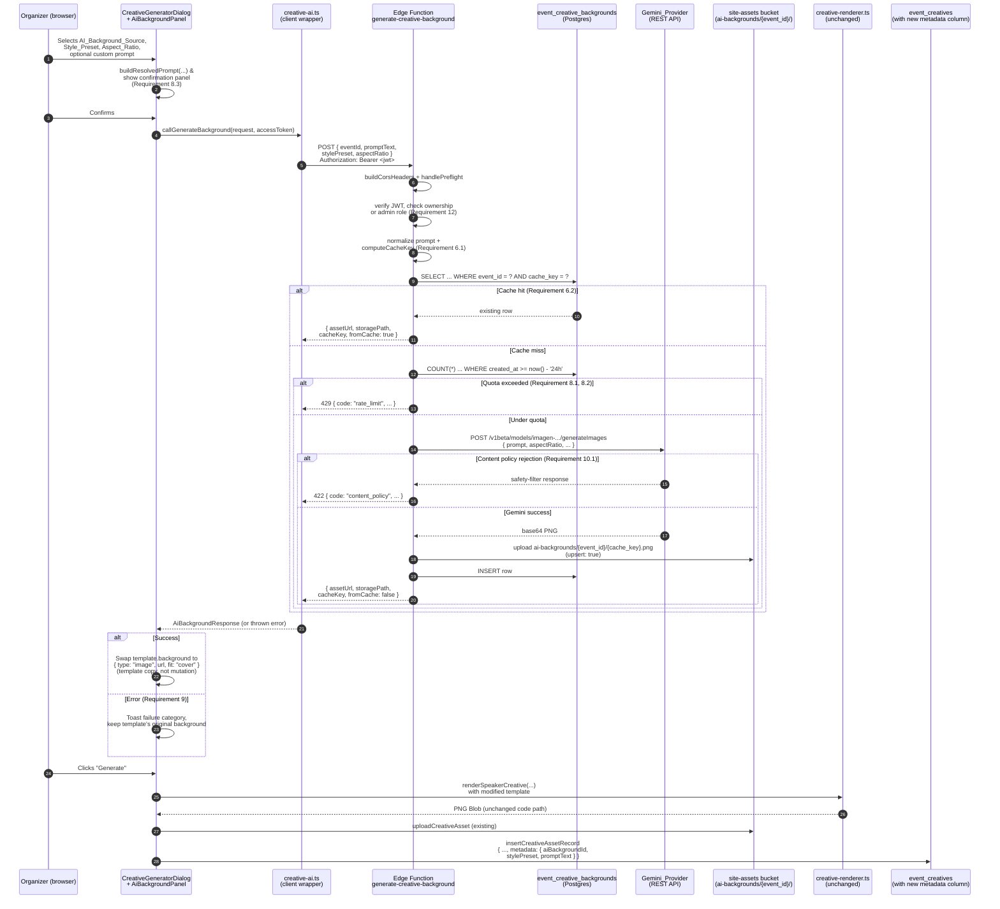

# Design Document: Creative AI Backgrounds

## Overview

The **Creative AI Backgrounds** feature is a strictly additive layer on top of
the shipped Social_Creative_Generator (spec:
`.kiro/specs/social-creative-generator/`). It lets an event organizer generate a
bespoke, event-themed background image via Google Gemini (Imagen / Gemini image
models), materialize the result as a PNG in Supabase Storage, and plug it into
an existing `Creative_Template` as an ordinary
`CreativeBgStyle.type: "image"` entry so the base renderer's existing
`drawBackground` path (`src/lib/creatives/creative-renderer.ts`) handles it
uniformly with organizer-uploaded backgrounds — no changes to the rendering hot
path, and speaker photos + sponsor logos remain unmodified direct image
composites (base spec Requirements 2.4, 3.3 preserved).

Nothing in this feature touches:

- `creative-templates.ts` — the template model, static presets, `PLATFORM_FORMATS`,
  `reflowTemplate`, or `resolveBackground`. All AI-derived backgrounds enter the
  existing plan pipeline as `CreativeBgStyle.type: "image"` on a template copy,
  hitting the same `resolveBackground` / `drawBackground` path an
  organizer-uploaded background would.
- `creative-renderer.ts`'s plan builders (`buildSpeakerPlan`, `buildSponsorPlan`,
  `buildComboPlan`) or its `drawPlan` / `renderXCreative` functions. The AI
  asset URL only ever becomes the value of a `PlanElement` with
  `kind: "background"`; it never reaches a `PlanElement` with `kind: "image"`.
- `event_creatives` insert path or storage upload of the rendered PNG. The new
  metadata is added as a JSONB column with default `'{}'::jsonb` so existing
  callers continue to produce valid rows.

The additive surface is:

- **One new Edge Function** — `supabase/functions/generate-creative-background/`
  — the only code path that calls Gemini. It reads `GEMINI_API_KEY` from
  Supabase secrets, authenticates the caller as the event's owner or a platform
  admin, checks a persistent cache, enforces a per-event daily quota, calls
  Gemini via a raw `fetch`, uploads the resulting PNG to
  `site-assets/ai-backgrounds/{event_id}/`, and inserts an
  `event_creative_backgrounds` row.
- **One new client-side module** — `src/lib/creatives/creative-ai.ts` — the
  pure `AiBackgroundRequest` / `AiBackgroundResponse` types, prompt
  composition, prompt normalization, cache key computation, and the
  `supabase.functions.invoke` wrapper.
- **Two new database changes** — a new table `event_creative_backgrounds`
  (schema, RLS, indexes) and one new column
  `event_creatives.metadata jsonb NOT NULL DEFAULT '{}'::jsonb`, both landing
  in a single new migration `023_creative_ai_backgrounds.sql`.
- **UI extensions on three existing components** and **two new components** —
  `CreativeGeneratorDialog` and `BatchCreativeGeneratorDialog` gain a
  "Background source" selector and mount a new `AiBackgroundPanel`;
  `CreativeLibrarySection` gains an "AI" badge on rows whose
  `metadata` identifies an AI background;
  `CreativesSection.tsx` mounts a new `AiBackgroundLibrary`.
- **One new documentation file** — `docs/gemini-setup.md`, mirroring
  `docs/agora-setup.md`.

Backward compatibility (base spec Requirement 1): an organizer who does not
select the new AI_Background_Source produces byte-for-byte identical Creative
output to today's shipped Creative_Generator. The Gemini API is never called
in that path — the Edge Function is not invoked at all.

## Architecture

The AI background pipeline is a strictly pre-render step. Its only output is a
public URL string on `site-assets`; that URL replaces the template's
`background` field (via a per-render template copy — never mutating the
static template registry) and the existing renderer takes over from there.



**Where AI insertion happens vs where it does not.** The AI-generated PNG URL
is spliced into a template *copy* inside `CreativeGeneratorDialog.handleGenerate`
just before calling `renderXCreative(...)`. The static template registries in
`creative-templates.ts` are never mutated; the copy lives only for the duration
of the render call:

```typescript
// Inside CreativeGeneratorDialog.handleGenerate:
const templateForRender: CreativeTemplate = aiBackgroundUrl
  ? { ...template, background: { type: "image", url: aiBackgroundUrl, fit: "cover" } }
  : template;
blob = await renderSpeakerCreative(speaker, templateForRender, format, theme);
```

`resolveBackground` in `creative-templates.ts` already handles
`type: "image"` (returns it unchanged, see lines that switch on `background.type`),
and `drawBackground` in `creative-renderer.ts` already draws
`type: "image"` with `"cover"` cropping — both are pre-existing code paths
that this feature reuses without modification.

**Batch pipeline reuses one AI background per batch run.** In
`BatchCreativeGeneratorDialog`, the same AI URL (when selected) is applied to
every `(entity, format)` render pair for the run. This is the "one generation,
reused across selected Platform_Formats" pattern from requirements decision #6,
extended to reuse across every entity in the batch as well — a per-batch
constraint, not per-entity — flagged in the UI so organizers understand the
trade-off (one generation is fast + cheap; per-entity would be N × Gemini
calls).

## Components and Interfaces

### New: `supabase/functions/generate-creative-background/index.ts` (Edge Function)

The only code path that calls Gemini. Runs on Deno; no npm packages beyond the
existing `@supabase/supabase-js` esm.sh import — Gemini is called via a raw
`fetch`. Uses the shared helpers `buildCorsHeaders` / `handlePreflight` from
`supabase/functions/_shared/cors.ts` (confirmed present) and
`createEdgeLogger` / `toErrorFields` from
`supabase/functions/_shared/edge-logger.ts` (confirmed present).

```typescript
// deno-lint-ignore-file no-explicit-any
import { createClient } from "https://esm.sh/@supabase/supabase-js@2";
import { buildCorsHeaders, handlePreflight, corsJson } from "../_shared/cors.ts";
import { createEdgeLogger, toErrorFields } from "../_shared/edge-logger.ts";

interface RequestBody {
  eventId: string;
  promptText: string;      // resolved (already-composed) prompt from the client
  stylePreset: string;     // one of the five presets, validated
  aspectRatio: "1:1" | "16:9" | "9:16" | "4:3";
}

interface SuccessResponse {
  assetUrl: string;
  storagePath: string;
  cacheKey: string;
  fromCache: boolean;
}

interface ErrorResponse {
  error: string;
  code: "network" | "rate_limit" | "content_policy" | "service_outage" |
        "configuration" | "auth" | "bad_request";
  details?: unknown;
}

const log = createEdgeLogger("generate-creative-background");
const DEFAULT_DAILY_QUOTA = 20;
const ALLOWED_ASPECT_RATIOS = new Set(["1:1", "16:9", "9:16", "4:3"]);
const ALLOWED_STYLE_PRESETS = new Set([
  "abstract-gradient", "minimal-geometric", "elegant-floral", "corporate", "tech-mesh",
]);

Deno.serve(async (req: Request) => {
  const cors = buildCorsHeaders(req);
  const preflight = handlePreflight(req, cors);
  if (preflight) return preflight;

  const correlationId = crypto.randomUUID();
  const rlog = log.child({ correlation_id: correlationId });

  // ── 1. Method + parse ───────────────────────────────────────────────────
  if (req.method !== "POST") {
    return corsJson({ error: "Method not allowed", code: "bad_request" }, { status: 405, cors });
  }

  let body: RequestBody;
  try { body = await req.json(); }
  catch { return corsJson({ error: "Invalid JSON body", code: "bad_request" }, { status: 400, cors }); }

  // ── 2. Validate ─────────────────────────────────────────────────────────
  if (!body.eventId || !body.promptText || !body.stylePreset || !body.aspectRatio) {
    return corsJson({ error: "eventId, promptText, stylePreset, aspectRatio required", code: "bad_request" }, { status: 400, cors });
  }
  if (!ALLOWED_ASPECT_RATIOS.has(body.aspectRatio)) {
    return corsJson({ error: "Unsupported aspectRatio", code: "bad_request" }, { status: 400, cors });
  }
  if (!ALLOWED_STYLE_PRESETS.has(body.stylePreset)) {
    return corsJson({ error: "Unknown stylePreset", code: "bad_request" }, { status: 400, cors });
  }

  // ── 3. Config ───────────────────────────────────────────────────────────
  const geminiKey = Deno.env.get("GEMINI_API_KEY");
  const quota = Number(Deno.env.get("GEMINI_PER_EVENT_DAILY_QUOTA") ?? DEFAULT_DAILY_QUOTA);
  const supabaseUrl = Deno.env.get("SUPABASE_URL");
  const serviceKey = Deno.env.get("SUPABASE_SERVICE_ROLE_KEY");

  if (!geminiKey || !supabaseUrl || !serviceKey) {
    rlog.error("missing configuration", {
      has_gemini_key: !!geminiKey, has_supabase_url: !!supabaseUrl, has_service_key: !!serviceKey,
    });
    return corsJson({ error: "AI background generation not configured", code: "configuration" }, { status: 500, cors });
  }

  // ── 4. Authenticate + authorize (Requirement 12) ────────────────────────
  const authHeader = req.headers.get("Authorization") || "";
  const jwt = authHeader.replace("Bearer ", "");
  if (!jwt) return corsJson({ error: "Missing Authorization header", code: "auth" }, { status: 403, cors });

  const supabase = createClient(supabaseUrl, serviceKey);
  const { data: userData, error: userErr } = await supabase.auth.getUser(jwt);
  if (userErr || !userData.user) {
    return corsJson({ error: "Not signed in", code: "auth" }, { status: 403, cors });
  }
  const userId = userData.user.id;

  const { data: event, error: eventErr } = await supabase
    .from("events")
    .select("user_id")
    .eq("id", body.eventId)
    .single();
  if (eventErr || !event) {
    return corsJson({ error: "Event not found", code: "auth" }, { status: 403, cors });
  }

  const isOwner = event.user_id === userId;
  let isAdmin = false;
  if (!isOwner) {
    const { data: hasAdminRole } = await supabase.rpc("has_role", { _user_id: userId, _role: "admin" });
    isAdmin = !!hasAdminRole;
  }
  if (!isOwner && !isAdmin) {
    return corsJson({ error: "Forbidden", code: "auth" }, { status: 403, cors });
  }

  // ── 5. Cache lookup (Requirement 6.1, 6.2) ──────────────────────────────
  const promptNormalized = body.promptText.trim().toLowerCase();
  const cacheKey = computeCacheKey(body.eventId, promptNormalized, body.stylePreset, body.aspectRatio);

  const { data: cached } = await supabase
    .from("event_creative_backgrounds")
    .select("asset_url, storage_path")
    .eq("event_id", body.eventId)
    .eq("cache_key", cacheKey)
    .maybeSingle();
  if (cached) {
    return corsJson({
      assetUrl: cached.asset_url, storagePath: cached.storage_path,
      cacheKey, fromCache: true,
    } satisfies SuccessResponse, { status: 200, cors });
  }

  // ── 6. Quota (Requirement 8.1, 8.2) ─────────────────────────────────────
  const twentyFourHoursAgo = new Date(Date.now() - 24 * 3600 * 1000).toISOString();
  const { count } = await supabase
    .from("event_creative_backgrounds")
    .select("id", { count: "exact", head: true })
    .eq("event_id", body.eventId)
    .gte("created_at", twentyFourHoursAgo);
  if ((count ?? 0) >= quota) {
    return corsJson({
      error: `Per-event daily quota reached (${quota}/day)`, code: "rate_limit",
    }, { status: 429, cors });
  }

  // ── 7. Call Gemini (Requirement 3, 5.2) ─────────────────────────────────
  let base64Png: string;
  try {
    const response = await fetch(
      `https://generativelanguage.googleapis.com/v1beta/models/imagen-4.0-generate-001:predict?key=${geminiKey}`,
      {
        method: "POST",
        headers: { "Content-Type": "application/json" },
        body: JSON.stringify({
          instances: [{ prompt: body.promptText }],
          parameters: { sampleCount: 1, aspectRatio: body.aspectRatio },
        }),
      }
    );
    if (!response.ok) {
      const errBody = await response.text();
      // Gemini returns 400 with an error body describing safety filter blocks.
      if (response.status === 400 && /safety|policy/i.test(errBody)) {
        rlog.warn("gemini content policy rejection", { event_id: body.eventId, status: response.status });
        return corsJson({ error: "Prompt rejected by content policy", code: "content_policy" }, { status: 422, cors });
      }
      rlog.error("gemini service error", { event_id: body.eventId, status: response.status, body_excerpt: errBody.slice(0, 500) });
      return corsJson({ error: "Gemini service outage", code: "service_outage" }, { status: 500, cors });
    }
    const json = await response.json();
    base64Png = json.predictions?.[0]?.bytesBase64Encoded;
    if (!base64Png) {
      rlog.error("gemini empty response", { event_id: body.eventId });
      return corsJson({ error: "Gemini returned no image", code: "service_outage" }, { status: 500, cors });
    }
  } catch (err) {
    rlog.error("gemini network error", { event_id: body.eventId, ...toErrorFields(err) });
    return corsJson({ error: "Network error contacting Gemini", code: "network" }, { status: 500, cors });
  }

  // ── 8. Upload PNG + insert row (Requirement 6.3) ────────────────────────
  const pngBytes = base64ToBytes(base64Png);
  const storagePath = `ai-backgrounds/${body.eventId}/${cacheKey}.png`;
  const { error: uploadErr } = await supabase.storage
    .from("site-assets")
    .upload(storagePath, pngBytes, { contentType: "image/png", upsert: true, cacheControl: "3600" });
  if (uploadErr) {
    rlog.error("supabase storage upload failed", { event_id: body.eventId, storage_path: storagePath, error_message: uploadErr.message });
    return corsJson({ error: "Failed to store generated image", code: "service_outage" }, { status: 500, cors });
  }
  const { data: publicUrlData } = supabase.storage.from("site-assets").getPublicUrl(storagePath);
  const assetUrl = publicUrlData.publicUrl;

  const { error: insertErr } = await supabase.from("event_creative_backgrounds").insert({
    event_id: body.eventId,
    cache_key: cacheKey,
    prompt_normalized: promptNormalized,
    style_preset: body.stylePreset,
    aspect_ratio: body.aspectRatio,
    asset_url: assetUrl,
    storage_path: storagePath,
    created_by: userId,
  });
  if (insertErr) {
    // The PNG is already uploaded with upsert:true so a retry will reuse it.
    rlog.error("event_creative_backgrounds insert failed", { event_id: body.eventId, cache_key: cacheKey, error_message: insertErr.message });
    return corsJson({ error: "Failed to persist background record", code: "service_outage" }, { status: 500, cors });
  }

  return corsJson({ assetUrl, storagePath, cacheKey, fromCache: false } satisfies SuccessResponse, { status: 200, cors });
});

function computeCacheKey(eventId: string, promptNormalized: string, stylePreset: string, aspectRatio: string): string {
  // Deterministic concatenation joined by \x1f (unit separator) — no hash;
  // matches the client's `computeCacheKey` exactly (Property 20).
  return [eventId, promptNormalized, stylePreset, aspectRatio].join("\x1f");
}

function base64ToBytes(b64: string): Uint8Array {
  const binaryString = atob(b64);
  const bytes = new Uint8Array(binaryString.length);
  for (let i = 0; i < binaryString.length; i++) bytes[i] = binaryString.charCodeAt(i);
  return bytes;
}
```

**Gemini endpoint choice.** Edge Functions run on Deno; a raw `fetch` avoids
the dependency surface of `npm:@google/genai`. The endpoint used is
Google's public Imagen 4 predict endpoint
(`https://generativelanguage.googleapis.com/v1beta/models/imagen-4.0-generate-001:predict`).
The API key is passed as a query parameter per Google's docs for API-key auth on
this endpoint. Documented in `docs/gemini-setup.md` (new).

**Aspect ratios.** The four ratios required by Requirement 5.1 (`1:1`, `16:9`,
`9:16`, `4:3`) all match Gemini's Imagen API's supported values verbatim — no
mapping table needed. Gemini additionally supports `3:4`, which we do not
expose in this feature.

**Failure category mapping.** The `code` field on the error response body is
the enum used by the client to select which toast message to show
(Requirement 9.2). The mapping between category and HTTP status:

| Category         | HTTP status | Trigger                                                                 |
|------------------|-------------|-------------------------------------------------------------------------|
| `bad_request`    | 400 / 405   | Malformed JSON, missing fields, unknown preset/aspect ratio             |
| `auth`           | 403         | Missing JWT, invalid JWT, event not found, non-owner + non-admin        |
| `content_policy` | 422         | Gemini 400 with `safety`/`policy` body markers (Requirement 10.1)       |
| `rate_limit`     | 429         | Per-event daily quota exceeded (Requirement 8.2)                        |
| `configuration`  | 500         | `GEMINI_API_KEY` / `SUPABASE_URL` / `SUPABASE_SERVICE_ROLE_KEY` missing |
| `service_outage` | 500         | Gemini non-2xx (other), empty response, storage upload/insert failure   |
| `network`        | 500         | `fetch` threw (DNS, TCP, TLS, timeout)                                  |

Every failure branch calls `rlog.error(...)` or `rlog.warn(...)`
(Requirement 9.4). No `console.*` calls (matches the shared logger pattern and
the project's hard rule that browser code enforces via ESLint — Edge Functions
run in Deno and the rule is enforced only by using `createEdgeLogger`).

### New: `src/lib/creatives/creative-ai.ts`

Pure client-side module. Contains the type surface, the deterministic
prompt-composition and cache-key helpers (mirrored server-side), and the
Supabase Functions invoke wrapper.

```typescript
import { supabase } from "@/integrations/supabase/client";
import { logger } from "@/lib/observability";

// ─── Public types ────────────────────────────────────────────────────────────

export type StylePreset =
  | "abstract-gradient"
  | "minimal-geometric"
  | "elegant-floral"
  | "corporate"
  | "tech-mesh";

export type AspectRatio = "1:1" | "16:9" | "9:16" | "4:3";

export interface AiBackgroundRequest {
  eventId: string;
  promptText: string;    // resolved (composed) prompt
  stylePreset: StylePreset;
  aspectRatio: AspectRatio;
}

export interface AiBackgroundResponse {
  assetUrl: string;
  storagePath: string;
  cacheKey: string;
  fromCache: boolean;
}

export type AiBackgroundErrorCode =
  | "network" | "rate_limit" | "content_policy" | "service_outage"
  | "configuration" | "auth" | "bad_request";

export class AiBackgroundError extends Error {
  readonly code: AiBackgroundErrorCode;
  constructor(message: string, code: AiBackgroundErrorCode) {
    super(message);
    this.name = "AiBackgroundError";
    this.code = code;
  }
}

// ─── Style_Preset descriptors (Requirement 2.1, 2.2) ─────────────────────────

interface StylePresetDescriptor {
  descriptiveText: string;       // included in every resolved prompt (Property 22)
  defaultPrimaryColor: string;   // fallback when theme.primaryColor is undefined (Req 2.4)
  defaultAccentColor: string;    // fallback when theme.accentColor is undefined (Req 2.4)
}

const STYLE_PRESETS: Record<StylePreset, StylePresetDescriptor> = {
  "abstract-gradient": {
    descriptiveText: "smooth abstract gradient background with soft light diffusion and no text",
    defaultPrimaryColor: "#4338ca",
    defaultAccentColor:  "#7c3aed",
  },
  "minimal-geometric": {
    descriptiveText: "minimal geometric composition of clean shapes and thin lines, generous negative space, no text",
    defaultPrimaryColor: "#0f172a",
    defaultAccentColor:  "#64748b",
  },
  "elegant-floral": {
    descriptiveText: "elegant hand-drawn floral background with delicate botanicals and soft watercolor washes, no text",
    defaultPrimaryColor: "#831843",
    defaultAccentColor:  "#f9a8d4",
  },
  "corporate": {
    descriptiveText: "clean corporate background with subtle depth and understated professional palette, no text",
    defaultPrimaryColor: "#1e3a8a",
    defaultAccentColor:  "#64748b",
  },
  "tech-mesh": {
    descriptiveText: "tech-inspired mesh background with fine grid lines, glowing node points, and dark base tones, no text",
    defaultPrimaryColor: "#0ea5e9",
    defaultAccentColor:  "#22d3ee",
  },
};

// ─── Pure helpers ────────────────────────────────────────────────────────────

/**
 * Composes the resolved Gemini prompt from the Style_Preset descriptor, the
 * event's theme colors (with Style_Preset-supplied defaults when undefined,
 * Requirement 2.4), the event's title, and an optional organizer-typed
 * custom-prompt override (appended, not replacing, Requirement 2.3). Pure —
 * used both by the confirmation panel (Requirement 8.3, to display exactly
 * what will be generated) and by `callGenerateBackground` (to send).
 *
 * Guarantees checked by Property 22:
 *  - The Style_Preset's `descriptiveText` always appears in the result.
 *  - At least one color reference appears (theme value OR the preset default).
 *  - When `eventTitle` is a non-empty string, it appears in the result.
 */
export function buildResolvedPrompt(
  stylePreset: StylePreset,
  primaryColor: string | undefined,
  accentColor: string | undefined,
  eventTitle: string,
  customPromptText?: string
): string {
  const descriptor = STYLE_PRESETS[stylePreset];
  const resolvedPrimary = primaryColor ?? descriptor.defaultPrimaryColor;
  const resolvedAccent  = accentColor ?? descriptor.defaultAccentColor;
  const trimmedTitle    = eventTitle.trim();
  const trimmedCustom   = customPromptText?.trim() ?? "";

  const parts: string[] = [
    descriptor.descriptiveText,
    `dominant color ${resolvedPrimary}`,
    `accent color ${resolvedAccent}`,
  ];
  if (trimmedTitle.length > 0) parts.push(`themed around the event "${trimmedTitle}"`);
  if (trimmedCustom.length > 0) parts.push(trimmedCustom);
  parts.push("high resolution, no text overlay, no watermark, no logo");

  return parts.join(", ");
}

/**
 * Normalizes a prompt for cache-key computation: trim leading/trailing
 * whitespace, then lowercase (Requirement 2.5). Pure. Mirrors the server-side
 * normalization in the Edge Function exactly.
 */
export function normalizePrompt(text: string): string {
  return text.trim().toLowerCase();
}

/**
 * Deterministic cache key. Client + Edge Function MUST produce identical
 * keys for identical inputs (Property 20).
 *
 * Uses `\x1f` (ASCII Unit Separator) as a delimiter rather than a hash. Rationale:
 *   1) A stable string produced by concatenation is easier to reason about
 *      and to debug from Postgres than an opaque hash;
 *   2) Total length stays well below Postgres text-column limits (even a
 *      400-char normalized prompt puts the key at ~500 chars, far under any
 *      practical limit for a `UNIQUE (event_id, cache_key)` index);
 *   3) `\x1f` cannot appear in a normalized prompt (it isn't produced by
 *      trim/lowercase on any typical input) so the parts can't collide.
 */
export function computeCacheKey(
  eventId: string,
  normalizedPrompt: string,
  stylePreset: StylePreset,
  aspectRatio: AspectRatio
): string {
  return [eventId, normalizedPrompt, stylePreset, aspectRatio].join("\x1f");
}

// ─── Client wrapper ──────────────────────────────────────────────────────────

/**
 * Invokes the `generate-creative-background` Edge Function with the resolved
 * request. On any non-success response, throws an `AiBackgroundError` whose
 * `code` matches the Edge Function's response body `code` field, so the
 * calling UI can select the appropriate toast message (Requirement 9.2). Logs
 * every failure via `logger.error(...)` from `@/lib/observability`
 * (Requirement 9.4 — client-side counterpart to the Edge Function's
 * `rlog.error` calls).
 */
export async function callGenerateBackground(
  request: AiBackgroundRequest
): Promise<AiBackgroundResponse> {
  const { data, error } = await supabase.functions.invoke<AiBackgroundResponse & { error?: string; code?: AiBackgroundErrorCode }>(
    "generate-creative-background",
    { body: request }
  );
  if (error) {
    // `supabase.functions.invoke` returns non-2xx as `error: FunctionsHttpError`.
    // Deserialize the error body if present so we can preserve the `code` field.
    const context = (error as unknown as { context?: Response }).context;
    let code: AiBackgroundErrorCode = "network";
    let message = error.message;
    if (context && typeof context.json === "function") {
      try {
        const parsed = await context.json();
        if (parsed?.code) code = parsed.code;
        if (parsed?.error) message = parsed.error;
      } catch { /* fall through to network */ }
    }
    logger.error("ai background generation failed", {
      event_id: request.eventId, style_preset: request.stylePreset,
      aspect_ratio: request.aspectRatio, code, message,
    });
    throw new AiBackgroundError(message, code);
  }
  if (!data) {
    throw new AiBackgroundError("Empty response from generate-creative-background", "service_outage");
  }
  return data;
}
```

### Extension: `src/lib/creatives/creative-storage.ts`

Two new functions added alongside the existing `fetchEventCreatives` /
`deleteCreativeAsset`, mirroring their patterns.

```typescript
export interface EventCreativeBackgroundRow {
  id: string;
  event_id: string;
  cache_key: string;
  prompt_normalized: string;
  style_preset: string;
  aspect_ratio: string;
  asset_url: string;
  storage_path: string;
  created_by: string;
  created_at: string;
}

/**
 * Fetches an event's AI_Background_Assets ordered most-to-least recently
 * created (Requirement 7.1), used by `AiBackgroundLibrary`. Mirrors
 * `fetchEventCreatives`'s exact query pattern.
 */
export async function fetchEventCreativeBackgrounds(
  eventId: string
): Promise<EventCreativeBackgroundRow[]>;

/**
 * Deletes an AI_Background_Asset (Requirement 6.4): removes its PNG from
 * `site-assets` AND its `event_creative_backgrounds` row. Always attempts
 * BOTH steps exactly once via `Promise.allSettled`, mirroring the base
 * spec's `deleteCreativeAsset` pattern (Property 18). Never throws.
 */
export interface DeleteEventCreativeBackgroundResult {
  storageDeleted: boolean;
  recordDeleted: boolean;
}
export async function deleteEventCreativeBackground(
  id: string, storagePath: string
): Promise<DeleteEventCreativeBackgroundResult>;
```

### New: `src/components/event/creatives/AiBackgroundPanel.tsx`

Sub-panel mounted inside `CreativeGeneratorDialog` (and reused by
`BatchCreativeGeneratorDialog`) when the "Background source" selector is set
to "AI-generated". Its role is:

- Render the Style_Preset selector, Aspect_Ratio_Selection selector, and
  optional custom-prompt textarea (Requirements 2.1, 5.1).
- Show a live preview of the resolved prompt using `buildResolvedPrompt` as
  the organizer types (Requirement 2 preview aid).
- Render a "Preview" button that:
  1. Opens an inline confirmation UI showing the resolved prompt + preset +
     aspect ratio (Requirement 8.3).
  2. On confirmation, calls `callGenerateBackground` and shows a spinner.
  3. On success, displays a thumbnail of `response.assetUrl` and a
     "Use this background" toggle.
  4. On error, shows a toast identifying the failure category via
     `AiBackgroundError.code` and keeps the panel state so the organizer can
     revise + retry (Requirement 10.2's Style_Preset/Aspect_Ratio persistence
     guarantee).
- Provide an "Open library" button that opens `AiBackgroundLibrary` in a
  drawer/dialog, so the organizer can reuse a past background instead of
  generating a new one (Requirement 7.2).

Props:

```typescript
interface AiBackgroundPanelProps {
  eventId: string;
  eventTitle: string;
  theme: EventTheme;
  // Called with the selected AI URL (from a fresh generation OR from the
  // library) once the organizer toggles "Use this background" on. Called
  // with `null` when the organizer toggles it off, or when a generation
  // failed — so the parent falls back to the template's original
  // background (Requirement 9.1).
  onBackgroundSelected: (asset: { assetUrl: string; stylePreset: StylePreset; promptText: string; backgroundId: string } | null) => void;
}
```

The panel owns its own `stylePreset`, `aspectRatio`, `customPrompt`, and
`preview: { assetUrl, stylePreset, promptText, backgroundId } | null` state.
State does NOT survive dialog close (matches the base
`CreativeGeneratorDialog` reset-on-open pattern) except when hydrated from
the library.

### Extension: `src/components/event/creatives/CreativeGeneratorDialog.tsx`

Additive-only changes. Two new state fields and one new left-pane section
between "Template" and "Speaker/Sponsor":

```typescript
type BackgroundSource = "template" | "ai";
const [backgroundSource, setBackgroundSource] = useState<BackgroundSource>("template");
const [aiBackground, setAiBackground] = useState<{
  assetUrl: string; stylePreset: StylePreset; promptText: string; backgroundId: string;
} | null>(null);
```

Between existing "Template" and "Entity" sections in the JSX:

```tsx
<section>
  <Label>Background source</Label>
  <RadioGroup value={backgroundSource} onValueChange={(v) => setBackgroundSource(v as BackgroundSource)}>
    <label>Template default</label>
    <label>AI-generated</label>
  </RadioGroup>
</section>
{backgroundSource === "ai" && (
  <AiBackgroundPanel
    eventId={eventId}
    eventTitle={eventPageConfig.seo?.metaTitle ?? ""}
    theme={theme}
    onBackgroundSelected={setAiBackground}
  />
)}
```

The `handleGenerate` per-format loop is amended in exactly one place — where
it constructs the render call — to splice the AI URL into a template copy
when present, and to record the AI metadata on the `event_creatives` insert:

```typescript
const templateForRender: CreativeTemplate =
  backgroundSource === "ai" && aiBackground
    ? { ...template, background: { type: "image", url: aiBackground.assetUrl, fit: "cover" } }
    : template;

// ...render as today with `templateForRender` ...

const metadata: Record<string, unknown> =
  backgroundSource === "ai" && aiBackground
    ? { aiBackgroundId: aiBackground.backgroundId, stylePreset: aiBackground.stylePreset, promptText: aiBackground.promptText }
    : {}; // Requirement 11.2, 11.3 — always set, default {}

const record = buildCreativeAssetRecord({ ..., metadata });
```

`buildCreativeAssetRecord` is extended to accept an optional `metadata`
parameter defaulting to `{}` so the base spec's callers stay unchanged
(their calls omit `metadata` → `{}` is the resulting column value).
`CreativeAssetRecord` gains a `metadata: Record<string, unknown>` field.

**Fallback behavior (Requirement 9).** If the organizer selected "AI" but
`aiBackground` is `null` (never generated a preview, or the preview failed),
`handleGenerate` uses `template` unchanged and inserts `metadata: {}`. Every
Creative export still succeeds. A toast is shown at preview time when the
generation fails; the "Use this background" toggle stays off until a
successful preview.

**Additive-only guarantee.** When `backgroundSource === "template"` (the
default), every code path inside `handleGenerate` is identical to today's
implementation, because `templateForRender === template` and `metadata === {}`.
Property 23 asserts this.

### Extension: `src/components/event/creatives/BatchCreativeGeneratorDialog.tsx`

Same "Background source" section + `AiBackgroundPanel` — mounted above the
existing "Template" section for visual parity. When "AI-generated" is
selected, a small note is rendered:

> "The same AI-generated background is reused across every {batchType} in
> this batch run. To use a different background per entity, run the generator
> individually per entity."

`handleRun`'s render callback and post-render persistence step apply the same
`templateForRender` splice and `metadata` object as the single-creative
dialog, so every successful batch outcome persists AI provenance on its
`event_creatives` row.

### Extension: `src/components/event/creatives/CreativeLibrarySection.tsx`

Requirement 11.4. `CreativeCard` reads `row.metadata` (typed via the
regenerated `types.ts` as `Json`) and, when it contains a non-empty
`aiBackgroundId`, renders an "AI" badge with a tooltip showing the style
preset and prompt:

```tsx
const isAiBacked = row.metadata && typeof row.metadata === "object"
  && "aiBackgroundId" in row.metadata && !!(row.metadata as { aiBackgroundId?: unknown }).aiBackgroundId;

{isAiBacked && (
  <Tooltip>
    <TooltipTrigger>
      <Badge variant="outline" className="text-[10px] gap-1">
        <Sparkles className="h-2.5 w-2.5" />
        AI
      </Badge>
    </TooltipTrigger>
    <TooltipContent className="max-w-xs">
      <p className="text-[11px] font-medium">Style: {(row.metadata as any).stylePreset}</p>
      <p className="text-[11px] text-muted-foreground mt-0.5">{(row.metadata as any).promptText}</p>
    </TooltipContent>
  </Tooltip>
)}
```

`EventCreativeRow` gains a `metadata: Json` field to reflect the new column.

### New: `src/components/event/creatives/AiBackgroundLibrary.tsx`

Requirement 7. A separate library view listing an event's
`event_creative_backgrounds` rows as a thumbnail grid. Structure mirrors
`CreativeLibrarySection` (fetches on mount + refresh button, delete action
per row calling `deleteEventCreativeBackground`) but with a simpler card
showing thumbnail + prompt (truncated) + style preset chip + delete +
"Use this" action (which resolves back to the parent
`AiBackgroundPanel` — used only when opened from within the panel).

```typescript
interface AiBackgroundLibraryProps {
  eventId: string;
  // Optional selection callback; when present the library renders a
  // "Use this" button per row that closes the library and returns the
  // selected background. When absent the library is display-only (mounted
  // as a peer section in CreativesSection).
  onSelect?: (row: EventCreativeBackgroundRow) => void;
  variant: "peer" | "picker"; // display mode
}
```

### Extension: `src/pages/dashboard/event/CreativesSection.tsx`

Requirement 7 mount. `AiBackgroundLibrary` is added as a peer section below
`CreativeLibrarySection` in the same dashboard entry point:

```tsx
<CreativeLibrarySection ... />
<AiBackgroundLibrary eventId={eventId} variant="peer" />
```

No other changes to `CreativesSection.tsx`.

### New: `docs/gemini-setup.md`

Mirror `docs/agora-setup.md`'s structure (numbered sections, prerequisites,
verification checklist). Covers: obtaining a Gemini API key from Google AI
Studio, setting `GEMINI_API_KEY` and `GEMINI_PER_EVENT_DAILY_QUOTA` in
Supabase Edge Function secrets, verifying the function is deployed and
callable, and troubleshooting the six failure categories from the failure
map above.

## Data Models

Two schema changes land in a single new migration
`supabase/migrations/023_creative_ai_backgrounds.sql`, plus one hand-edit to
`src/integrations/supabase/types.ts` (per project convention this file is
regenerated after migrations by codegen — but there is no live-DB codegen in
this workspace, so we hand-edit it, matching the same pattern the base spec's
task 1.3 followed).

### New table: `public.event_creative_backgrounds`

```sql
CREATE TABLE public.event_creative_backgrounds (
  id uuid PRIMARY KEY DEFAULT gen_random_uuid(),
  event_id uuid NOT NULL REFERENCES public.events(id) ON DELETE CASCADE,
  cache_key text NOT NULL,
  prompt_normalized text NOT NULL,
  style_preset text NOT NULL,
  aspect_ratio text NOT NULL,
  asset_url text NOT NULL,
  storage_path text NOT NULL,
  created_by uuid NOT NULL,
  created_at timestamptz NOT NULL DEFAULT now(),
  CONSTRAINT event_creative_backgrounds_cache_key_unique
    UNIQUE (event_id, cache_key)
);

CREATE INDEX event_creative_backgrounds_event_idx
  ON public.event_creative_backgrounds (event_id, created_at DESC);

ALTER TABLE public.event_creative_backgrounds ENABLE ROW LEVEL SECURITY;

-- Same organizer/admin-scoped pattern as event_creatives (migration 022).
CREATE POLICY "Owner view event_creative_backgrounds" ON public.event_creative_backgrounds
  FOR SELECT TO authenticated
  USING (EXISTS (SELECT 1 FROM public.events WHERE id = event_id AND (user_id = auth.uid() OR has_role(auth.uid(), 'admin'))));

CREATE POLICY "Owner manage event_creative_backgrounds" ON public.event_creative_backgrounds
  FOR ALL TO authenticated
  USING (EXISTS (SELECT 1 FROM public.events WHERE id = event_id AND (user_id = auth.uid() OR has_role(auth.uid(), 'admin'))))
  WITH CHECK (EXISTS (SELECT 1 FROM public.events WHERE id = event_id AND (user_id = auth.uid() OR has_role(auth.uid(), 'admin'))));

GRANT SELECT, INSERT, UPDATE, DELETE ON public.event_creative_backgrounds TO authenticated;
```

Rationale for RLS pattern: identical to `event_creatives` (Requirement 12.3).
No anon/public SELECT policy — this is organizer/admin tool data, not
public event-page content.

`UNIQUE (event_id, cache_key)` is what makes the cache-hit path
deterministically fast (Postgres uses the unique index for the lookup query
`WHERE event_id = ? AND cache_key = ?`).

### New column: `public.event_creatives.metadata`

```sql
ALTER TABLE public.event_creatives
  ADD COLUMN metadata jsonb NOT NULL DEFAULT '{}'::jsonb;
```

Rationale: Requirement 11.2 needs the column, 11.3 needs a default of `{}`
so existing (non-AI) rows written by the base spec's insert path (which
doesn't set `metadata`) get `{}` automatically without a backfill. `NOT NULL`
with a default means every row — old and new — has a valid value, so
`typeof row.metadata === "object"` in the Library card is a safe assumption.

**Deliberate deviation from the requirements' phrasing.** Requirement 11.2
says "SHALL NOT be `NOT NULL`", but declaring the column `NOT NULL DEFAULT
'{}'::jsonb` is strictly stronger and simpler — the requirement's *intent*
("existing rows remain valid without backfill") is fully satisfied by the
`DEFAULT '{}'` clause, which Postgres applies to existing rows during
`ADD COLUMN` in a single non-blocking metadata-only operation. Making the
column `NOT NULL` prevents an entire class of bugs at the Library UI layer
(`row.metadata === null` no longer needs to be handled) and matches how
other JSONB columns in the base schema are declared (e.g.
`page_config jsonb NOT NULL DEFAULT '{}'::jsonb` on `events`). Flagging
here as a design deviation; if a strict interpretation of Requirement 11.2
is preferred, drop `NOT NULL` and the UI code will add a null-check.

### `src/integrations/supabase/types.ts` hand-edits

Two edits:

1. New `event_creative_backgrounds` table entry under `Tables`, following
   the shape of the existing `event_creatives` entry (Row/Insert/Update +
   `Relationships` for `event_id → events`).
2. Add `metadata: Json` to `event_creatives.Row` and `Update`, and
   `metadata?: Json` to `event_creatives.Insert` (with `NOT NULL DEFAULT`
   the field is optional on insert but always non-null on read).

Per project convention this file is normally regenerated; since there is no
live DB codegen in this workspace, we hand-edit it — same pattern the base
spec followed for task 1.3.

## Correctness Properties

*A property is a characteristic or behavior that should hold true across all
valid executions of a system — essentially, a formal statement about what
the system should do. Properties serve as the bridge between human-readable
specifications and machine-verifiable correctness guarantees.*

Numbering continues from the base spec (which defined 1–19); this spec
adds four new properties.

### Property 20: Cache key is deterministic and normalization-invariant

*For any* tuple `(eventId, promptText, stylePreset, aspectRatio)` where
`promptText` is any string, `stylePreset` is a valid `StylePreset`, and
`aspectRatio` is a valid `AspectRatio`, the client's `computeCacheKey`
applied to `normalizePrompt(promptText)` produces a string equal to the
Edge Function's key computation applied to the server-side normalized
prompt (verified against a mocked mirror of the Edge Function's key
function). Additionally, for any two `promptText` values that differ only
in leading/trailing whitespace or in letter case, the two resulting cache
keys are equal.

**Validates: Requirements 6.1, 2.5**

### Property 21: AI asset URL never appears in a photo or logo element

*For any* speaker or sponsor entity, any `CreativeTemplate`, any
`Platform_Format`, any `EventTheme`, and any AI-generated background URL
`aiUrl`, when the template is passed through the AI-splicing step
(`{ ...template, background: { type: "image", url: aiUrl, fit: "cover" } }`)
and rendered through `buildSpeakerPlan` / `buildSponsorPlan` /
`buildComboPlan`, the resulting `RenderPlan.elements` contains `aiUrl`
only inside an element with `kind: "background"` and never inside any
element with `kind: "image"` (regardless of that image element's
`role: "photo" | "logo"`).

**Validates: Requirements 4.3, 4.1** (extends the base spec's Property 4)

### Property 22: Resolved prompt composition includes all required parts

*For any* `StylePreset`, any (possibly-`undefined`) `primaryColor` and
`accentColor`, any non-empty `eventTitle` string, and any (possibly-empty
or `undefined`) `customPromptText`, the result of
`buildResolvedPrompt(stylePreset, primaryColor, accentColor, eventTitle, customPromptText)`:

1. Contains the `stylePreset`'s `descriptiveText` as a substring;
2. Contains at least one color reference — the theme value when defined,
   otherwise the `StylePreset`'s `defaultPrimaryColor` /
   `defaultAccentColor` — so the prompt never sends an empty color
   (Requirement 2.4);
3. When `eventTitle.trim().length > 0`, contains the trimmed event title
   as a substring (Requirement 2.2);
4. When `customPromptText?.trim().length > 0`, contains the trimmed
   custom prompt as a substring (Requirement 2.3 — append, not replace).

**Validates: Requirements 2.2, 2.3, 2.4**

### Property 23: Fallback preserves the base spec's plan exactly

*For any* speaker, sponsor, or (speaker, sponsor) pair, any
`CreativeTemplate`, any `Platform_Format`, and any `EventTheme`, the
`RenderPlan` produced by the plan builder when `aiBackground` is `null`
(i.e. the organizer did not select AI, or selected AI but the preview
failed / no preview was fired) is deep-equal to the `RenderPlan` produced
by the identical inputs against the identical template (no splicing
applied). Equivalently: the AI-off code path is a no-op with respect to the
base spec's rendering pipeline.

**Validates: Requirements 1.2, 9.1** (backward-compatibility invariant)

**Property Reflection.** I reviewed these four properties for redundancy:

- Property 20 and Property 22 have no overlap: 20 is about the cache-key
  function's determinism, 22 is about prompt composition's content
  guarantees. Different functions, different assertions.
- Property 21 and Property 23 both touch the plan builders but assert
  different things: 21 asserts the AI URL's *placement* in the plan when
  AI is on; 23 asserts the plan's *equivalence* to the base spec's plan
  when AI is off. Both are needed — 23 alone doesn't check where the URL
  ends up when AI is on; 21 alone doesn't check that AI-off is a no-op.
- Merging 22 into a single "prompt correctness" property would obscure
  which requirement each substring guarantee validates; keeping the four
  clauses inside one property keeps the traceability tight.

No properties are removed or consolidated; each provides distinct
validation value.

## Error Handling

Every failure branch on both sides of the wire is enumerated below, with the
exact log call and user-visible outcome. All client logs use `logger` from
`@/lib/observability`; all Edge Function logs use `createEdgeLogger` →
`rlog.error` / `rlog.warn`; no `console.*` calls anywhere (project's
enforced hard rule).

- **Missing `GEMINI_API_KEY` / `SUPABASE_URL` / `SUPABASE_SERVICE_ROLE_KEY`**
  (Edge Function): `rlog.error("missing configuration", {...})`, response
  `500 { code: "configuration" }`. Client shows toast: *"AI background
  generation is not configured. Contact platform support."* Requirement 3.4,
  9.2.
- **Unauthenticated / non-owner / non-admin caller** (Edge Function,
  Requirement 12.2): `rlog.error("forbidden", { user_id, event_id })`,
  response `403 { code: "auth" }`. Client shows toast: *"You don't have
  permission to generate a background for this event."*
- **Prompt-only whitespace / missing required field** (Edge Function):
  `rlog.warn("bad request", { fields })`, response
  `400 { code: "bad_request" }`. Client shows toast: *"Please provide a
  prompt, style, and aspect ratio."*
- **Cache miss + quota exceeded** (Requirement 8.2): `rlog.warn("quota
  exceeded", { event_id, quota, count })`, response
  `429 { code: "rate_limit" }`. Client shows toast: *"This event has hit
  its daily AI background limit ({quota}/day). Try again tomorrow or reuse
  an existing background."*
- **Gemini content-policy rejection** (Requirement 10.1): `rlog.warn(
  "gemini content policy rejection", { event_id, status })`, response
  `422 { code: "content_policy" }`. Client shows toast: *"That prompt was
  rejected by Gemini's content policy. Try rewording your custom prompt."*
  The Style_Preset and Aspect_Ratio_Selection stay intact so the organizer
  can retry (Requirement 10.2). Nothing is uploaded to Storage or inserted
  into `event_creative_backgrounds` (Requirement 10.3) — the Edge Function
  returns before those steps.
- **Gemini service error (5xx, empty response, etc.)** (Requirement 9.2):
  `rlog.error("gemini service error", {...})`, response
  `500 { code: "service_outage" }`. Client shows toast: *"Gemini is
  temporarily unavailable. Try again in a moment."*
- **Network failure calling Gemini** (Requirement 9.2): `rlog.error("gemini
  network error", { ...toErrorFields(err) })`, response
  `500 { code: "network" }`. Client shows toast: *"Couldn't reach Gemini.
  Check your connection and try again."*
- **Supabase Storage upload failure**: `rlog.error("supabase storage
  upload failed", {...})`, response `500 { code: "service_outage" }`. The
  PNG isn't inserted-and-orphaned because the insert step hasn't run yet.
- **`event_creative_backgrounds` insert failure (post-upload)**: `rlog.error(
  "event_creative_backgrounds insert failed", {...})`, response
  `500 { code: "service_outage" }`. The uploaded PNG is left in Storage
  under its `cache_key`-derived path; a retry with identical inputs would
  reuse it via `upsert: true` in the upload step (no orphan proliferation).
- **AI generation failure at Preview time in `AiBackgroundPanel`**
  (Requirement 9.1, 9.3): the panel keeps the "Use this background" toggle
  off; the parent dialog's `aiBackground` state stays `null`; `handleGenerate`
  falls through to the base spec's render path using the template's
  original background; the `event_creatives` insert uses `metadata: {}`
  (Requirement 11.3). The Creative export succeeds.
- **AI background deletion partial failure** (mirrors base spec's
  Property 18): `deleteEventCreativeBackground` reports which of storage /
  DB deletion succeeded; the library shows a targeted toast; the caller
  decides whether to remove the row from local state.
- **Row referenced by an AI-backed `event_creatives.metadata.aiBackgroundId`
  is later deleted from `event_creative_backgrounds`**: the base
  `event_creatives` row is preserved (no FK — the reference lives inside
  JSONB); the Library card's tooltip still shows the recorded style preset
  and prompt text (both are stored on `event_creatives.metadata` itself,
  not lazily-looked-up), so the provenance display remains useful even
  after the source background is deleted.

## Testing Strategy

**Dual approach**, following the base spec's conventions and colocated test
placement:

- **Unit tests** (Vitest) — pure client-side functions and the client wrapper
  with a mocked `supabase.functions.invoke`. Colocated at
  `src/lib/creatives/__tests__/`.
- **Property tests** (`fast-check`, already a devDependency) — the four
  properties above, each as its own `property-NN-*.pbt.test.ts` file
  matching the base spec's numbering convention. Configured with `numRuns:
  100` at minimum, per project convention.
- **Integration tests (mocked client)** — for the new storage helpers,
  mirroring `creative-storage.integration.test.ts`'s hoisted-mock pattern.
- **Edge Function tests** — deliberately out of scope for the frontend
  Vitest run (the function is Deno-only; there is no local Deno test
  harness in the project). Manual verification instructions are documented
  below.

### Test file layout

```
src/lib/creatives/__tests__/
├── creative-ai.test.ts                              (unit)
├── property-20-cache-key-deterministic.pbt.test.ts
├── property-21-ai-background-photo-logo-isolation.pbt.test.ts
├── property-22-resolved-prompt-composition.pbt.test.ts
├── property-23-ai-fallback-preservation.pbt.test.ts
└── creative-storage-ai-backgrounds.integration.test.ts   (mocked-client)
```

### Unit tests: `creative-ai.test.ts`

Covers:

- `buildResolvedPrompt` — happy path (all inputs set), theme-color-fallback
  (both undefined), theme-color-partial-fallback (only accent undefined),
  no custom prompt, custom prompt appended not replacing (Requirement 2.3),
  empty event title omitted.
- `normalizePrompt` — trim + lowercase.
- `computeCacheKey` — deterministic output for identical inputs, distinct
  output for any component difference.
- `callGenerateBackground` (mocked `supabase.functions.invoke`) — one
  representative test per failure category (`network`, `rate_limit`,
  `content_policy`, `configuration`, `auth`, `service_outage`) plus the
  cache-hit and non-cache-hit success cases. Verifies the `AiBackgroundError`
  is thrown with the correct `code` and that `logger.error` is called with
  the correlation fields.

### Property test: `property-20-cache-key-deterministic.pbt.test.ts`

Header comment: `// Feature: creative-ai-backgrounds, Property 20: Cache key
is deterministic and normalization-invariant`, `// Validates: Requirements
6.1, 2.5` — matching the base spec's PBT header convention.

fast-check strategy:

```typescript
fc.assert(
  fc.property(
    fc.uuid(),
    fc.string(),
    fc.constantFrom<StylePreset>("abstract-gradient", "minimal-geometric",
      "elegant-floral", "corporate", "tech-mesh"),
    fc.constantFrom<AspectRatio>("1:1", "16:9", "9:16", "4:3"),
    fc.string({ minLength: 0, maxLength: 5 }).filter(s => /^\s*$/.test(s)),
    (eventId, prompt, preset, ratio, whitespace) => {
      const clientKey = computeCacheKey(eventId, normalizePrompt(prompt), preset, ratio);
      const serverKey = mockServerComputeCacheKey(eventId, prompt.trim().toLowerCase(), preset, ratio);
      expect(clientKey).toBe(serverKey);

      // Whitespace/case invariance
      const promptWithWhitespace = whitespace + prompt.toUpperCase() + whitespace;
      const varyingKey = computeCacheKey(eventId, normalizePrompt(promptWithWhitespace), preset, ratio);
      expect(varyingKey).toBe(clientKey);
    }
  ),
  { numRuns: 100 }
);
```

`mockServerComputeCacheKey` is a duplicate of the Edge Function's `computeCacheKey`
function — deliberately not imported from the Deno function (which would
require a Deno test runner) but transcribed line-for-line in a small helper
file, so any drift between client and server implementations breaks this
test.

### Property test: `property-21-ai-background-photo-logo-isolation.pbt.test.ts`

Header: `// Validates: Requirements 4.3, 4.1`.

Strategy: generate an arbitrary entity, template, format, theme, and a
distinctive `aiUrl` (e.g. `https://ai-marker-<uuid>.example/`), splice it
into a template copy, call the matching `buildXPlan`, then assert:

```typescript
const plan = buildSpeakerPlan(speaker, templateForRender, format, theme);
for (const el of plan.elements) {
  if (el.kind === "image") expect(el.url).not.toBe(aiUrl);
  if (el.kind === "background" && el.style.type === "image") {
    // The one place the URL is allowed.
    expect(el.style.url).toBe(aiUrl);
  }
}
```

Property runs for all three entity types (speaker, sponsor, combo) — a
single `fc.oneof` picks one per iteration.

### Property test: `property-22-resolved-prompt-composition.pbt.test.ts`

Header: `// Validates: Requirements 2.2, 2.3, 2.4`.

Strategy:

```typescript
fc.assert(fc.property(
  fc.constantFrom<StylePreset>(...ALL_PRESETS),
  fc.option(fc.hexaString({ minLength: 6, maxLength: 6 }).map(h => `#${h}`)),
  fc.option(fc.hexaString({ minLength: 6, maxLength: 6 }).map(h => `#${h}`)),
  fc.string({ minLength: 1, maxLength: 80 }).filter(s => s.trim().length > 0),
  fc.option(fc.string({ maxLength: 200 })),
  (preset, primary, accent, title, custom) => {
    const result = buildResolvedPrompt(preset, primary ?? undefined, accent ?? undefined, title, custom ?? undefined);
    // (1) descriptive text present
    expect(result).toContain(STYLE_PRESET_DESCRIPTORS[preset].descriptiveText);
    // (2) at least one color reference (theme value or fallback)
    const expectedPrimary = primary ?? STYLE_PRESET_DESCRIPTORS[preset].defaultPrimaryColor;
    expect(result).toContain(expectedPrimary);
    // (3) event title present when non-empty
    if (title.trim().length > 0) expect(result).toContain(title.trim());
    // (4) custom prompt appended when non-empty
    if (custom && custom.trim().length > 0) expect(result).toContain(custom.trim());
  }
), { numRuns: 100 });
```

`STYLE_PRESET_DESCRIPTORS` is exported from `creative-ai.ts` (via a
non-default export named `STYLE_PRESET_DESCRIPTORS_FOR_TEST`, following the
same test-friendly export pattern used elsewhere in the codebase).

### Property test: `property-23-ai-fallback-preservation.pbt.test.ts`

Header: `// Validates: Requirements 1.2, 9.1`.

Strategy: generate an arbitrary entity + template + format + theme, then
assert that the plan produced when the "AI-off" splice is NOT applied is
deep-equal (`expect(planWithoutAi).toStrictEqual(planUnchanged)`) to the
plan produced by the base spec's direct call. Since `templateForRender ===
template` in the AI-off branch is a literal identity, the property amounts
to: passing the same template through both paths produces `toStrictEqual`
plans across all three plan builders.

This property is small but valuable — it locks in that the shipping
`CreativeGeneratorDialog` change is truly additive-only. Any future
refactor that accidentally splices *something* into `templateForRender`
in the AI-off branch will fail this test.

### Integration test: `creative-storage-ai-backgrounds.integration.test.ts`

Mirrors `creative-storage.integration.test.ts`'s hoisted-mock pattern.
Covers `fetchEventCreativeBackgrounds` (verifies the `.select("*").eq(
"event_id", ...).order("created_at", { ascending: false })` shape) and
`deleteEventCreativeBackground` (verifies both the storage `.remove(
[storagePath])` and the DB `.delete().eq("id", ...)` calls run via
`Promise.allSettled`, and that partial-failure results are reported
correctly). Two test cases each.

### Manual Edge Function verification

Documented in `docs/gemini-setup.md`. A representative `curl` invocation:

```bash
curl -X POST "$SUPABASE_URL/functions/v1/generate-creative-background" \
  -H "Authorization: Bearer $ORGANIZER_JWT" \
  -H "Content-Type: application/json" \
  -d '{
    "eventId": "00000000-0000-0000-0000-000000000000",
    "promptText": "smooth abstract gradient background, dominant color #4338ca, accent color #7c3aed, high resolution, no text",
    "stylePreset": "abstract-gradient",
    "aspectRatio": "1:1"
  }'
```

Expected: `200` with `{ assetUrl, storagePath, cacheKey, fromCache: false }`
on first call, `fromCache: true` on the second identical call. Repeating
21 times (or `GEMINI_PER_EVENT_DAILY_QUOTA + 1`) with slightly-varied
prompts should hit `429 { code: "rate_limit" }` after the quota is
exhausted (each varied prompt is a cache miss and counts against the
quota).

**New dependencies**: none. `@supabase/supabase-js` is imported by the Edge
Function via the same `esm.sh` URL every other function uses; no npm
addition is required. The client side already has everything it needs
(`supabase.functions.invoke` is provided by the existing supabase-js
dependency).
