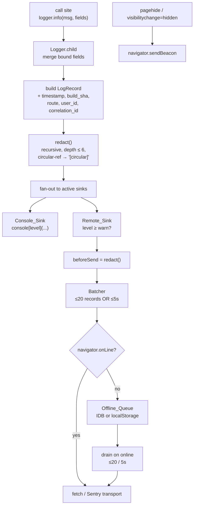
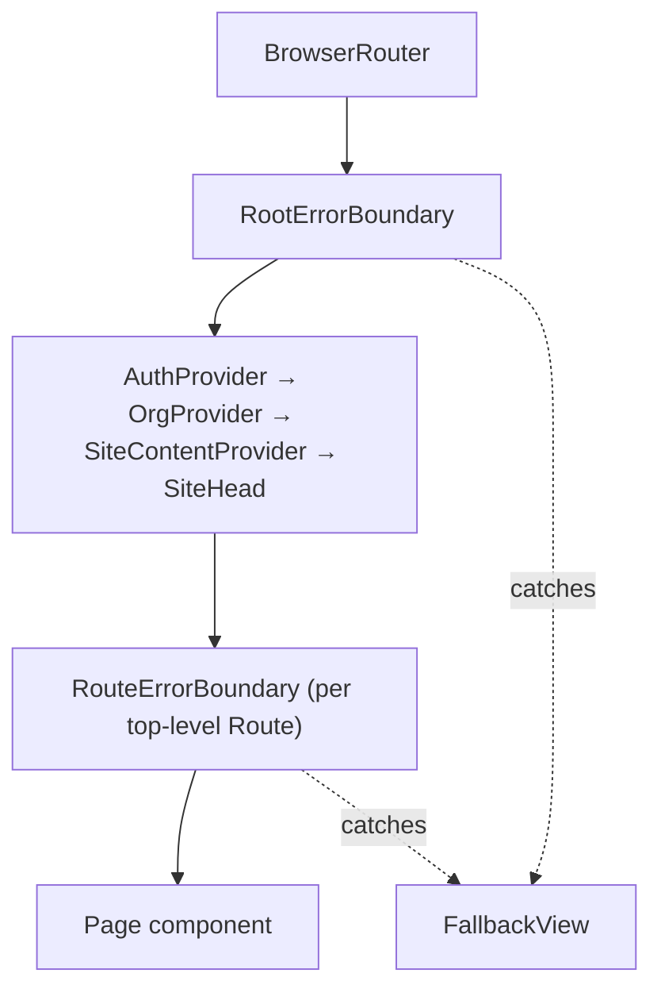
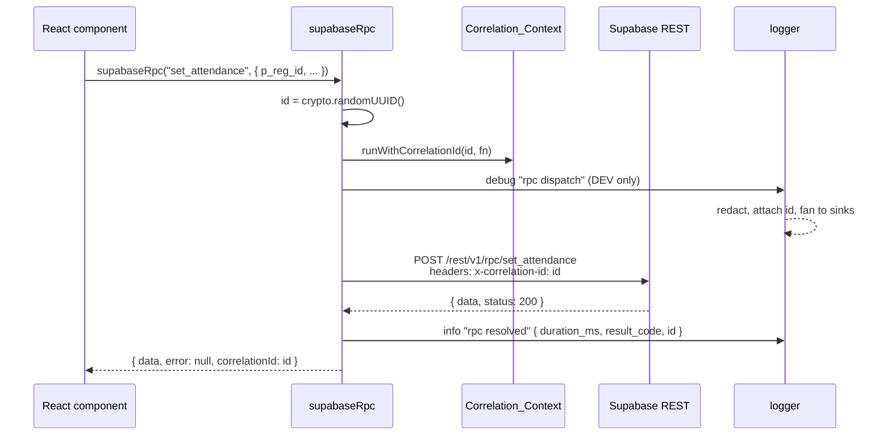
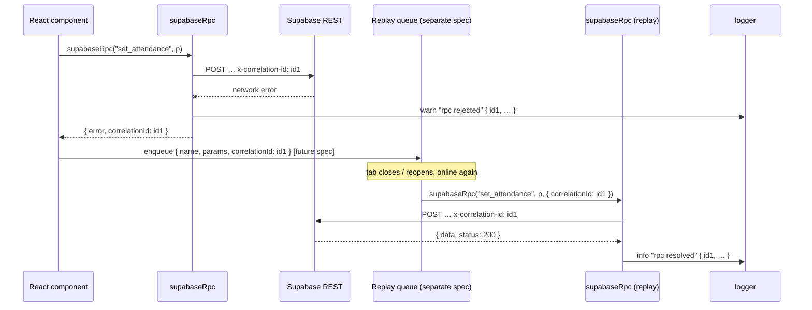
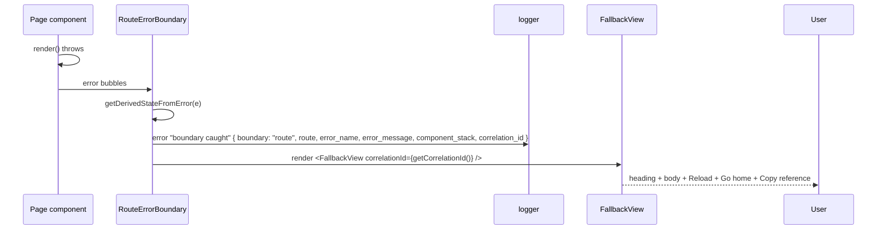
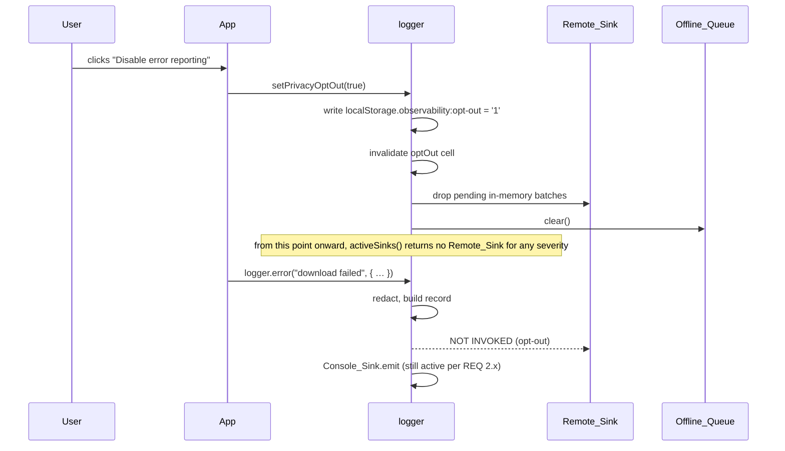

# Design Document — Observability Foundation

## Overview

This design implements the cross-cutting observability layer specified in `requirements.md`. It introduces a single typed `logger` module under `src/lib/observability/`, a Sink-adapter pattern with Console and Remote sinks, a PII redaction routine, a browser-safe Correlation_Context, an Offline_Queue, an RPC wrapper around `supabase.rpc`, and a two-tier React Error Boundary topology with a branded Fallback_View.

The design honours these stack constraints up-front:

- **Vite + React 18 + TS + Tailwind + shadcn/ui + Supabase, no SSR.** The Logger is browser-only. Anywhere a Node primitive (e.g., `AsyncLocalStorage`) would be tempting, the design uses an explicit `runWithCorrelationId(id, fn)` API plus a thin Promise.then patch scoped to the RPC wrapper.
- **No heavy new deps without justification.** Every dependency added is called out in the "Dependency budget" table below, with bundle-size and rationale.
- **Reuse existing RPCs.** The RPC wrapper does not change SQL — `set_attendance` / `bulk_set_attendance` (already shipped in the `checkin-checkout-tabs` spec) and the rest of the existing RPC surface are called the same way; only the client-side wrapper is new.
- **Preserve the live-updates-delayed contract.** `src/components/event/RegistrationsSection.tsx` keeps the exact `console.warn('UI sync failure')` callsite alongside an equivalent `logger.warn(...)`. The lint rule allows it via an inline `eslint-disable-next-line no-console` comment.
- **Future-proof for the offline-replay spec (separate).** The RPC wrapper signature accepts an optional `correlation_id?: string` so a replayed call can reuse the original id.

### Design decisions and rationale (open items)

| # | Decision | Choice | Rationale |
|---|----------|--------|-----------|
| A | Remote sink provider | **Sentry** | Mature SaaS with first-class Vite source-map upload (`@sentry/vite-plugin`), `beforeSend` redaction hook, IP-disable / no-PII flags, generous free tier. Highlight.io has session replay we don't want for privacy. Datadog RUM is overkill and pricier. Self-hosted GlitchTip is plausible but adds ops we don't have. |
| B | Sentry SDK package | **`@sentry/browser`** (not `@sentry/react`) | We don't need the React-specific `<ErrorBoundary>`, profiler, or router instrumentation — we are writing our own boundaries and wrapper. Drops ~25 KB gz vs `@sentry/react`. We import only `BrowserClient`, `defaultStackParser`, `makeFetchTransport`, and `Scope` for tree-shaking. |
| C | Correlation context | **In-house Promise.then patch + `runWithCorrelationId(id, fn)`** | zone.js (~100 KB gz) monkey-patches the world; we only need to thread one id through one Promise chain. Pure argument-passing would force every helper to take `correlationId` — a much larger blast radius than the wrapper's needs. |
| D | Offline queue storage | **Tiny in-house IndexedDB wrapper + localStorage fallback** | The `idb` package is ~3 KB gz, but our needs are a single object store with put/getAll/delete-by-key — ~60 lines hand-rolled. Avoids the dep and avoids `idb`'s broader API surface that we wouldn't review. |
| E | Boot stub location | **`src/main.tsx`, hoisted to line 1** | Inlining in `index.html` works but loses TypeScript and forces us to touch the static HTML on every change. Hoisting in `main.tsx` is the same in practice — Vite ships the boot stub before the rest of the app — and keeps the file in TS. |

### Dependency budget

| Package | Size (min+gz) | Required for | Notes |
|---------|---------------|--------------|-------|
| `@sentry/browser` | ~25 KB gz | Remote_Sink | Tree-shakable; we import only the low-level pieces (`BrowserClient`, transport, stack parser, scope). |
| `@sentry/vite-plugin` | dev-only | source-map upload at build time | Not shipped to bundle |
| (none for IndexedDB) | 0 | Offline_Queue | Hand-rolled wrapper, ~60 LoC |
| (none for correlation) | 0 | Correlation_Context | Hand-rolled, ~30 LoC |

Everything else in this design uses code we write ourselves. No `idb`, no `zone.js`, no `nanoid` (we use `crypto.randomUUID()`), no `cuid`.

---

## Architecture

### Module layout

```
src/lib/observability/
├── index.ts                     # public re-exports: logger, runWithCorrelationId, getCorrelationId, setPrivacyOptOut, supabaseRpc
├── logger.ts                    # Logger class + factory; orchestrates sinks
├── boot.ts                      # window.__observabilityBoot stub installer + drainer
├── correlation.ts               # runWithCorrelationId, getCorrelationId, Promise.then patch (scoped)
├── redaction.ts                 # redact() pure function + Redaction_Set patterns
├── offline-queue.ts             # IndexedDB-backed FIFO with localStorage fallback
├── rpc.ts                       # supabaseRpc(name, params, opts?) wrapper
├── sinks/
│   ├── types.ts                 # Sink interface, LogRecord type
│   ├── console.ts               # Console_Sink
│   └── remote.ts                # Remote_Sink (Sentry adapter)
└── boundaries/
    ├── RootErrorBoundary.tsx    # wraps the whole tree under <BrowserRouter>
    ├── RouteErrorBoundary.tsx   # wraps each top-level route element
    └── FallbackView.tsx         # branded fallback UI with Copy reference / Reload / Go home
```

### Layered data flow



### Concurrency model

The Correlation_Context is a single module-scoped variable `currentCorrelationId: string | null`. `runWithCorrelationId(id, fn)` saves the previous value, sets the new one, calls `fn()`, and restores in a `try/finally`. To thread the id across `await` boundaries inside the wrapped function, `correlation.ts` installs a one-time patch on `Promise.prototype.then` that captures `currentCorrelationId` at the point `.then` is registered and restores it for the duration of the chained callback. The patch is conditional on the active id being non-null, so promises created outside any `runWithCorrelationId` scope are untouched.

This is implemented as a single-line wrapper in `then`:

```ts
const origThen = Promise.prototype.then;
Promise.prototype.then = function patchedThen(onFulfilled, onRejected) {
  const captured = currentCorrelationId;
  const wrap = <T>(cb?: ((v: any) => T)) =>
    cb && ((v: any) => {
      const prev = currentCorrelationId;
      currentCorrelationId = captured;
      try { return cb(v); } finally { currentCorrelationId = prev; }
    });
  return origThen.call(this, wrap(onFulfilled), wrap(onRejected));
};
```

Concurrency isolation (REQ 9.5) holds because each promise callback restores the id captured *at registration time* of that specific `.then`, and concurrent RPC chains register their own `.then`s with their own captured ids. The current id changes deterministically with the call stack, never observed by a callback registered under a different id. See "Correctness Properties → Property 3" for the formal statement.

### Public API surface

```ts
// src/lib/observability/index.ts

export type LogLevel = 'trace' | 'debug' | 'info' | 'warn' | 'error' | 'fatal';

export interface Logger {
  trace(message: string, fields?: Record<string, unknown>): void;
  debug(message: string, fields?: Record<string, unknown>): void;
  info(message: string, fields?: Record<string, unknown>): void;
  warn(message: string, fields?: Record<string, unknown>): void;
  error(message: string, fields?: Record<string, unknown>): void;
  fatal(message: string, fields?: Record<string, unknown>): void;
  child(boundFields: Record<string, unknown>): Logger;
}

export const logger: Logger;

export function runWithCorrelationId<T>(id: string, fn: () => T | Promise<T>): T | Promise<T>;
export function getCorrelationId(): string | null;

export function setPrivacyOptOut(value: boolean): void;
export function getPrivacyOptOut(): boolean;

// Drop-in replacement for supabase.rpc(name, params).
// `opts.correlationId` is the future-hook for offline replay (separate spec).
export interface SupabaseRpcOpts {
  correlationId?: string;
  signal?: AbortSignal;
}
export function supabaseRpc<T = unknown>(
  name: string,
  params?: Record<string, unknown>,
  opts?: SupabaseRpcOpts,
): Promise<{ data: T | null; error: { message: string; code?: string } | null; correlationId: string }>;
```

The wrapper return type adds `correlationId` to what `supabase.rpc` already returns so call sites that need to surface it (e.g., a toast with "Reference: …") can read it directly without consulting `getCorrelationId()` post-hoc. The shape of `data`/`error` is identical to `@supabase/supabase-js` so the rename is mechanical.


---

## Components and Interfaces

### Sink interface (`sinks/types.ts`)

```ts
export interface LogRecord {
  level: LogLevel;
  message: string;
  fields: Record<string, unknown>;     // already redacted
  timestamp: string;                   // ISO 8601
  build_sha: string;                   // VITE_BUILD_SHA, "unknown" if missing
  route: string;                       // window.location.pathname
  correlation_id: string | null;
  user_id: string | null;
}

export interface Sink {
  readonly name: string;
  /** Must never throw. Returning a rejected Promise is allowed; the Logger swallows it. */
  emit(record: LogRecord): void | Promise<void>;
  /** Synchronous flush hook called from `pagehide` / `visibilitychange=hidden`. Beacon-only. */
  flushBeacon?(): void;
  /** Cooperative shutdown for tests. */
  close?(): Promise<void>;
}
```

The Sink interface is the single seam future sinks plug into — a Logflare adapter or a self-hosted endpoint adapter only needs to implement `emit` (and optionally `flushBeacon`) to participate. Adding a sink does not touch the Logger.

### Logger (`logger.ts`)

The Logger is a single class with three responsibilities: build the `LogRecord`, run redaction, fan out to active sinks. It is **not** a singleton class; `index.ts` exports a single live instance, but `logger.child(...)` produces additional instances that share the sinks and only differ in their `boundFields`. Lazy initialization (REQ 1.5, 1.6) is implemented as a guarded `init()` call wrapped in `try/catch`; if init throws once, the Logger flips a permanent `disabled = true` flag and every emit becomes a no-op. The Boot_Buffer (`boot.ts`) catches calls made before `init()` completes.

Per-emit flow (pseudocode):

```ts
emit(level, message, perCallFields) {
  if (this.disabled) return;
  if (!this.initialized) { return this.bootBuffer.push({ level, message, perCallFields }); }

  let record: LogRecord;
  try {
    const merged = { ...this.boundFields, ...perCallFields };
    const redacted = redact(merged);                        // pure
    record = {
      level, message,
      fields: redacted,
      timestamp: new Date().toISOString(),
      build_sha: import.meta.env.VITE_BUILD_SHA ?? 'unknown',
      route: window.location.pathname,
      correlation_id: getCorrelationId(),
      user_id: this.userIdProvider() ?? null,
    };
  } catch (e) {
    // REQ 4.3 — redaction failed; emit a sanitized warn record with redaction_error: true
    record = sanitizedFallbackRecord(level, message);
  }

  for (const sink of this.activeSinks(level)) {
    try {
      const r = sink.emit(record);
      if (r && typeof (r as any).catch === 'function') (r as Promise<void>).catch(() => {});
    } catch { /* REQ 4.1 — never throw */ }
  }
}
```

`activeSinks(level)` enforces level gates (REQ 2.1–2.4) and the privacy opt-out (REQ 2.5, 11.4). The opt-out is read from a memoized cell that is invalidated by `setPrivacyOptOut`; the cell is rechecked on every `emit` so toggling mid-session takes effect immediately (REQ 11.5).

### Console_Sink (`sinks/console.ts`)

Maps Log_Level to `console.method`: `trace→debug`, `debug→debug`, `info→info`, `warn→warn`, `error→error`, `fatal→error`. Emits a single line: `[<level>] <message>`, with the structured fields as the second argument (so devtools renders an expandable object). Honours the production gate (REQ 2.2) — production console gets only `warn`/`error`/`fatal`.

### Remote_Sink (`sinks/remote.ts`)

A thin wrapper over `@sentry/browser`'s low-level `BrowserClient`, configured at init:

```ts
import { BrowserClient, defaultStackParser, makeFetchTransport, getCurrentScope } from '@sentry/browser';

const client = new BrowserClient({
  dsn: import.meta.env.VITE_OBSERVABILITY_DSN,        // empty → no-op
  release: import.meta.env.VITE_BUILD_SHA ?? 'unknown',
  sendDefaultPii: false,                               // REQ 8.5
  defaultIntegrations: false,                          // we don't want auto-breadcrumbs of inputs
  transport: makeFetchTransport,
  stackParser: defaultStackParser,
  beforeSend: (event) => redact(event) as typeof event,// REQ 8.7 — apply our redaction to SDK-collected data too
  beforeSendTransaction: () => null,                   // we don't use perf transactions
});
```

The `Sink.emit` method translates a `LogRecord` to either `client.captureException(...)` (if `fields.error` is an Error) or `client.captureMessage(message, { level, contexts: { observability: fields } })`. Per REQ 8.10, only `user_id` is set on the Sentry scope — never email or name. The Remote_Sink's batcher and Offline_Queue sit *between* the Logger and the Sentry client; we do not rely on Sentry's own queueing because we need control over `sendBeacon` flush behaviour and offline persistence.

If `VITE_OBSERVABILITY_DSN` is empty, `BrowserClient` is never constructed (REQ 8.3). In that case `Sink.emit` is a no-op. This also covers Vitest / dev runs where the env is intentionally unset.

### Redaction (`redaction.ts`)

A pure recursive function `redact(value: unknown, depth = 0, seen = new WeakSet()): unknown`. Behaviour:

1. If `depth > 6`, return the literal `'[truncated]'`. Returning a sentinel rather than recursing further bounds worst-case work at `O(n)` for a tree of `n` nodes within depth 6.
2. If `value` is already `seen`, return `'[circular]'`. Otherwise add to `seen` for objects/arrays.
3. If `value` is a string, replace email / JWT / E.164-phone substrings with `'[redacted-email]' / '[redacted-token]' / '[redacted-phone]'` via the regex set below. Multiple matches in one string each get replaced.
4. If `value` is an Error, return `{ name, message: redact(message), stack: redact(stack) }`.
5. If `value` is a plain object, walk its own enumerable string keys; if a key matches the deny-list (case-insensitive substring match against `password|passwd|secret|token|access_token|refresh_token|authorization|cookie|p_token|p_password`), replace the value with `'[redacted]'` regardless of value type. Otherwise recurse on the value.
6. If `value` is an Array, recurse on each element.
7. Other primitives (number, boolean, null, undefined) pass through unchanged.

Regex set:

| Category | Pattern (JS) |
|----------|--------------|
| email | `/\b[\w.+-]+@[\w-]+\.[\w.-]{2,}\b/g` |
| jwt | `/\beyJ[A-Za-z0-9_-]{8,}\.[A-Za-z0-9_-]{8,}\.[A-Za-z0-9_-]{8,}\b/g` |
| phone (E.164) | `/(?<!\d)\+?\d[\d\s().-]{6,18}\d(?!\d)/g` |

The function is wrapped by `safeRedact()` in `logger.ts` which catches anything thrown (REQ 4.3). Worst-case complexity is O(n × s) where n is node count up to depth 6 and s is the longest string scanned; both are bounded by upstream limits (record size ≤ 16 KB serialized per REQ 5.1).

### Correlation (`correlation.ts`)

```ts
let currentCorrelationId: string | null = null;
let patchInstalled = false;

export function getCorrelationId(): string | null { return currentCorrelationId; }

export function runWithCorrelationId<T>(id: string, fn: () => T | Promise<T>): T | Promise<T> {
  installPromisePatch();
  const prev = currentCorrelationId;
  currentCorrelationId = id;
  try {
    const result = fn();
    if (result && typeof (result as any).then === 'function') {
      return (result as Promise<T>).finally(() => { currentCorrelationId = prev; });
    }
    currentCorrelationId = prev;
    return result;
  } catch (e) {
    currentCorrelationId = prev;
    throw e;
  }
}
```

The `installPromisePatch()` is idempotent and only installed when `runWithCorrelationId` is first called, so test environments and code paths that never use correlation pay zero cost.

### Offline Queue (`offline-queue.ts`)

Schema (IndexedDB store `observability_queue`):

```
key:    auto-increment number     // FIFO order
value:  { record: LogRecord, attempts: number, nextAttemptAt: number /* ms epoch */ }
```

Operations: `enqueue(record)`, `peekBatch(n)` returns up to `n` entries with `nextAttemptAt <= now`, `ack(keys)` deletes by key, `requeue(key, status)` increments `attempts` and sets `nextAttemptAt = now + min(60_000, 1_000 * 2^attempts)`. Cap enforcement (REQ 5.8) runs inside `enqueue`: if `count > 1000`, oldest entries are deleted to bring count to 1000 and a single `'offline queue overflow'` warn is emitted.

LocalStorage fallback (REQ 6.2): same operations against a JSON array under key `observability:queue`. The fallback also enforces the 1000-cap; the IndexedDB-only durability-across-tab-close property (REQ 6.3) is satisfied by a `pagehide` listener that synchronously copies the in-memory queue to localStorage *as a backup* before relying on `sendBeacon` — even if IDB write transactions are still pending at unload, the localStorage snapshot is durable and the next page load will detect and reconcile.

Retry policy (REQ 6.5):

| HTTP status | Action |
|-------------|--------|
| network error | retry (exponential backoff) |
| 408, 425, 429 | retry |
| 5xx (500, 502, 503, 504) | retry |
| Any other 4xx | drop + emit `warn 'remote sink rejected record'` |
| 2xx | ack |

Drain rate is rate-limited (REQ 5.7) to ≤20 records per 5-second sliding window via a token bucket initialized full to 20 with a 5-second refill.

### RPC wrapper (`rpc.ts`)

```ts
export async function supabaseRpc<T = unknown>(
  name: string,
  params: Record<string, unknown> = {},
  opts: SupabaseRpcOpts = {},
) {
  const correlationId = opts.correlationId ?? crypto.randomUUID();    // REQ 9.2 / 9.7
  const startedAt = performance.now();

  return runWithCorrelationId(correlationId, async () => {
    const log = logger.child({ rpc_name: name });
    if (import.meta.env.DEV) log.debug('rpc dispatch', { params });   // REQ 10.1, redacted by logger

    // We use the Supabase REST endpoint directly so we can attach the header.
    // The supabase-js client does not currently expose a per-call header API,
    // so we mirror its rpc() behaviour: POST to /rest/v1/rpc/<name> with the
    // session JWT and apikey, plus our x-correlation-id header.
    const { data, error, status } = await postRpc(name, params, {
      headers: { 'x-correlation-id': correlationId },                 // REQ 9.3
      signal: opts.signal,
    });

    const duration_ms = Math.round(performance.now() - startedAt);
    const result_code = String(status);

    if (error) {
      log.warn('rpc rejected', { duration_ms, result_code, error_message: error.message });  // REQ 9.6, 10.3
    } else {
      const lvl = import.meta.env.DEV ? 'debug' : 'info';             // REQ 9.6, 10.2, 10.4
      log[lvl]('rpc resolved', { duration_ms, result_code });
    }

    return { data, error, correlationId };
  });
}
```

`postRpc` is a thin internal helper. It reads the same envs as the existing supabase client, reuses the active session token from `supabase.auth.getSession()`, and adds our `x-correlation-id` header. We wrap rather than monkey-patch `supabase.rpc` because supabase-js does not currently expose a per-call header hook; intercepting at the higher-level wrapper is cleaner and keeps `src/integrations/supabase/client.ts` untouched.

Existing call sites migrate as `supabase.rpc("foo", { ... })` → `supabaseRpc("foo", { ... })`, which is one rename per call. Existing RPCs (`set_attendance`, `bulk_set_attendance`, `self_check_in`, `toggle_attendance`, `undo_attendance`, etc.) require **zero SQL changes** — the wrapper only adds an HTTP header.

### Boot stub (`boot.ts`)

Hoisted to line 1 of `src/main.tsx`. Installs `window.__observabilityBoot` with the six emit method names, each pushing into a bounded ring of capacity 64 (REQ 12.4). Also installs `window.addEventListener('error', ...)` and `window.addEventListener('unhandledrejection', ...)` handlers that record into the same buffer (REQ 12.5). When `logger.ts` finishes initialization, it calls `__observabilityBoot.__drain__(logger)`, replays records in order, and replaces `window.__observabilityBoot` with a no-op shim (REQ 12.3).

If the buffer overflows during boot (rare — it sizes 64 records before the main bundle loads), the next emit it accepts is `warn 'boot buffer overflowed'` (REQ 4.5), to be flushed as the first record after drain.

### Error boundaries



`RootErrorBoundary` and `RouteErrorBoundary` are two thin React class components that share the same render path (`FallbackView`) but emit different `boundary` field values (`"root"` vs `"route"`) when they log (REQ 7.4). Wiring in `src/App.tsx`:

```tsx
<BrowserRouter>
  <RootErrorBoundary>
    <AuthProvider>
      <OrgProvider>
        <SiteContentProvider>
          <SiteHead />
          <LazyRouteBoundary>
            <Suspense fallback={<FullPageLoader />}>
              <Routes>
                <Route path="/" element={<RouteErrorBoundary><HomeRoute /></RouteErrorBoundary>} />
                {/* …every other top-level route is wrapped the same way */}
              </Routes>
            </Suspense>
          </LazyRouteBoundary>
        </SiteContentProvider>
      </OrgProvider>
    </AuthProvider>
  </RootErrorBoundary>
</BrowserRouter>
```

`LazyRouteBoundary` (already in the codebase) is kept as the chunk-load specialist — it catches dynamic-import errors that the route-level boundary cannot intercept because they happen during Suspense resolution. It will be migrated to use `logger.error` instead of `console.error`, with the same fallback semantics it has today.

`FallbackView` renders:

- A heading: "Something went wrong"
- A short, brand-aligned paragraph: "We've recorded the error and our team has been notified. Try reloading, or head back home."
- A monospace block displaying the active Correlation_Id, or the literal `"no reference"` if none (REQ 7.10).
- A `Button` labelled `"Copy reference"` (disabled when no id) that uses `navigator.clipboard.writeText` (REQ 7.8).
- A `Button` labelled `"Reload"` calling `window.location.reload()` (REQ 7.6).
- A `Button asChild`-wrapped `<Link to="/">Go home</Link>` that also calls `this.setState({ error: null })` via a callback prop, so the boundary resets its caught-error state (REQ 7.7).

The Fallback_View source contains zero `console.*` calls (REQ 7.9). The Copy button has `aria-label="Copy error reference"`, surfaces a `toast.success("Reference copied")` on success, and falls back to selecting the text inside the monospace block via `Range`/`Selection` if the Clipboard API is unavailable.


---

## Data Models

### `LogLevel` and ordering

```ts
export type LogLevel = 'trace' | 'debug' | 'info' | 'warn' | 'error' | 'fatal';
const LEVEL_RANK: Record<LogLevel, number> = { trace: 10, debug: 20, info: 30, warn: 40, error: 50, fatal: 60 };
```

Severity comparisons in the rest of the design read `LEVEL_RANK[level] >= LEVEL_RANK['warn']`.

### `LogRecord`

Defined in `sinks/types.ts` (see Components). The on-the-wire shape sent to Sentry is:

```ts
// captureMessage path
{
  message: string,                          // already redacted? — message is also redacted, see below
  level: 'debug' | 'info' | 'warning' | 'error' | 'fatal', // mapped from LogLevel
  release: build_sha,
  user: { id: user_id } | undefined,
  tags: { route, correlation_id },
  contexts: { observability: fields },      // already redacted
}
// captureException path
captureException(fields.error, { /* same tags / contexts / user */ });
```

The `message` argument to the emit method is also routed through redaction (`redact({ __m: message }).__m`) so that a developer who accidentally interpolates an email into the message string still has it scrubbed.

### `OfflineQueueEntry`

```ts
interface OfflineQueueEntry {
  key: number;                              // IDB autoincrement, or array index in fallback
  record: LogRecord;
  attempts: number;                         // incremented on retryable failure
  nextAttemptAt: number;                    // ms-epoch; ≥ now means eligible
}
```

### `BootBufferEntry`

```ts
interface BootBufferEntry {
  level: LogLevel;
  message: string;
  fields: Record<string, unknown>;
  capturedAt: number;                       // performance.now() at push time, replayed as fields._capturedAt
}
```

### Privacy opt-out persistence

```ts
// localStorage key: 'observability:opt-out'
// Value: '1' (opted out) or absent (opted in).
// Env override: VITE_OBSERVABILITY_OPT_OUT=1 forces opt-out for the whole build.
function getPrivacyOptOut(): boolean {
  if (import.meta.env.VITE_OBSERVABILITY_OPT_OUT === '1') return true;
  try { return localStorage.getItem('observability:opt-out') === '1'; } catch { return false; }
}
```

### Build-time constants

| Constant | Source | Default if absent |
|----------|--------|-------------------|
| `import.meta.env.VITE_BUILD_SHA` | `git rev-parse --short HEAD` resolved in `vite.config.ts` | `'unknown'` |
| `import.meta.env.VITE_OBSERVABILITY_DSN` | `.env` / CI secret | empty → Remote_Sink no-op |
| `import.meta.env.VITE_OBSERVABILITY_OPT_OUT` | `.env` (rare) | unset |
| `OBSERVABILITY_AUTH_TOKEN` | CI secret (Node env, not Vite-exposed) | unset → skip source-map upload with a single warning |


---

## Correctness Properties

*A property is a characteristic or behavior that should hold true across all valid executions of a system — essentially, a formal statement about what the system should do. Properties serve as the bridge between human-readable specifications and machine-verifiable correctness guarantees.*

The acceptance criteria in `requirements.md` were classified per-criterion (see prework). Many criteria collapse onto a small set of flagship properties; the list below is the consolidated set, with each property covering a known group of criteria. Each property is universally quantified and implementable as a single property-based test using `fast-check`.

### Property 1: Redaction is total over the Redaction_Set

*For any* input value `v` — including arbitrarily nested plain objects, arrays, `Error` instances, cyclic graphs, and strings containing embedded email / JWT / E.164-phone substrings — `redact(v)` terminates within finite time and returns a value that, walked exhaustively, contains zero substrings matching the email pattern, zero substrings matching the JWT pattern, zero substrings matching the E.164 phone pattern, and zero values at a deny-list key path other than the literal `'[redacted]'`.

**Validates: Requirements 3.2, 3.3, 3.4, 3.5, 3.6, 3.7, 3.8, 3.9, 8.7, 10.5, 11.2**

### Property 2: The Logger never throws and never leaks rejections

*For any* sequence of emit calls with arbitrary `(level, message, fields)` — including malformed values, deeply nested cycles, and oversized strings — and *for any* combination of sinks that throw synchronously, return rejected promises, or return resolved promises, no emit call throws to the caller and no unhandled promise rejection escapes the Logger.

**Validates: Requirements 1.6, 4.1, 4.2**

### Property 3: Correlation context is causal and concurrency-isolated

*For any* set of N concurrent invocations of `supabaseRpc`, where each invocation `i` either generates a fresh UUIDv4 `c_i` or supplies an explicit `c_i` via the `correlationId` option, every log record emitted causally inside invocation `i` (from any await depth inside its `runWithCorrelationId(c_i, fn)` scope) carries `correlation_id === c_i`, and no log record from invocation `i` is observed with `correlation_id === c_j` for any `j ≠ i`. The outbound request's `x-correlation-id` header equals `c_i`.

**Validates: Requirements 9.2, 9.3, 9.4, 9.5, 9.7**

### Property 4: Privacy opt-out is unconditional across all severities

*For any* sequence of emit calls at any severity, while `getPrivacyOptOut()` returns `true`, the Remote_Sink's `emit` method is invoked zero times.

**Validates: Requirements 2.5, 11.4**

### Property 5: Boot buffer replay preserves order

*For any* sequence of pre-init emit calls of length ≤ 64, after the real Logger initializes and drains the Boot_Buffer, the sequence of records observed by sinks equals the input sequence in order.

**Validates: Requirements 4.4, 12.3**

### Property 6: Sinks only ever see redacted records

*For any* emit, the record passed to any active sink is a fixed point of `redact` — that is, `redact(record.fields)` deep-equals `record.fields`.

**Validates: Requirements 2.7, 3.1**

### Property 7: Offline_Queue is durable and FIFO across tab close

*For any* sequence of emit-while-offline calls followed by a tab-close event, the records recoverable on the next page load equal the offline-emitted sequence in order; and successful delivery to the Remote_Sink removes exactly the delivered record before the next is dispatched.

**Validates: Requirements 5.6, 6.3, 6.4**

### Property 8: Offline drain is rate-limited to ≤ 20 records per 5 s window

*For any* drain timeline starting from any queue size, the count of records dispatched to the Remote_Sink in any 5-second sliding window is ≤ 20.

**Validates: Requirements 5.7**

### Property 9: Live-updates indicator emits exactly one warn per occurrence

*For any* sequence of `liveLag` state transitions in `RegistrationsSection`, the number of `console.warn('UI sync failure')` calls equals the number of off→on transitions of the indicator, and the equivalent `logger.warn(...)` call count equals the same number.

**Validates: Requirements 13.2, 13.5**

---

## Error Handling

This section consolidates the failure-mode contract distributed across the requirements.

### Logger-level failures

| Failure | Behaviour | Requirement |
|---------|-----------|-------------|
| Lazy init throws on first emit | flip `disabled = true`, every subsequent emit is a no-op | 1.6 |
| Sink emit throws synchronously | catch and discard | 4.1 |
| Sink emit returns rejected promise | attach `.catch(() => {})` | 4.2 |
| Redaction throws | emit `warn 'redaction failed'` with `{ redaction_error: true, message }`; do not pass the original record onward | 4.3 |
| Boot buffer overflow | drop oldest, emit one `warn 'boot buffer overflowed'` after drain | 4.5 |

### Remote_Sink failures

| Failure | Behaviour | Requirement |
|---------|-----------|-------------|
| Empty DSN | construct nothing; `emit` is a no-op | 8.3 |
| Network error / timeout / 408/425/429/5xx | requeue with exponential backoff (1 s → 60 s cap) | 6.5 |
| Other 4xx | drop record, emit `warn 'remote sink rejected record'` with `status` | 6.6 |
| `sendBeacon` returns false / unavailable | drop the affected end-of-life batch (no fetch fallback) | 5.5 |

### Boundary-level failures

| Failure | Behaviour | Requirement |
|---------|-----------|-------------|
| Descendant render/lifecycle/commit throw | render Fallback_View, emit `error` log with `boundary`/`route`/`error_name`/`error_message`/`component_stack`/`correlation_id` | 7.3, 7.4 |
| No active correlation id at catch | display `"no reference"` and disable Copy | 7.10 |
| Clipboard API unavailable | fall back to `Range`/`Selection` to allow manual copy | (graceful degradation) |

### Offline_Queue eviction

If `enqueue` would push the queue over 1000 entries, the oldest entries are deleted to bring count to 1000 and a single `warn 'offline queue overflow'` is emitted (REQ 5.8). The eviction is the only path that drops queued records on the client side; everything else is delivered or retried.

### Build-pipeline failures

If `git rev-parse` fails during Vite config evaluation, `VITE_BUILD_SHA` becomes `'unknown'` and the build proceeds (REQ 14.2). If the source-map upload step's auth token is missing, the build prints a single warning and skips the upload step but does not fail (REQ 14.5). The deployment artefact is still safe to ship — it just won't be source-mapped on the Remote_Sink side.

---

## Sequence Diagrams

### 1. Successful RPC with correlation id propagation



### 2. Failed RPC, future offline replay reuses the original id



### 3. Error boundary catches, surfaces the active correlation id



### 4. Privacy opt-out flips mid-session




---

## Build-Time Wiring

### Vite configuration

```ts
// vite.config.ts (additions only)
import { execSync } from 'node:child_process';
import { sentryVitePlugin } from '@sentry/vite-plugin';

function resolveBuildSha(): string {
  try { return execSync('git rev-parse --short HEAD', { stdio: ['ignore', 'pipe', 'ignore'] }).toString().trim(); }
  catch { return 'unknown'; }                                   // REQ 14.2
}

const BUILD_SHA = resolveBuildSha();

export default defineConfig(({ mode }) => ({
  // …existing config…
  define: {
    'import.meta.env.VITE_BUILD_SHA': JSON.stringify(BUILD_SHA), // REQ 14.1
  },
  build: {
    sourcemap: mode === 'production' ? 'hidden' : true,          // REQ 14.3, 8.9
  },
  plugins: [
    react(),
    mode === 'development' && componentTagger(),
    mode === 'production'
      && process.env.OBSERVABILITY_AUTH_TOKEN                    // REQ 14.5 — skip if missing
      && sentryVitePlugin({
           org: process.env.OBSERVABILITY_ORG,
           project: process.env.OBSERVABILITY_PROJECT,
           authToken: process.env.OBSERVABILITY_AUTH_TOKEN,
           sourcemaps: { assets: './dist/**/*.{js,map}', filesToDeleteAfterUpload: './dist/**/*.map' }, // REQ 14.4, 8.9
           release: { name: BUILD_SHA },
         }),
  ].filter(Boolean),
}));
```

If `OBSERVABILITY_AUTH_TOKEN` is missing during a production build, the plugin entry is `false`, the build runs as today, and the `vite.config.ts` itself prints a single `console.warn('[observability] OBSERVABILITY_AUTH_TOKEN not set; skipping source-map upload')` (REQ 14.5). This is the **one** legitimate `console.warn` allowed in build tooling — outside the `src/` lint scope.

### Environment variable documentation

`.env.example` adds:

```dotenv
# Observability — Sentry (or compatible) DSN. Empty = no remote reporting.
VITE_OBSERVABILITY_DSN=""
# Set to "1" to opt the entire build out of remote observability (rare; per-user opt-out is preferred).
VITE_OBSERVABILITY_OPT_OUT=""
```

CI-only (not Vite-exposed):

```bash
# Sentry source-map upload credentials. Missing → upload step is skipped with a warning.
OBSERVABILITY_AUTH_TOKEN=
OBSERVABILITY_ORG=
OBSERVABILITY_PROJECT=
```

### CI pipeline addition

The GitHub Actions / CI step that runs `pnpm build` (or `bun build`) is unchanged; the source-map upload now happens **inside** Vite via `@sentry/vite-plugin`. A post-build smoke check is added:

```bash
# Fail if any *.map file shipped to dist/
if find dist -name '*.map' -type f | grep -q .; then
  echo "::error::Source maps leaked into dist/"; exit 1
fi
```

---

## Migration Plan for Existing `console.*` Calls

There are ~12 files in `src/{components,pages,hooks,lib}` containing `console.*` calls (audited via `grep_search`). The migration table below maps every call to its replacement. The single contractually-mandated callsite in `RegistrationsSection.tsx` keeps the `console.warn` and adds an equivalent `logger.warn`.

| File | Current call | Migration |
|------|--------------|-----------|
| `src/App.tsx:30` | `console.info(`[LazyRoute] loading ${name}`)` | `logger.debug('lazy-route loading', { name })` |
| `src/App.tsx:33` | `console.error(`[LazyRoute] failed to load ${name}`, …)` | `logger.error('lazy-route load failed', { name, error_name, error_message })` |
| `src/components/LazyRouteBoundary.tsx:24` | `console.error('[LazyRoute] render error', …)` | `logger.error('lazy-route render error', { error_name, error_message, stack, componentStack })` |
| `src/components/event/RegistrationsSection.tsx:274` | `console.warn('UI sync failure')` **(KEEP)** | Keep verbatim with `// eslint-disable-next-line no-console -- contract: live-updates-delayed indicator` AND add `logger.warn('ui sync failure', { reg_id })` immediately after |
| `src/components/event/RegistrationsSection.tsx:381,386,419,424` | `console.warn('self_check_in failed', …)` etc. | Replace with `logger.warn('self-check-in failed', { row, error_message })` etc. |
| `src/components/event/AddParticipantDialog.tsx:103` | `console.warn('SignUp error:', …)` | `logger.warn('signup error', { error_message })` |
| `src/components/event/SpeakerManagement.tsx:71,85,91` | `console.error/warn('[SpeakerManagement] …', …)` | `logger.error/warn('speaker management failure', { kind, error_message })` |
| `src/components/event/SponsorManagement.tsx:102,114,119` | `console.error/warn('[SponsorManagement] …', …)` | analogous |
| `src/components/event/attendance/EventAttendanceHistoryDialog.tsx:40` | `console.warn('event audit fetch failed', …)` | `logger.warn('event audit fetch failed', { event_id, error_message })` |
| `src/components/event/attendance/AttendanceHistoryDialog.tsx:39` | `console.warn('audit fetch failed', …)` | `logger.warn('audit fetch failed', { registration_id, error_message })` |
| `src/pages/NotFound.tsx:8` | `console.error('404 …', pathname)` | `logger.warn('not-found route', { pathname })` |
| `src/pages/DiscoverFeed.tsx:37` | `console.error('[DiscoverFeed] events query failed', error)` | `logger.error('discover events query failed', { error_message })` |
| `src/pages/dashboard/AttendeesPage.tsx:58` | `console.error('Failed to fetch attendees:', message)` | `logger.error('fetch attendees failed', { error_message })` |
| `src/lib/event-routes.ts:128` | `console.warn('[event-route-anomaly]', a)` | `logger.warn('event route anomaly', { anomaly: a })` |
| `src/hooks/usePortalAccess.ts:25` | `console.warn('[usePortalAccess]', message)` | `logger.warn('portal access fetch failed', { error_message })` |
| `src/hooks/useApplications.ts:371` | `console.warn('sponsor_members upsert:', message)` | `logger.warn('sponsor members upsert failed', { error_message })` |

`scripts/check-event-slugs.mjs` and `scripts/audit-quickview-tokens.mjs` are Node scripts and remain outside the `src/**` lint scope, so they keep their `console.*` calls.

### ESLint rule

```js
// eslint.config.js (additions to the rules block of the src/**/*.{ts,tsx} entry)
'no-console': ['error', { allow: [] }],     // total ban inside src/**; the only allowed callsite carries an eslint-disable-next-line
```

Per-file overrides are not needed because the single allowlisted call uses an inline disable comment. CI runs `pnpm lint` and fails on any new `console.*`.

### Migration order (avoids a single mega-PR)

1. Land the Logger module + Boot stub + ESLint rule with an exemption for all current files (`'no-console': 'warn'`). CI starts surfacing warnings.
2. Migrate files in batches (3–5 files per PR) flipping each to `logger.*`.
3. Once all files are migrated, flip the rule from `'warn'` to `'error'` in a final PR.
4. The `RegistrationsSection.tsx` PR is the **last** in the batch and lands together with the eslint-disable-line comment so the strict rule passes.

This staged migration is what guarantees that the `console.warn('UI sync failure')` contract is preserved at every step (it is never deleted; the equivalent `logger.warn` is added alongside in step 2 for that file).

---

## Documentation Deliverables

### `docs/observability.md`

Structure:

1. **Why** — what this layer is for and why we don't use `console.*`.
2. **Quick start** — three short examples:
   ```ts
   import { logger, supabaseRpc } from '@/lib/observability';
   logger.info('clicked rsvp', { event_id });
   logger.error('rsvp failed', { event_id, error_message: err.message });
   const { data, error, correlationId } = await supabaseRpc('set_attendance', { p_reg_id });
   if (error) toast.error('Could not check in', { description: `Reference: ${correlationId}` });
   ```
3. **Log levels** — when to use trace/debug/info/warn/error/fatal.
4. **Structured fields** — the recommended field names (`event_id`, `org_id`, `error_message`, `duration_ms`, `result_code`); deny-list keys to avoid (`token`, `password`, etc.).
5. **Correlation ids** — how to read `getCorrelationId()` and surface it in error toasts.
6. **Privacy and opt-out** — link to `docs/observability-privacy.md`.
7. **FAQ** — "why does my email get redacted?", "what happens offline?", "how do I add a new sink?".

### `docs/observability-privacy.md`

Structure:

1. **What we collect** — log records of severity warn / error / fatal, error stack traces, route, user id, build sha, correlation id.
2. **What we do not collect** — emails, names, phone numbers, JWTs, passwords, raw IP addresses (the SDK is configured to drop them on the server), input field values, page session replay.
3. **Retention** — 30 days at the provider (Sentry).
4. **Opt-out** — how to flip it from the in-app settings UI; what happens when you do (in-memory batches and the offline queue are cleared, no further records leave the browser).
5. **Where the data lives** — provider region, who has access, how to request deletion.

### README addition

A new top-level "Observability" section linking to both docs.

---

## Rollout / Migration Plan

The rollout is sequenced so that:

- The live `console.warn('UI sync failure')` contract is preserved at every step.
- Production builds without `VITE_OBSERVABILITY_DSN` continue to ship safely (the Remote_Sink no-ops; one `console.warn` is printed at build time per REQ 14.5).
- Source maps are uploaded to Sentry but never shipped to `dist/` from the first production build that has the plugin enabled.

Phases:

1. **Phase A — Logger landing (no migration yet).** Add `src/lib/observability/`, the boot stub, the Vite config changes, and the docs files. ESLint rule installed at `'warn'`. The Remote_Sink is wired but DSN is empty in dev and staging — verify in production with a small canary org first.
2. **Phase B — Error boundaries.** Add `RootErrorBoundary` and `RouteErrorBoundary` and wrap routes in `src/App.tsx`. `LazyRouteBoundary` migrates from `console.error` to `logger.error` in this phase.
3. **Phase C — RPC wrapper rollout.** Migrate call sites file-by-file. Each PR flips `supabase.rpc(name, params)` to `supabaseRpc(name, params)` and is small enough to review carefully. The wrapper passes through the same `data`/`error` shape so smoke tests don't change.
4. **Phase D — `console.*` migration batches.** As described above.
5. **Phase E — Lint flip.** Promote `'no-console'` from `'warn'` to `'error'`. CI then enforces the canonical channel.
6. **Phase F — Remote_Sink in production.** Set `VITE_OBSERVABILITY_DSN` for production builds and `OBSERVABILITY_AUTH_TOKEN` for the CI source-map upload step. Verify a controlled error surfaces in the Sentry inbox with a source-mapped stack and the correct `release` tag.

At every phase, the Logger remains lazy / never throws (Property 2), so a partial rollout cannot crash the app.

---

## Testing Strategy

### Tooling

- **Unit + property tests:** `vitest` (already in repo) with `fast-check` (already in `devDependencies`).
- **DOM tests:** `@testing-library/react` + `jsdom` (already in repo).
- **Bench:** `vitest bench` for the perf budget (REQ 5.1) with a generous CI threshold.
- **Build smoke:** the post-build `find dist -name '*.map'` shell check.
- **Lint:** `pnpm lint` with the new `no-console: 'error'` rule.

### Property-based tests (1 PBT per Correctness Property, ≥100 iterations each)

Each PBT is tagged with a comment of the form:

```
// Feature: observability-foundation, Property N: <property text>
```

Mapping:

| Test file | Property | Notes |
|-----------|----------|-------|
| `src/lib/observability/__tests__/redaction.property.test.ts` | Property 1 | Generator: `fc.anything()` plus injection of email / JWT / phone fragments at random nested positions; cycles via `fc.letrec`. Walks output and asserts no remaining matches. |
| `src/lib/observability/__tests__/logger-never-throws.property.test.ts` | Property 2 | Sink that throws synchronously / returns rejected Promise / returns resolved Promise with random `(level, message, fields)` and asserts no throw / no unhandled rejection. |
| `src/lib/observability/__tests__/correlation.property.test.ts` | Property 3 | N concurrent invocations of `runWithCorrelationId(c_i, fn)`, each `fn` schedules random awaits and emits logs; asserts every captured `correlation_id` equals the parent's `c_i` and the `x-correlation-id` header matches. |
| `src/lib/observability/__tests__/optout.property.test.ts` | Property 4 | With `getPrivacyOptOut() = true`, generate arbitrary emit sequences and assert Remote_Sink call count is 0. |
| `src/lib/observability/__tests__/boot-replay.property.test.ts` | Property 5 | Generate sequences ≤ 64 of pre-init emits; init Logger; assert sink-captured order equals input order. |
| `src/lib/observability/__tests__/sink-receives-redacted.property.test.ts` | Property 6 | Stub sink captures records; assert `redact(record.fields)` deep-equals `record.fields`. |
| `src/lib/observability/__tests__/offline-durability.property.test.ts` | Property 7 | Use a fake IDB (`fake-indexeddb` only if needed; otherwise an in-memory shim). Generate emit-while-offline sequences; simulate `pagehide`; reload; assert recovered list equals enqueued. |
| `src/lib/observability/__tests__/drain-rate.property.test.ts` | Property 8 | Fake clock; generate queue prefill + drain timeline; assert any 5 s window has ≤ 20 dispatches. |
| `src/components/event/__tests__/registrations-live-warn.property.test.ts` | Property 9 | Render `RegistrationsSection` with stubbed realtime; toggle `liveLag` a random number of times; assert `console.warn('UI sync failure')` and `logger.warn` call counts equal off→on transitions. |

### Example / unit tests

| File | What it covers |
|------|----------------|
| `src/lib/observability/__tests__/logger-init.test.ts` | REQ 1.1, 1.5: import shape; no I/O at module load. |
| `src/lib/observability/__tests__/redaction-failure.test.ts` | REQ 4.3: forced redaction throw → `warn 'redaction failed'`. |
| `src/lib/observability/__tests__/boot-overflow.test.ts` | REQ 4.5: 65 pre-init emits → 64 retained + overflow warn. |
| `src/lib/observability/__tests__/sendBeacon-flush.test.ts` | REQ 5.3, 5.4: `pagehide` and `visibilitychange=hidden` trigger `sendBeacon`; no `fetch` fallback. |
| `src/lib/observability/__tests__/offline-cap.test.ts` | REQ 5.8: 1001 enqueued → 1000 retained + single overflow warn. |
| `src/lib/observability/__tests__/optout-toggle.test.ts` | REQ 11.5, 11.6: `setPrivacyOptOut(true)` clears in-memory batch and queue within one tick. |
| `src/lib/observability/__tests__/remote-sink-config.test.ts` | REQ 8.5, 8.6, 8.10: SDK options and user-id-only payload. |
| `src/lib/observability/__tests__/sentry-release-tag.test.ts` | REQ 8.4: every captured event has `release === build_sha`. |
| `src/lib/observability/__tests__/dsn-empty-noop.test.ts` | REQ 8.3: empty DSN → no transport call. |
| `src/lib/observability/__tests__/rpc-prefix-debug-prod.test.ts` | REQ 10.4: under PROD shim, no pre-dispatch debug. |
| `src/lib/observability/__tests__/non-retryable-drop.test.ts` | REQ 6.6: 401/403/404/422 → drop + warn. |
| `src/lib/observability/boundaries/__tests__/RootErrorBoundary.test.tsx` | REQ 7.3, 7.4, 7.5: boundary catches, emits the structured error log, renders FallbackView. |
| `src/lib/observability/boundaries/__tests__/RouteErrorBoundary.test.tsx` | same with `boundary: "route"`. |
| `src/lib/observability/boundaries/__tests__/FallbackView.test.tsx` | REQ 7.5–7.10: copy button, reload, go home, no-reference state. |
| `src/lib/observability/__tests__/no-console-in-fallback.test.ts` | REQ 7.9: source-grep for `console.` in `FallbackView.tsx`. |
| `tests/build/no-source-maps-in-dist.test.ts` | REQ 8.9, 14.4: post-build smoke that `dist/**/*.map` is empty. |

### Bench

`src/lib/observability/__tests__/emit-budget.bench.ts` — emits a 16 KB-serialized record 1000× and asserts mean per-call wall time < 50 ms (CI-friendly threshold; the requirement of 5 ms is for a controlled hardware baseline and is checked manually before each release on a representative laptop).

### Configuration

- Property tests run with `fc.assert(prop, { numRuns: 100 })` minimum; the redaction property runs 500 because its generator space is the largest.
- Tag every property test with the `// Feature: observability-foundation, Property N: …` comment so the relationship to the design document is grep-able.

