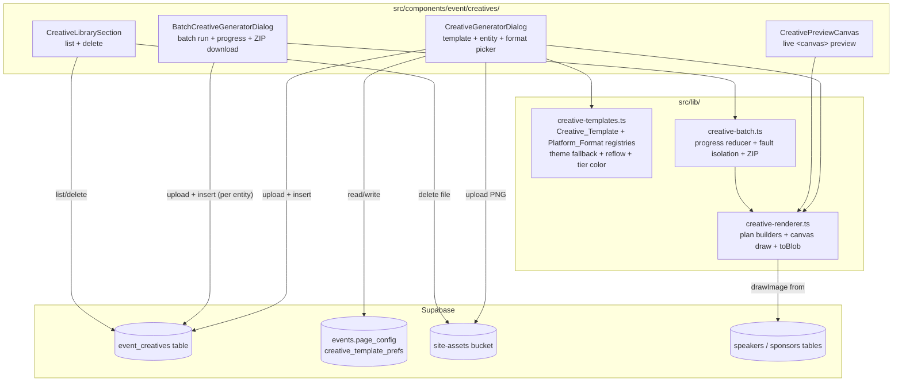

# Design Document: Social Creative Generator

## Overview

The Creative_Generator lets an organizer produce branded, platform-sized PNG
promotional graphics for speakers and sponsors on an event, without a designer and
without leaving the app. It follows the same architectural pattern already proven by
the badge system (`src/lib/badge-design.ts` + `src/lib/print-badges.ts`): a
declarative, code-defined template model populated with entity data and rendered
client-side. The key difference is the rendering target — badges render to HTML for
`window.print()`, whereas creatives render to an off-screen `<canvas>` and export
fixed-pixel PNGs via `canvas.toBlob()`, because social/email platforms require exact
pixel dimensions that print HTML cannot guarantee.

Three new library modules do the work, grouped under `src/lib/creatives/`
(following the same directory-per-feature convention as `src/lib/attendance/`):

- **`src/lib/creatives/creative-templates.ts`** — `Creative_Template` type +
  static preset registry (speaker/sponsor/combo), `Platform_Format` registry, and
  the pure layout-resolution functions (theme fallback, aspect-ratio reflow, tier
  color lookup).
- **`src/lib/creatives/creative-renderer.ts`** — the `Creative_Canvas_Renderer`:
  pure "render plan" builders (`buildSpeakerPlan`, `buildSponsorPlan`,
  `buildComboPlan`) plus the canvas-drawing functions that turn a plan into a
  `Blob` (`renderSpeakerCreative`, `renderSponsorCreative`, `renderComboCreative`).
- **`src/lib/creatives/creative-batch.ts`** — the `Batch_Generator`:
  progress-reducer, per-entity fault isolation, and ZIP archive assembly for a
  batch run.

Persistence follows the existing Supabase patterns: a new `event_creatives` table
records each successful render (mirroring `event_speakers`/`event_sponsors` RLS
conventions), template *selection* is stored as JSON on `events.page_config`
(no new preference table — see Data Models below for the rationale), and rendered
PNGs upload to the existing `site-assets` Storage bucket exactly like speaker
photos and sponsor logos.

New UI lives under `src/components/event/creatives/`, following the settings-panel
+ live-preview layout already established by `PrintBadgesDialog.tsx`.

## Architecture



**Rendering pipeline (single creative):**

1. Organizer picks an entity (Speaker/Sponsor, or a Speaker+Sponsor pair for Combo),
   a `Creative_Template`, and one or more `Platform_Format`s.
2. `buildXPlan(entity, template, eventTheme)` (pure) resolves theme fallback,
   computes reflowed element bounds for the target aspect ratio, and fits text —
   producing a `RenderPlan`: a flat list of positioned elements (photo/logo/text/
   background/tier-badge) with resolved pixel geometry. No canvas or DOM involved.
3. `renderPlanToCanvas(plan, format)` (imperative) draws the plan onto an
   off-screen `<canvas>` sized exactly to the `Platform_Format`'s pixel dimensions,
   then `canvas.toBlob("image/png")` exports the PNG.
4. The dialog uploads the blob to `site-assets` and inserts an `event_creatives`
   row.

Separating step 2 (pure, testable) from step 3 (imperative, canvas-only) is what
makes the correctness properties in this design practical to test with fast-check —
the plan-construction and layout-resolution logic never touches the DOM.

## Components and Interfaces

### `src/lib/creatives/creative-templates.ts`

```typescript
export type CreativeType = "speaker" | "sponsor" | "combo";

/** Named output specification matching a target social/email surface. */
export type PlatformFormatId =
  | "linkedin-post" | "instagram-post" | "instagram-story" | "twitter-post" | "email-banner";

export interface PlatformFormat {
  id: PlatformFormatId;
  label: string;        // e.g. "LinkedIn Post"
  width: number;         // px
  height: number;        // px
}

export const PLATFORM_FORMATS: PlatformFormat[] = [
  { id: "linkedin-post",    label: "LinkedIn Post",    width: 1200, height: 627  },
  { id: "instagram-post",   label: "Instagram Post",   width: 1080, height: 1080 },
  { id: "instagram-story",  label: "Instagram Story",  width: 1080, height: 1920 },
  { id: "twitter-post",     label: "Twitter/X Post",   width: 1600, height: 900  },
  { id: "email-banner",     label: "Email Banner",     width: 600,  height: 200  },
];

/** Background fill — mirrors FrontBgStyle in badge-design.ts, image type added. */
export type CreativeBgStyle =
  | { type: "solid"; color: string }
  | { type: "gradient"; from: string; to: string; angle: number }
  | { type: "image"; url: string; fit: "cover" | "contain" };

/** Anchor + size for an image element (photo/logo), in % of the template's
 *  AUTHORED canvas (see aspect ratio below) — reflowed to px at render time. */
export interface ImageSlot {
  xPct: number; yPct: number;      // center anchor, 0..100
  widthPct: number; heightPct: number; // box size, 0..100 of authored canvas
  shape: "circle" | "rounded-rect" | "rect";
}

/** Text placement — mirrors ElementPlacement in badge-design.ts. */
export interface TextSlot {
  key: "name" | "title" | "company" | "tierBadge" | "presentedBy" | "sponsorName";
  xPct: number; yPct: number;
  maxWidthPct: number; maxHeightPct: number; // box the text must fit inside
  fontFamily: string; fontWeight: number;
  baseSizePx: number;   // authored size at the template's authored dimensions
  color: string;
  align: "left" | "center" | "right";
  transform?: "none" | "uppercase";
}

export interface CreativeTemplate {
  id: string;
  type: CreativeType;
  name: string;
  description: string;
  /** Authored canvas dimensions this template's slot %s were designed against. */
  authoredWidth: number;
  authoredHeight: number;
  background: CreativeBgStyle;
  /** Element slots, keyed by role. Combo templates use `speakerPhoto`/
   *  `sponsorLogo` prefixes; speaker/sponsor templates use their own subset. */
  imageSlots: Partial<Record<"photo" | "logo" | "speakerPhoto" | "sponsorLogo", ImageSlot>>;
  textSlots: TextSlot[];
  /** Divider/"presented by" marker — combo templates only. */
  divider?: { xPct: number; yPct1: number; yPct2: number; color: string };
  /** Theme-overridable fields: which colors/logo this template pulls from
   *  Event_Theme when defined, falling back to the values above otherwise. */
  themeOverridable: { background?: boolean; accentTextKeys?: TextSlot["key"][] };
}

export const SPEAKER_TEMPLATES: CreativeTemplate[] = [ /* "Spotlight", "Minimal", "Bold Card" */ ];
export const SPONSOR_TEMPLATES: CreativeTemplate[] = [ /* "Tier Badge", "Logo Feature" */ ];
export const COMBO_TEMPLATES:   CreativeTemplate[] = [ /* "Presented By", "Split Panel" */ ];

export function templatesFor(type: CreativeType): CreativeTemplate[];

// ─── Theme resolution (Property 1) ───────────────────────────────────────────

export interface EventTheme {
  primaryColor?: string;
  accentColor?: string;
  orgLogoUrl?: string;
}

/** Resolve a template's background against the event's theme, falling back to
 *  the template's own default when the theme value is undefined. Pure. */
export function resolveBackground(template: CreativeTemplate, theme: EventTheme): CreativeBgStyle;

/** Resolve a text slot's accent color against the theme, if that slot key is
 *  listed in `themeOverridable.accentTextKeys`. Pure. */
export function resolveAccentColor(template: CreativeTemplate, slotKey: TextSlot["key"], theme: EventTheme): string;

// ─── Sponsor tier color (Property 5) ─────────────────────────────────────────

/** Same platinum/gold/silver/bronze/custom → color mapping as the `TIERS`
 *  constant in SponsorManagement.tsx, re-exported here for the renderer so
 *  the two stay in sync (single source of truth imported by both). */
export function tierAccentColor(tier: string): string;

// ─── Aspect-ratio reflow (Property 9) ────────────────────────────────────────

export interface ResolvedBox { x: number; y: number; width: number; height: number; }

/** Reflow every slot's %-based geometry from the template's authored aspect
 *  ratio onto a target Platform_Format's pixel dimensions, guaranteeing every
 *  resulting box is fully contained within [0,width] x [0,height]. Pure. */
export function reflowTemplate(
  template: CreativeTemplate,
  format: PlatformFormat
): { imageSlots: Record<string, ResolvedBox>; textSlots: Record<string, ResolvedBox> };
```

**Aspect-ratio reflow strategy.** Each template is authored against a canonical
canvas (e.g. 1200×1200). `reflowTemplate` converts every slot's percentage-based
`xPct/yPct/widthPct/heightPct` into absolute pixels against the *target*
`Platform_Format` dimensions directly — percentages are already
resolution-independent, so reflowing is a straight percent→pixel multiply against
the new width/height. The one adjustment needed for very different aspect ratios
(e.g. authored 1:1 → target 1080×1920 story) is a **safe-area clamp**: after
computing each box, `reflowTemplate` clamps `x`, `y` so `x + width <= targetWidth`
and `y + height <= targetHeight` (and `x, y >= 0`), which is exactly what Property 9
verifies. This is simpler than a full constraint-solver relayout and is sufficient
because template authors design slots with margin already built into the
percentages (no slot is authored edge-to-edge).

### `src/lib/creatives/creative-renderer.ts`

```typescript
export interface SpeakerLike {
  id: string; name: string; photo_url?: string | null;
  title?: string | null; designation?: string | null; company?: string | null;
}
export interface SponsorLike {
  id: string; name: string; logo_url?: string | null; tier: string; tier_label?: string | null;
}

/** One resolved, drawable unit. Produced by the plan builders (pure);
 *  consumed by `drawPlan` (canvas-only). */
export type PlanElement =
  | { kind: "background"; style: CreativeBgStyle }
  | { kind: "image"; role: "photo" | "logo"; url: string | null; box: ResolvedBox; shape: ImageSlot["shape"]; placeholderInitial?: string }
  | { kind: "text"; key: TextSlot["key"]; text: string; box: ResolvedBox; fontFamily: string; fontWeight: number; color: string; align: TextSlot["align"] }
  | { kind: "divider"; x: number; y1: number; y2: number; color: string };

export interface RenderPlan {
  format: PlatformFormat;
  elements: PlanElement[];
}

// ─── Plan builders (Properties 3, 4, 6, 7) ──────────────────────────────────

export function buildSpeakerPlan(
  speaker: SpeakerLike, template: CreativeTemplate, format: PlatformFormat, theme: EventTheme
): RenderPlan;

export function buildSponsorPlan(
  sponsor: SponsorLike, template: CreativeTemplate, format: PlatformFormat, theme: EventTheme
): RenderPlan;

/** Throws `ComboEntityNotLinkedError` if either entity is not linked to the
 *  event (checked by the caller passing pre-validated linkage — see
 *  `assertComboEligible`, Property 7). */
export function buildComboPlan(
  speaker: SpeakerLike, sponsor: SponsorLike, template: CreativeTemplate, format: PlatformFormat, theme: EventTheme
): RenderPlan;

export class ComboEntityNotLinkedError extends Error {}

/** Validates a Combo_Creative request against the event's linked speaker/sponsor
 *  id sets. Pure — takes id sets, not Supabase calls. Property 7. */
export function assertComboEligible(
  speakerId: string, sponsorId: string,
  eventSpeakerIds: ReadonlySet<string>, eventSponsorIds: ReadonlySet<string>
): void; // throws ComboEntityNotLinkedError if either is missing

// ─── Text fitting (Property 10) ─────────────────────────────────────────────

export interface FitResult { lines: string[]; fontSizePx: number; }

/** Given text, a box (px), a starting font size, and a canvas 2D context's
 *  `measureText`, returns wrapped lines and a (possibly shrunk) font size such
 *  that every line's measured width <= box.width and total wrapped height
 *  (lines.length * lineHeight) <= box.height. Pure given a measure function,
 *  so it's testable without a real canvas using a deterministic mock
 *  measurer (e.g. width = text.length * fontSizePx * 0.55). */
export function fitText(
  text: string, box: ResolvedBox, baseSizePx: number,
  measure: (text: string, fontSizePx: number) => number
): FitResult;

// ─── Canvas drawing (imperative, not property-tested) ───────────────────────

export function drawPlan(ctx: CanvasRenderingContext2D, plan: RenderPlan): Promise<void>;

/** Render one entity at one format and return the PNG blob. Composes
 *  buildXPlan + an off-screen canvas + drawPlan + toBlob. */
export function renderSpeakerCreative(speaker: SpeakerLike, template: CreativeTemplate, format: PlatformFormat, theme: EventTheme): Promise<Blob>;
export function renderSponsorCreative(sponsor: SponsorLike, template: CreativeTemplate, format: PlatformFormat, theme: EventTheme): Promise<Blob>;
export function renderComboCreative(speaker: SpeakerLike, sponsor: SponsorLike, template: CreativeTemplate, format: PlatformFormat, theme: EventTheme): Promise<Blob>;

// ─── Filenames (Property 11) ─────────────────────────────────────────────────

/** e.g. "jane-doe-linkedin-post.png". Sanitizes the entity name to a
 *  filesystem-safe slug and appends the format label's slug + ".png". Pure. */
export function creativeFilename(entityName: string, format: PlatformFormat): string;
```

**Missing-field handling (Property 3).** `buildSpeakerPlan`/`buildSponsorPlan`
never throw on a missing `photo_url`/`logo_url`/`title`/`company`: a missing photo
produces a `PlanElement` with `role: "photo"`, `url: null`, and
`placeholderInitial` set to the speaker's first initial (drawn as a colored circle
with the initial, satisfying Requirement 2.2); a missing logo produces no `image`
element and instead an extra `text` element rendering the sponsor's name in the
logo's box (Requirement 3.2); a missing title/company simply omits that `text`
element from the plan (Requirement 2.3) rather than emitting one with empty text.

**Native-dimension logo sizing (Property 4).** Requirement 3.3 requires the logo be
drawn at its *native* pixel dimensions rather than stretched to the template's logo
box. `buildSponsorPlan` cannot know natural image dimensions synchronously (pure
function, no image load) — so the plan's logo `box` is the *anchor point + max box*
declared by the template, and `drawPlan` (the imperative, canvas-touching step)
loads the image, reads `naturalWidth/naturalHeight`, and positions the image at its
native size *centered on* the slot's anchor, downscaling only if the native size
would overflow the max box (never upscaling or stretching). This keeps the
easily-testable part (never stretch beyond native size) in a small pure helper:

```typescript
/** Given a slot's anchor+max box and an image's native pixel size, compute the
 *  final draw box: native size if it fits, else uniformly downscaled to fit —
 *  never upscaled, never non-uniformly stretched. Pure. Property 4. */
export function nativeSizedLogoBox(
  slot: ResolvedBox, naturalWidth: number, naturalHeight: number
): ResolvedBox;
```

### `src/lib/creatives/creative-batch.ts`

```typescript
export interface BatchTarget<T> { entity: T; }
export type BatchOutcome<T> =
  | { entity: T; status: "success"; blob: Blob; format: PlatformFormat; filename: string }
  | { entity: T; status: "failed"; format: PlatformFormat; error: string };

/** Runs `render` for every (entity × selected format) pair, isolating
 *  per-pair failures. Property 14 (fault isolation). */
export async function runBatch<T extends { id: string }>(
  entities: T[],
  formats: PlatformFormat[],
  render: (entity: T, format: PlatformFormat) => Promise<Blob>,
  onProgress?: (completed: number, total: number) => void
): Promise<BatchOutcome<T>[]>;

// ─── Progress reducer (Property 13) ─────────────────────────────────────────

export interface BatchProgress { completed: number; total: number; }
export function progressReducer(state: BatchProgress, event: "completed"): BatchProgress;

// ─── ZIP archive (Property 15) ──────────────────────────────────────────────

/** Builds a ZIP Blob containing every successful outcome's PNG, named by
 *  `creativeFilename`. Uses `fflate` (see Testing Strategy / dependency note). */
export async function buildBatchArchive<T>(outcomes: BatchOutcome<T>[]): Promise<Blob>;
```

**ZIP library choice.** Neither `jszip` nor any zip library is currently a
dependency (`package.json` has no `zip`/`jszip`/`fflate` entry). I'm proposing
**`fflate`** pinned at an exact version (`0.8.2`, the latest stable release as of
this design) over `jszip`: it's ~8KB min+gzip vs. jszip's ~100KB, has zero
dependencies, and its synchronous `zipSync`/`strToU8` API is a straightforward fit
for building an in-memory archive from a list of `Blob`s (converted to
`Uint8Array` via `arrayBuffer()`). This is a new runtime dependency — flagging per
the dependency-addition guidance; let me know if a different library is preferred.

### UI: `src/components/event/creatives/`

```
src/components/event/creatives/
├── CreativeGeneratorDialog.tsx        // single-creative flow (Req 1, 2, 3, 4, 5, 7)
├── BatchCreativeGeneratorDialog.tsx   // batch flow (Req 6)
├── CreativeLibrarySection.tsx         // list + delete (Req 8)
├── CreativePreviewCanvas.tsx          // shared <canvas> preview, used by both dialogs
├── EntityPicker.tsx                   // speaker / sponsor / combo-pair picker
└── TemplatePicker.tsx                 // per-type template thumbnail picker
```

**`CreativeGeneratorDialog`** mirrors `PrintBadgesDialog`'s two-pane layout: left
pane has Creative type tabs (Speaker/Sponsor/Combo), `TemplatePicker`, `EntityPicker`,
and a `Platform_Format` multi-select checklist; right pane hosts
`CreativePreviewCanvas`, debounced-refreshing on any selection change (same 400ms
debounce pattern as `PrintBadgesDialog`'s `refreshPreview`). The footer's primary
action calls `renderXCreative` once per selected format, uploads each to
`site-assets`, inserts `event_creatives` rows, and offers per-file downloads plus a
"Save template as event default" toggle that persists the selection via
`saveCreativeTemplatePref` (see Data Models).

**`BatchCreativeGeneratorDialog`** reuses `TemplatePicker` + format multi-select
(no entity picker — targets "all speakers" or "all sponsors" for the event), calls
`runBatch`, renders a progress bar bound to `progressReducer` state, and on
completion shows a per-entity success/failure list plus a single "Download all
(.zip)" button wired to `buildBatchArchive`.

**`CreativeLibrarySection`** queries `event_creatives` ordered by `created_at desc`,
renders a thumbnail grid, and a delete action per row that calls the delete
orchestration (Property 18) before removing the row from local state.

**Entry point:** added as a new sidebar section in `EventDetailPage.tsx`
(`{ label: "Creatives", icon: ImageIcon, key: "creatives" }`, lazy-loaded like
`ApplicationsSectionLazy`), rendered as
`activeSection === "creatives" && <CreativesSectionLazy eventId={event.id} />`,
where `CreativesSection` composes the library list with buttons that open the two
dialogs.

## Data Models

### `event_creatives` table (new migration)

```sql
CREATE TABLE public.event_creatives (
  id uuid PRIMARY KEY DEFAULT gen_random_uuid(),
  event_id uuid NOT NULL REFERENCES public.events(id) ON DELETE CASCADE,
  creative_type text NOT NULL CHECK (creative_type IN ('speaker','sponsor','combo')),
  speaker_id uuid REFERENCES public.speakers(id) ON DELETE SET NULL,
  sponsor_id uuid REFERENCES public.sponsors(id) ON DELETE SET NULL,
  template_id text NOT NULL,
  platform_format text NOT NULL,
  asset_url text NOT NULL,
  storage_path text NOT NULL,
  created_by uuid NOT NULL,
  created_at timestamptz NOT NULL DEFAULT now(),
  CONSTRAINT event_creatives_entity_check CHECK (
    (creative_type = 'speaker' AND speaker_id IS NOT NULL AND sponsor_id IS NULL) OR
    (creative_type = 'sponsor' AND sponsor_id IS NOT NULL AND speaker_id IS NULL) OR
    (creative_type = 'combo'   AND speaker_id IS NOT NULL AND sponsor_id IS NOT NULL)
  )
);
CREATE INDEX event_creatives_event_idx ON public.event_creatives(event_id, created_at DESC);

ALTER TABLE public.event_creatives ENABLE ROW LEVEL SECURITY;

-- Same organizer/admin-scoped pattern as event_speakers / event_sponsors (Req 9).
CREATE POLICY "Owner view event_creatives" ON public.event_creatives
  FOR SELECT TO authenticated
  USING (EXISTS (SELECT 1 FROM public.events WHERE id = event_id AND (user_id = auth.uid() OR has_role(auth.uid(), 'admin'))));

CREATE POLICY "Owner manage event_creatives" ON public.event_creatives
  FOR ALL TO authenticated
  USING (EXISTS (SELECT 1 FROM public.events WHERE id = event_id AND (user_id = auth.uid() OR has_role(auth.uid(), 'admin'))))
  WITH CHECK (EXISTS (SELECT 1 FROM public.events WHERE id = event_id AND (user_id = auth.uid() OR has_role(auth.uid(), 'admin'))));

GRANT SELECT, INSERT, UPDATE, DELETE ON public.event_creatives TO authenticated;
```

This follows `event_speakers`/`event_sponsors` exactly: SELECT and ALL are both
scoped to the event's owner (`events.user_id = auth.uid()`) or an admin — there is
no "public/anon view" policy here (unlike `event_speakers`) because creatives are
an organizer tool, not public event-page content, matching Requirement 9's
"restrict... to that event's owning organizer and users with the admin role."

Storage: rendered PNGs upload to the existing `site-assets` bucket under a new
`event-creatives/{event_id}/` prefix, reusing the bucket's existing
`storage.objects` RLS policies (`"Public read site-assets"`, `"Authenticated
upload/update/delete site-assets"` from migration section `008_site_assets_org_
upload.sql`) — no new bucket or policy is created, satisfying Requirement 9.3.

### Template selection persistence — `events.page_config`, not a new table

**Decision: store creative template preferences inside `events.page_config` JSON,
not a new `event_creative_templates` table.**

Rationale, based on how `page_config` is actually used in this codebase
(`src/components/event/page-form/types.ts`, `EventPageForm.tsx`):

- `page_config` is already the established place for **per-event JSON preferences
  that don't need relational structure, foreign keys, or RLS finer than the event
  row itself** — it holds `ThemeConfig`, `SeoConfig`, section ordering, etc., all
  read/written wholesale via `normalizeConfig(event.page_config)` and
  `.update({ page_config: config })`.
- The data being persisted here — "which `template_id` is the default for
  `speaker`/`sponsor`/`combo` on this event" — is exactly that shape: a small,
  event-scoped preference map with no need for its own primary key, timestamps, or
  independent RLS (it's already covered by the `events` row's existing RLS).
  Creating a dedicated table would need its own RLS policies duplicating
  `events` ownership checks for no relational benefit, since Creative_Templates
  themselves are static code, not rows to join against.
- This mirrors the requirements' own framing (`requirements.md` decision #5):
  "Template *selection*... is persisted per-event; Creative_Templates themselves
  are static, code-defined presets... not a new database-backed template
  builder" — a new table would contradict "not a new database-backed template
  builder" by creating exactly that.

```typescript
// Added to EventPageConfig (src/components/event/page-form/types.ts) — additive,
// optional field so existing saved configs remain valid via normalizeConfig's
// forward-merge pattern.
export interface EventPageConfig {
  // ...existing fields (v, theme, sections, seo, etc.)
  creativeTemplatePrefs?: Partial<Record<CreativeType, string>>; // type -> template_id
}
```

```typescript
// src/lib/creatives/creative-templates.ts
export function saveCreativeTemplatePref(
  config: EventPageConfig, type: CreativeType, templateId: string
): EventPageConfig; // pure — returns a new config; caller persists via existing
                     // events.update({ page_config }) path used by EventPageForm

export function readCreativeTemplatePref(
  config: EventPageConfig, type: CreativeType
): string | undefined;
```

The dialog reads the current pref via `readCreativeTemplatePref` after
`normalizeConfig(event.page_config)`, and on "Save as event default" writes back
through the same `supabase.from("events").update({ page_config })` call already
used by `EventPageForm.tsx` — no new persistence code path.

### Confirmed existing columns (read from `000_full_schema.sql`)

**`speakers`**: `id, user_id, name, email, bio, photo_url, company, designation,
title, first_name, last_name, mobile_country_code, mobile_number, linkedin_url,
company_website, company_employee_count, industry, created_at, updated_at`.
The Creative_Generator uses `name`, `photo_url`, `company`, and
`designation`/`title` (both exist; `title` is used preferentially with
`designation` as fallback, matching the badge system's `BadgeData.title` mapping
convention).

**`sponsors`**: `id, user_id, name, email, logo_url, website, tier, tier_label,
description, created_at, updated_at`. The Creative_Generator uses `name`,
`logo_url`, `tier` (`platinum`/`gold`/`silver`/`bronze`/`custom`), and `tier_label`
(display label when `tier = 'custom'`).

**`event_speakers`** / **`event_sponsors`**: link tables with `event_id`,
`speaker_id`/`sponsor_id`, `display_order` — used by `assertComboEligible` (via a
query for the event's linked speaker/sponsor id sets) to validate Requirement 4.3.

No fields are invented beyond these; `bio`, `email`, `website`, `description` etc.
exist but are out of scope per the requirements (only name/photo/title/company for
speakers; name/logo/tier for sponsors).

## Correctness Properties

*A property is a characteristic or behavior that should hold true across all valid
executions of a system — essentially, a formal statement about what the system
should do. Properties serve as the bridge between human-readable specifications and
machine-verifiable correctness guarantees.*

### Property 1: Theme resolution with fallback

*For any* `CreativeTemplate` and any `EventTheme` (with any subset of
`primaryColor`/`accentColor`/`orgLogoUrl` defined or undefined), `resolveBackground`
and `resolveAccentColor` return the theme's value when it is defined for an
overridable field, and the template's own built-in default when it is undefined —
and when `orgLogoUrl` is undefined, the resolved plan omits the logo element rather
than rendering an empty/broken image.

**Validates: Requirements 1.2, 1.3**

### Property 2: Template selection persistence round-trip

*For any* `EventPageConfig`, `CreativeType`, and `template_id` string, calling
`readCreativeTemplatePref(saveCreativeTemplatePref(config, type, templateId), type)`
returns exactly `templateId`, and preferences for other Creative types already
present in `config` are left unchanged.

**Validates: Requirements 1.4**

### Property 3: Missing optional fields are handled gracefully

*For any* `SpeakerLike` or `SponsorLike` with any subset of its optional fields
(`photo_url`, `title`, `company` for speakers; `logo_url` for sponsors) set to
`null`/`undefined`, building that entity's render plan never throws, includes a
text/image element for every *present* optional field with the correct value, and
either omits the element (missing title/company) or substitutes a documented
fallback element (placeholder initial for missing photo, styled name text for
missing logo) for every *missing* optional field — with no element left rendering
empty text.

**Validates: Requirements 2.2, 2.3, 3.2**

### Property 4: Sponsor logo is never upscaled or stretched

*For any* logo slot box and any natural image width/height, `nativeSizedLogoBox`
returns a box whose width and height either equal the natural width/height exactly
(when it fits within the slot) or are uniformly downscaled by the same factor on
both axes (when it doesn't fit) — never upscaled beyond native size and never
scaled by different factors on each axis.

**Validates: Requirements 3.3**

### Property 5: Sponsor tier accent color mapping

*For all* sponsor tier values (`platinum`, `gold`, `silver`, `bronze`, `custom`),
`tierAccentColor(tier)` returns the same color as the existing `TIERS` mapping in
`SponsorManagement.tsx` for that tier.

**Validates: Requirements 3.4**

### Property 6: Combo creative structural completeness

*For any* valid speaker and sponsor pair and any Combo `CreativeTemplate`,
`buildComboPlan` produces a plan that contains the speaker's photo/placeholder and
name elements, the sponsor's logo/name elements, and at least one `divider` element
separating the two.

**Validates: Requirements 4.1, 4.2**

### Property 7: Combo creative rejects entities not linked to the event

*For any* speaker id, sponsor id, and any two sets representing the event's linked
speaker ids and sponsor ids, `assertComboEligible` throws
`ComboEntityNotLinkedError` if and only if the speaker id is absent from the linked
speaker set or the sponsor id is absent from the linked sponsor set; it does not
throw when both are present.

**Validates: Requirements 4.3**

### Property 8: Rendered output matches the exact target pixel dimensions

*For any* `Platform_Format` and any valid render plan, the canvas produced by
`renderSpeakerCreative` / `renderSponsorCreative` / `renderComboCreative` has
`width` and `height` exactly equal to that `Platform_Format`'s declared `width` and
`height`.

**Validates: Requirements 5.2**

### Property 9: Reflowed element bounds stay within canvas

*For any* `CreativeTemplate` and any `Platform_Format` (regardless of how far its
aspect ratio differs from the template's authored aspect ratio), every box
returned by `reflowTemplate` satisfies `box.x >= 0`, `box.y >= 0`,
`box.x + box.width <= format.width`, and `box.y + box.height <= format.height`.

**Validates: Requirements 5.3**

### Property 10: Text always fits within its element's bounds

*For any* text string (including very long strings and strings with no whitespace
to wrap on) and any element box, `fitText` returns wrapped lines and a font size
such that every line's measured width is `<= box.width` and the total wrapped text
block height is `<= box.height`.

**Validates: Requirements 10.1, 10.2**

### Property 11: Download filenames are valid and traceable

*For any* entity name string (including unicode, punctuation, path separators, and
empty/whitespace-only strings) and any `Platform_Format`, `creativeFilename`
returns a string ending in `.png` that contains no filesystem-unsafe characters
(`/ \ : * ? " < > |`) and whose non-empty portion is derived from both the
sanitized entity name and the format's label.

**Validates: Requirements 5.4**

### Property 12: Batch run covers every entity exactly once with consistent settings

*For any* non-empty list of entities and any non-empty list of selected
`Platform_Format`s, `runBatch` produces exactly one outcome per (entity, format)
pair, every outcome's `format` is one of the selected formats, and (when a single
template id is passed through to the `render` callback for every call) every
successful outcome was rendered with that same template id.

**Validates: Requirements 6.1, 6.2, 6.3**

### Property 13: Batch progress is monotonic and bounded

*For any* total count `N` and any sequence of `"completed"` events fed into
`progressReducer`, the resulting `completed` value is non-decreasing across the
sequence and never exceeds `N`.

**Validates: Requirements 6.4**

### Property 14: Batch failures are isolated and completely reported

*For any* list of entities and any subset of them chosen to fail (via a mocked
`render` callback), `runBatch`'s returned outcomes partition the entity set exactly
— every entity appears in exactly one outcome, entities in the failing subset have
`status: "failed"`, and all others have `status: "success"`, regardless of the
order in which entities are processed.

**Validates: Requirements 6.5**

### Property 15: Batch archive contains exactly the successful creatives

*For any* list of `BatchOutcome`s, `buildBatchArchive` produces a ZIP blob whose
entries — when read back — have exactly the filenames and byte contents of the
`status: "success"` outcomes (and no entries for `status: "failed"` outcomes).

**Validates: Requirements 6.6**

### Property 16: Creative asset records are fully populated from their inputs

*For any* render result (entity, `CreativeType`, `Platform_Format`, uploaded asset
URL/path), the constructed `event_creatives` insert payload has non-empty
`event_id`, `creative_type`, `template_id`, `platform_format`, `asset_url`, and
`storage_path` fields whose values match the inputs, and has `speaker_id`/
`sponsor_id` populated consistently with `creative_type` per the table's check
constraint.

**Validates: Requirements 8.1**

### Property 17: Creative library lists most-recent-first

*For any* list of `event_creatives`-shaped records with arbitrary `created_at`
timestamps (including duplicate timestamps), the library's sort function returns
them ordered such that no record's `created_at` is later than the `created_at` of
any record before it in the result.

**Validates: Requirements 8.2**

### Property 18: Delete orchestration always attempts both steps and reports partial failure

*For any* combination of mocked storage-delete success/failure and mocked
database-delete success/failure, the delete orchestration invokes both the storage
delete and the database delete exactly once each, and its reported outcome is
`"success"` only when both succeeded, otherwise identifies which step(s) failed.

**Validates: Requirements 8.3**

### Property 19: Authorization matches the owner-or-admin rule

*For any* event owner id, requester id, and admin boolean flag, the authorization
predicate used to gate creative generation, batch generation, and library access
returns `true` if and only if the requester id equals the owner id or the admin
flag is `true`, and returns `false` for every other combination.

**Validates: Requirements 9.1, 9.2**

## Error Handling

- **Missing/broken photo or logo images** (`img.onerror` during `drawPlan`'s image
  load, or a `photo_url`/`logo_url` that 404s): caught per-image; `drawPlan` falls
  back to the same placeholder path as a `null` URL (placeholder initial for
  photos, styled name text for logos) and calls
  `logger.warn("creative image load failed", { entity_id, url, kind })` — the
  overall render still completes and produces a usable PNG rather than failing the
  whole creative.
- **`fitText` cannot fit text even at the minimum font size** (extremely long
  unbroken strings): falls back to truncating with an ellipsis at the minimum
  size, and logs `logger.warn("creative text truncated", { key, text_length,
  box_width, box_height })`. This keeps Property 10's "always within bounds"
  guarantee true (truncated text still measures within bounds) while avoiding
  infinite shrink loops.
- **Combo request for an unlinked entity** (`ComboEntityNotLinkedError`): caught by
  `CreativeGeneratorDialog`, shown via `toast.error` with an explanatory message
  ("This sponsor isn't assigned to this event"), and logged with
  `logger.warn("combo creative rejected", { event_id, speaker_id, sponsor_id,
  reason })`. No render is attempted (Requirement 4.3).
- **Storage upload failure** (single creative or one entity within a batch): the
  single-creative path surfaces `toast.error("Upload failed", { description })`
  and logs `logger.error("creative upload failed", { event_id, entity_id,
  platform_format, error_message })`; the batch path records that entity/format
  pair as `status: "failed"` (Property 14) and continues the run rather than
  aborting, per Requirement 6.5.
- **`event_creatives` insert failure after a successful upload**: logged via
  `logger.error("creative record insert failed", { event_id, storage_path,
  error_message })` and surfaced to the user with a retry action; the uploaded
  file is not silently orphaned — the same storage path is reused on retry via
  `upsert: true` to avoid duplicate files.
- **Delete orchestration partial failure** (Property 18): if the storage delete
  succeeds but the DB delete fails (or vice versa), `CreativeLibrarySection` shows
  a toast identifying which step failed and leaves the row in the list (if the DB
  record still exists) so the organizer can retry, logged via
  `logger.error("creative delete partial failure", { asset_id, storage_deleted,
  record_deleted })`.
- **Unauthorized access** (Property 19 predicate returns `false`): the RLS
  policies on `event_creatives` and `site-assets` are the actual enforcement
  boundary (Requirement 9.2); the UI-level check only prevents rendering a dialog
  the user can't use and logs `logger.warn("creative access denied", { event_id,
  user_id })` — no client-side check is treated as the security boundary.

All logging uses `logger` from `@/lib/observability`; no `console.*` calls are
introduced anywhere in the new code, per the project's hard rule.

## Testing Strategy

**Unit tests** (Vitest), colocated under `src/lib/creatives/__tests__/` for the
pure functions and `src/components/event/creatives/__tests__/` for component
wiring:

- `creative-templates.test.ts` — static registry shape (Requirement 5.1: exactly
  the five named formats with exact dimensions; Requirement 1.1: template registry
  covers all three Creative types).
- `creative-renderer.test.ts` — example tests for the happy-path plan contents
  (Requirement 2.1, 2.4, 3.1: photo drawn without `ctx.filter`/transform applied),
  and `drawPlan`'s image-load-failure fallback path (integration-style, using a
  jsdom `Image` mock).
- `CreativeGeneratorDialog.test.tsx` / `CreativePreviewCanvas.test.tsx` — component
  tests for live preview update-on-selection-change (Requirement 7.1, 7.2), using
  React Testing Library, asserting the canvas redraw is triggered rather than
  pixel-diffing.
- `creative-library.integration.test.ts` — 1-2 examples against a test Supabase
  project (or mocked client) verifying the real upload + insert path
  (Requirement 8.1's I/O half) and the real ordered query (Requirement 8.2's I/O
  half), per the INTEGRATION classification from the prework analysis.

**Property-based tests** (`fast-check`, already a devDependency), one test file
per property under `src/lib/creatives/__tests__/property-NN-*.pbt.test.ts`,
following the exact numbering/tagging convention used by
`src/lib/attendance/__tests__/`:

- Each test file's header comment states
  `// Feature: social-creative-generator, Property N: <title>` and
  `// Validates: Requirements X.Y, ...`, matching the existing attendance PBT
  files' header format.
- Each property test uses `fc.assert(fc.property(...), { numRuns: 100 })` at
  minimum, per the project's property-test configuration requirement.
- `fitText` (Property 10) is tested with a deterministic mock `measure` function
  rather than a real `CanvasRenderingContext2D`, since `measureText` isn't
  available in the Vitest/jsdom environment without a canvas polyfill — this keeps
  the property pure and fast (no jsdom canvas dependency needed).
- `drawPlan`, `renderSpeakerCreative`/`renderSponsorCreative`/`renderComboCreative`,
  and `buildBatchArchive`'s actual ZIP byte encoding are **not** property-tested
  directly (canvas drawing is imperative/side-effecting, and DOM `HTMLCanvasElement`
  isn't reliably available in Vitest/jsdom) — instead, Property 8 (exact pixel
  dimensions) and Property 15 (archive contents) are tested against the *plan* and
  *outcome list* respectively using an `OffscreenCanvas`-or-mock-canvas shim
  (`{ width, height, toBlob }`) that records what it was asked to draw, which is
  sufficient to verify dimension and content-set correctness without a real
  browser canvas.
- Property 19 (authorization) mirrors the pattern of the existing
  `attendance/__tests__/property-08-authorization.pbt.test.ts` file structure.

**New dependency**: `fflate@0.8.2` (exact pin) added to `dependencies` for ZIP
archive assembly (Property 15, Requirement 6.6) — no existing zip library was
found in `package.json`.

**Test file layout summary:**

```
src/lib/creatives/
├── creative-templates.ts
├── creative-renderer.ts
├── creative-batch.ts
└── __tests__/
    ├── creative-templates.test.ts                          (unit)
    ├── creative-renderer.test.ts                            (unit)
    ├── property-01-theme-resolution.pbt.test.ts
    ├── property-02-template-pref-roundtrip.pbt.test.ts
    ├── property-03-missing-optional-fields.pbt.test.ts
    ├── property-04-native-logo-sizing.pbt.test.ts
    ├── property-05-tier-color-mapping.pbt.test.ts
    ├── property-06-combo-structural-completeness.pbt.test.ts
    ├── property-07-combo-unlinked-rejection.pbt.test.ts
    ├── property-08-exact-pixel-dimensions.pbt.test.ts
    ├── property-09-reflow-bounds.pbt.test.ts
    ├── property-10-text-fit.pbt.test.ts
    ├── property-11-filename-composition.pbt.test.ts
    ├── property-12-batch-coverage-consistency.pbt.test.ts
    ├── property-13-batch-progress-monotonic.pbt.test.ts
    ├── property-14-batch-fault-isolation.pbt.test.ts
    ├── property-15-batch-archive-contents.pbt.test.ts
    ├── property-16-asset-record-completeness.pbt.test.ts
    ├── property-17-library-ordering.pbt.test.ts
    ├── property-18-delete-orchestration.pbt.test.ts
    └── property-19-authorization.pbt.test.ts

src/components/event/creatives/
├── CreativeGeneratorDialog.tsx
├── BatchCreativeGeneratorDialog.tsx
├── CreativeLibrarySection.tsx
├── CreativePreviewCanvas.tsx
├── EntityPicker.tsx
├── TemplatePicker.tsx
└── __tests__/
    ├── CreativeGeneratorDialog.test.tsx
    ├── CreativePreviewCanvas.test.tsx
    └── creative-library.integration.test.ts
```

(Library modules placed under `src/lib/creatives/` rather than flat in `src/lib/`
to group the three cohesive modules + their tests together, following the same
directory-per-feature convention as `src/lib/attendance/`.)
