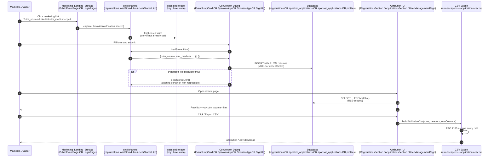

# Design Document: UTM Attribution Coverage

## Overview

This feature extends the **UTM_Attribution** pattern already shipped for
attendee registrations (commit `638c185`) to three additional conversion
surfaces: **Speaker_Application**, **Sponsor_Application**, and
**User_Profile** (organizer signup). Every design decision here is either
a direct reuse of an existing helper (`captureUtm`, `loadStoredUtm`,
`clearStoredUtm` in `src/lib/utm.ts`) or an application of a shipped
pattern to a new surface (RFC 4180-escaped CSV export, `via <utm_source>`
inline hint, five-field Attribution section in a detail dialog).

The design is strictly additive:

- **No changes to the shipped attendee path.** `EventRsvpCard.tsx`,
  `RegistrationsSection.tsx`, `RegistrantQuickView.tsx`, and the
  `registrations` table stay byte-identical. Requirement 6
  (non-regression) is a structural guarantee — not a policy — because
  this spec never edits those files.
- **No changes to `src/lib/utm.ts`.** The existing `captureUtm` /
  `loadStoredUtm` / `clearStoredUtm` API surface is sufficient; only new
  call sites are added.
- **No changes to `utm_clicks` or `event_utm_summary`.** Analytics
  aggregation stays scoped to click-tracking + attendee registrations,
  matching decision #4 in the requirements intro.

The additive surface is:

- **One new migration** — `026_utm_attribution_coverage.sql` — adding
  the five `utm_*` text columns to `speaker_applications`,
  `sponsor_applications`, and `profiles`; a new
  `handle_new_user_utm_fields()` trigger extension that reads UTM from
  `auth.users.raw_user_meta_data` and stamps them onto the new
  `profiles` row.
- **One new pure client-side module** — `src/lib/utm/csv-escape.ts` —
  the shared RFC 4180 CSV cell escaper used by every export in this
  spec, with a `throwOnUnserializable` mode that surfaces Requirement
  10.6 / 11.3's "abort on escape failure" contract as a caught
  exception.
- **Capture wiring** in `src/pages/LoginPage.tsx` (one `useEffect`
  calling `captureUtm(window.location.search)` on mount).
- **Insert wiring** in `SpeakerApplicationDialog.tsx`,
  `SponsorApplicationDialog.tsx`, and the LoginPage sign-up submit path,
  each reading `loadStoredUtm()` immediately before its insert and
  threading the five keys through — mirroring
  `EventRsvpCard.tsx:232-236`.
- **Display extensions** in `ApplicationsSection.tsx` (inline `via
  <source>` hint under each Application row + read-only Attribution
  section in each detail view) and `UserManagementPage.tsx` (per-row
  hint + detail-drawer Attribution section, gated on Admin_View).
- **CSV exports** — one new `applications-csv.ts` helper plus new
  export actions in `ApplicationsSection.tsx` (Speaker + Sponsor tabs)
  and an extended existing export in `UserManagementPage.tsx`. All
  three exports share the same header layout convention: the row's
  domain columns first, then the five contiguous trailing UTM columns
  in `utm_source`, `utm_medium`, `utm_campaign`, `utm_content`,
  `utm_term` order.
- **`src/integrations/supabase/types.ts`** — regenerated (hand-edited
  per the workspace convention documented in the AI backgrounds and
  creative-customization specs) so the three affected table types
  include the new UTM columns.

Backward compatibility: because every hook point in the pipeline
short-circuits when `loadStoredUtm()` returns nothing (all five
UTM_Fields land as SQL NULL — Requirement 1.5), a user who arrives at any
of the four conversion surfaces without a UTM-tagged link continues to
produce rows byte-identical to the pre-feature schema shape. Existing
rows in `speaker_applications`, `sponsor_applications`, and `profiles`
are migrated to `NULL` for all five UTM_Fields per Requirement 1.6, so
already-persisted rows have well-defined UTM values immediately after
migration.

## Architecture

The attribution pipeline is fundamentally the same for every conversion
surface: **capture → store → read → stamp → display → export**. What
changes across surfaces is only *where* the capture and stamping call
sites live.



**Two design invariants make Requirement 6 (Attendee_Registration
non-regression) a structural guarantee:**

1. This spec does not import from, reference, or modify
   `EventRsvpCard.tsx`, `RegistrationsSection.tsx`, or
   `RegistrantQuickView.tsx`. The attendee display + export code paths
   are literally untouched.
2. The `registrations` table's UTM columns and RLS policies remain
   exactly as they are in `000_full_schema.sql` line 8672+. Migration
   `026` only touches `speaker_applications`, `sponsor_applications`,
   and `profiles`.

**Non-regression check at Task 17 (final checkpoint):** every test file
under `src/components/event/__tests__/RegistrationsSection.*.test.ts`
and every property test that references the `registrations` schema must
still pass with zero test changes.

## Components and Interfaces

### New: `supabase/migrations/026_utm_attribution_coverage.sql`

Additive migration touching three tables and one existing trigger
function. No new indexes on `applications`/`profiles` UTM columns (those
tables are queried by `event_id` / `user_id`, not by UTM values — indexing
UTM would only be worth the write cost when we build application/profile
UTM analytics, a future spec per decision #4).

```sql
-- ─── 1. speaker_applications: add UTM_Fields ────────────────────────────
alter table public.speaker_applications
  add column if not exists utm_source   text,
  add column if not exists utm_medium   text,
  add column if not exists utm_campaign text,
  add column if not exists utm_content  text,
  add column if not exists utm_term     text;

-- ─── 2. sponsor_applications: add UTM_Fields ────────────────────────────
alter table public.sponsor_applications
  add column if not exists utm_source   text,
  add column if not exists utm_medium   text,
  add column if not exists utm_campaign text,
  add column if not exists utm_content  text,
  add column if not exists utm_term     text;

-- ─── 3. profiles: add UTM_Fields ────────────────────────────────────────
alter table public.profiles
  add column if not exists utm_source   text,
  add column if not exists utm_medium   text,
  add column if not exists utm_campaign text,
  add column if not exists utm_content  text,
  add column if not exists utm_term     text;

comment on column public.speaker_applications.utm_source is
  'First-touch UTM source captured from the tab''s sessionStorage at submission time. See spec .kiro/specs/utm-attribution-coverage/';
comment on column public.sponsor_applications.utm_source is
  'First-touch UTM source captured from the tab''s sessionStorage at submission time. See spec .kiro/specs/utm-attribution-coverage/';
comment on column public.profiles.utm_source is
  'First-touch UTM source read from auth.users.raw_user_meta_data by the handle_new_user trigger at account creation.';

-- ─── 4. handle_new_user trigger extension ──────────────────────────────
-- Reads utm_source/medium/campaign/content/term from
-- auth.users.raw_user_meta_data (populated by LoginPage's supabase.auth.signUp
-- `options.data` payload — Requirement 5.1) and stamps them onto the new
-- profiles row (Requirement 5.2).
--
-- Missing metadata keys and empty-string values persist as SQL NULL per
-- Requirement 1.5 / 5.2. The trigger is CREATE OR REPLACE so it drops
-- straight onto the existing definition without a DROP first.

create or replace function public.handle_new_user()
returns trigger
language plpgsql
security definer
set search_path = public
as $$
declare
  meta jsonb := coalesce(new.raw_user_meta_data, '{}'::jsonb);
  v_utm_source   text := nullif(trim(meta->>'utm_source'),   '');
  v_utm_medium   text := nullif(trim(meta->>'utm_medium'),   '');
  v_utm_campaign text := nullif(trim(meta->>'utm_campaign'), '');
  v_utm_content  text := nullif(trim(meta->>'utm_content'),  '');
  v_utm_term     text := nullif(trim(meta->>'utm_term'),     '');
begin
  -- ...preserve every existing field the trigger currently sets
  --    (account_type, display_name, first_name, last_name, etc.);
  --    only the utm_* extraction and UPSERT columns are new below.

  insert into public.profiles (
    id, email,
    -- ...existing columns...
    utm_source, utm_medium, utm_campaign, utm_content, utm_term
  ) values (
    new.id, new.email,
    -- ...existing values from the current trigger body...
    v_utm_source, v_utm_medium, v_utm_campaign, v_utm_content, v_utm_term
  )
  on conflict (id) do update set
    -- ...existing on-conflict columns...
    utm_source   = coalesce(public.profiles.utm_source,   excluded.utm_source),
    utm_medium   = coalesce(public.profiles.utm_medium,   excluded.utm_medium),
    utm_campaign = coalesce(public.profiles.utm_campaign, excluded.utm_campaign),
    utm_content  = coalesce(public.profiles.utm_content,  excluded.utm_content),
    utm_term     = coalesce(public.profiles.utm_term,     excluded.utm_term);

  return new;
end
$$;
```

**Critical migration note on `handle_new_user`.** The trigger's existing
body (fields the current implementation copies from `raw_user_meta_data`
into `profiles`) must be preserved verbatim during the CREATE OR REPLACE.
The design cannot include the existing body inline because it lives in
`000_full_schema.sql` and may have been amended by later migrations in
the local workspace. **Task 1.2 explicitly reads the current trigger
definition via `pg_get_functiondef()` before writing the migration and
splices only the UTM-related lines in**, rather than rewriting the whole
function. This prevents accidentally reverting any earlier trigger
change.

**RLS policies:** the three affected tables already have RLS enabled
(`speaker_applications`, `sponsor_applications` are event-scoped; `profiles`
is `id = auth.uid()` for self, plus admin-role bypass). Adding columns
does not change RLS scope — Requirement 13's "same policies as parent
row" is satisfied by inheriting the table's existing policies with zero
policy edits.

### Extension: `src/lib/utm.ts`

**No API surface change.** The existing helpers are sufficient:

```typescript
// Existing (shipped, unchanged in this spec):
export type UtmParams = { utm_source?: string; utm_medium?: string; ... };
export function captureUtm(search: string, force?: boolean): UtmParams;
export function loadStoredUtm(): UtmParams;
export function clearStoredUtm(): void;
export function hasUtm(u: UtmParams): boolean;
```

The 512-character cap and URL-decoding trim from Requirements 2.3, 12.1,
and 12.4 are implementation details of `captureUtm` — verify the shipped
implementation already enforces them; if not, extend `captureUtm` in
place (still no API change). Task 2.1 explicitly reads the shipped
`captureUtm` source and confirms the cap; if missing, adds it as a
non-breaking internal change.

### New: `src/lib/utm/csv-escape.ts`

Pure module shared by every UTM CSV export in this spec (Applications
CSVs + User_Profile CSV extension) AND — as a side benefit — usable by
the shipped `RegistrationsSection.exportCSV`'s already-inlined escaper if
we want to consolidate later (not in this spec's scope).

```typescript
import { logger } from "@/lib/observability";

/**
 * Escapes a single CSV cell per RFC 4180. Values containing a comma, a
 * double-quote, a carriage return, or a line feed are wrapped in double
 * quotes with any interior double-quote character doubled.
 *
 * `null` and `undefined` values are emitted as zero characters (empty
 * cell) per Requirements 10.7, 11.4, and 14.4 — never as the literal
 * text "null" / "NULL" / "None" / "n/a".
 *
 * `throwOnUnserializable` controls the failure mode when the value is
 * neither a primitive nor coercible to a plain string (e.g. a symbol
 * or a bigint that could lose precision on toString). When true
 * (production use), throws `CsvEscapeError` so the calling export
 * aborts before delivering any bytes (Requirements 10.6, 11.3). When
 * false (defensive/tolerant callers), returns the empty string and
 * logs via `logger.warn`.
 *
 * Pure.
 */
export function escapeCsvCell(
  value: unknown,
  opts?: { throwOnUnserializable?: boolean }
): string {
  const throwOnFail = opts?.throwOnUnserializable ?? true;

  // Absent values → empty cell
  if (value === null || value === undefined) return "";

  // Coerce to string; guard against symbols and bigints
  let s: string;
  if (typeof value === "string") s = value;
  else if (typeof value === "number" || typeof value === "boolean") s = String(value);
  else if (typeof value === "symbol" || typeof value === "bigint") {
    if (throwOnFail) throw new CsvEscapeError(`Cannot serialize ${typeof value} to CSV cell`);
    logger.warn("csv escape unserializable value dropped", { type: typeof value });
    return "";
  } else if (typeof value === "object") {
    // Objects/arrays are not expected in UTM columns; serialize
    // defensively as JSON. This preserves round-trip fidelity in the
    // extremely unlikely case a caller passes an object.
    try { s = JSON.stringify(value); }
    catch (err) {
      if (throwOnFail) throw new CsvEscapeError(
        `JSON.stringify failed on CSV cell: ${err instanceof Error ? err.message : String(err)}`
      );
      logger.warn("csv escape json failed", { error_message: err instanceof Error ? err.message : String(err) });
      return "";
    }
  } else {
    if (throwOnFail) throw new CsvEscapeError(`Unknown value type ${typeof value}`);
    logger.warn("csv escape unknown value type", { type: typeof value });
    return "";
  }

  // RFC 4180 escape: wrap in double-quotes when the cell contains
  // any of these characters, doubling interior quotes.
  return /[",\r\n]/.test(s) ? `"${s.replace(/"/g, '""')}"` : s;
}

/** Thrown by `escapeCsvCell(..., { throwOnUnserializable: true })`
 *  when a cell value cannot be safely serialized. Callers catch this
 *  to satisfy Requirements 10.6 / 11.3 (abort before delivering any
 *  bytes to the user). */
export class CsvEscapeError extends Error {
  constructor(message: string) {
    super(message);
    this.name = "CsvEscapeError";
  }
}

/**
 * Assembles a full CSV document from a header row and a matrix of data
 * rows. Every cell is escaped via `escapeCsvCell(cell, { throwOnUnserializable: true })`.
 * On any `CsvEscapeError`, this function rethrows without emitting any
 * partial output — the caller aborts the download and surfaces a toast
 * (Requirements 10.6 and 11.3). UTF-8, CRLF line terminators, no BOM
 * (Requirement 10.9).
 *
 * Pure.
 */
export function buildCsvDocument(
  headers: readonly string[],
  rows: readonly (readonly unknown[])[]
): string {
  const escapeRow = (row: readonly unknown[]) => row.map((c) => escapeCsvCell(c)).join(",");
  return [escapeRow(headers), ...rows.map(escapeRow)].join("\r\n");
}
```

### New: `src/lib/utm/applications-csv.ts`

Pure builder for Speaker_Application and Sponsor_Application exports.
Shape follows the shipped `RegistrationsSection.exportCSV` convention:
the row's domain columns first, then the five contiguous trailing UTM
columns.

```typescript
import { buildCsvDocument } from "./csv-escape";
import type { Tables } from "@/integrations/supabase/types";

type SpeakerApplication = Tables<"speaker_applications">;
type SponsorApplication = Tables<"sponsor_applications">;

const UTM_HEADERS = ["utm_source", "utm_medium", "utm_campaign", "utm_content", "utm_term"] as const;

/**
 * Builds the Speaker_Application CSV per Requirement 10.1 / 10.3. Domain
 * columns picked to match the applicant review use case: name / email /
 * headline / status / submitted at. Every UTM_Field cell is emitted as
 * an empty string when NULL (Requirement 10.7 / 14.4).
 */
export function buildSpeakerApplicationsCsv(rows: readonly SpeakerApplication[]): string {
  const headers = [
    "Name", "Email", "Company", "Session Title", "Status", "Submitted At",
    ...UTM_HEADERS,
  ];
  const dataRows = rows.map((r) => [
    r.name ?? "",
    r.email ?? "",
    r.company ?? "",
    r.session_title ?? "",
    r.status ?? "",
    r.created_at ? new Date(r.created_at).toISOString() : "",
    r.utm_source, r.utm_medium, r.utm_campaign, r.utm_content, r.utm_term,
  ]);
  return buildCsvDocument(headers, dataRows);
}

/**
 * Builds the Sponsor_Application CSV per Requirement 10.2 / 10.4.
 */
export function buildSponsorApplicationsCsv(rows: readonly SponsorApplication[]): string {
  const headers = [
    "Company", "Contact Name", "Contact Email", "Tier", "Status", "Submitted At",
    ...UTM_HEADERS,
  ];
  const dataRows = rows.map((r) => [
    r.company_name ?? "",
    r.contact_name ?? "",
    r.contact_email ?? "",
    r.tier ?? "",
    r.status ?? "",
    r.created_at ? new Date(r.created_at).toISOString() : "",
    r.utm_source, r.utm_medium, r.utm_campaign, r.utm_content, r.utm_term,
  ]);
  return buildCsvDocument(headers, dataRows);
}

/** Triggers a browser download of a UTF-8 CSV blob with a `.csv` file
 *  extension. Shared by the two Applications tabs in
 *  `ApplicationsSection.tsx`. */
export function downloadCsv(filename: string, content: string): void {
  const blob = new Blob([content], { type: "text/csv;charset=utf-8" });
  const url = URL.createObjectURL(blob);
  const a = document.createElement("a");
  a.href = url;
  a.download = filename;
  document.body.appendChild(a);
  a.click();
  a.remove();
  setTimeout(() => URL.revokeObjectURL(url), 1000);
}
```

### Extension: `src/pages/LoginPage.tsx`

Two additive changes:

1. **Capture on mount** (Requirement 2.2):

```typescript
import { captureUtm } from "@/lib/utm";

useEffect(() => {
  captureUtm(window.location.search);
}, []);
```

2. **Thread UTM through signUp options** (Requirements 5.1, 5.3):

```typescript
import { loadStoredUtm } from "@/lib/utm";

// ...inside handleSubmit's sign-up branch, before calling supabase.auth.signUp:
const utm = loadStoredUtm();
const { data: signUpResult, error } = await supabase.auth.signUp({
  email,
  password,
  options: {
    // ...existing options.data fields (first_name, last_name, etc.)...
    data: {
      // ...existing metadata (preserved verbatim)...
      utm_source:   utm.utm_source   ?? null,
      utm_medium:   utm.utm_medium   ?? null,
      utm_campaign: utm.utm_campaign ?? null,
      utm_content:  utm.utm_content  ?? null,
      utm_term:     utm.utm_term     ?? null,
    },
  },
});
```

No change to `clearStoredUtm` behavior — Requirement 5.4 / 5.5 require
Attribution_Storage to remain intact after a signUp, so LoginPage never
calls `clearStoredUtm`. This lets the same first-touch UTM attribute a
subsequent RSVP or Application in the same tab.

### Extension: `src/components/applications/SpeakerApplicationDialog.tsx`

Single-line addition to the existing insert path (mirrors
`EventRsvpCard.tsx:232-236` exactly):

```typescript
import { loadStoredUtm } from "@/lib/utm";

// ...inside submit handler, immediately before the insert:
const utm = loadStoredUtm();

const { data, error } = await supabase
  .from("speaker_applications")
  .insert({
    // ...existing fields (name, email, event_id, session_title, etc.)...
    utm_source:   utm.utm_source   ?? null,
    utm_medium:   utm.utm_medium   ?? null,
    utm_campaign: utm.utm_campaign ?? null,
    utm_content:  utm.utm_content  ?? null,
    utm_term:     utm.utm_term     ?? null,
  } as never)
  .select()
  .single();
```

No `clearStoredUtm` call — Requirement 3.4 requires storage to remain
intact.

### Extension: `src/components/applications/SponsorApplicationDialog.tsx`

Identical pattern:

```typescript
import { loadStoredUtm } from "@/lib/utm";

const utm = loadStoredUtm();
const { data, error } = await supabase
  .from("sponsor_applications")
  .insert({
    // ...existing fields (company_name, contact_email, tier, event_id, etc.)...
    utm_source:   utm.utm_source   ?? null,
    utm_medium:   utm.utm_medium   ?? null,
    utm_campaign: utm.utm_campaign ?? null,
    utm_content:  utm.utm_content  ?? null,
    utm_term:     utm.utm_term     ?? null,
  } as never)
  .select()
  .single();
```

### Extension: `src/components/event/ApplicationsSection.tsx`

Two additive UI changes plus two new CSV export buttons.

**1. Inline `via <source>` hint under each row's contact line**
(Requirements 7.1, 8.1):

```tsx
{app.utm_source && app.utm_source.trim() !== "" ? (
  <p
    className="text-[10px] text-muted-foreground/80 truncate"
    title={`Source: ${app.utm_source}`}
  >
    via <span className="font-medium">{app.utm_source}</span>
  </p>
) : null}
```

**2. Read-only Attribution section in the detail dialog**
(Requirements 7.3-7.5, 8.3-8.5):

```tsx
// In each application's detail dialog, alongside the existing
// "Session proposal" / "Past experience" sections:
{(() => {
  const anyUtm =
    app.utm_source || app.utm_medium || app.utm_campaign ||
    app.utm_content || app.utm_term;
  if (!anyUtm) return null;
  return (
    <Section title="Attribution">
      <AttributionField label="Source"   value={app.utm_source} />
      <AttributionField label="Medium"   value={app.utm_medium} />
      <AttributionField label="Campaign" value={app.utm_campaign} />
      <AttributionField label="Content"  value={app.utm_content} />
      <AttributionField label="Term"     value={app.utm_term} />
    </Section>
  );
})()}
```

Where `AttributionField` is a tiny local sub-component that renders the
label + value pair, showing an empty state for Absent_UTM values
(Requirement 7.4 / 8.4 — label shown, value area empty).

**3. CSV export buttons per tab** (Requirements 10.1, 10.2):

Add a `<Button>` in each tab header ("Speaker applications" / "Sponsor
applications"). Handler:

```typescript
import { buildSpeakerApplicationsCsv, buildSponsorApplicationsCsv, downloadCsv } from "@/lib/utm/applications-csv";
import { CsvEscapeError } from "@/lib/utm/csv-escape";
import { toast } from "sonner";

const handleExportSpeakers = () => {
  try {
    const csv = buildSpeakerApplicationsCsv(filteredSpeakerApps);
    downloadCsv(`speaker-applications-${eventSlug ?? eventId}.csv`, csv);
    toast.success("CSV exported", { description: `${filteredSpeakerApps.length} row(s).` });
  } catch (err) {
    if (err instanceof CsvEscapeError) {
      toast.error("Export blocked", {
        description: "One or more rows contained a value that could not be exported. No file was created.",
      });
    } else {
      toast.error("Export failed", { description: err instanceof Error ? err.message : "Unknown error." });
    }
  }
};
```

### Extension: `src/pages/dashboard/admin/UserManagementPage.tsx`

Three additive changes.

**1. Extended user query** to pull `utm_*` columns:

```typescript
supabase
  .from("profiles")
  .select("id, email, first_name, last_name, account_type, created_at, utm_source, utm_medium, utm_campaign, utm_content, utm_term")
  // ...existing filters + ordering...
```

**2. Inline `via <source>` hint on each user row** (Requirement 9.1):

The user list renders each `<Row>` with name, email, account_type badge.
Add the `via` hint under the email, truncated at 64 chars per Requirement
9.1's rendered-char cap:

```tsx
{user.utm_source && user.utm_source.trim() !== "" ? (
  <p className="text-[10px] text-muted-foreground/80 truncate" title={`Source: ${user.utm_source}`}>
    via <span className="font-medium">{truncateWithEllipsis(user.utm_source, 64)}</span>
  </p>
) : null}
```

**3. Attribution section in user detail** (Requirement 9.3-9.4). The
existing user detail dialog/drawer (or if a full-page detail doesn't
exist yet, an expandable row) gets the same 5-field labelled Attribution
section as ApplicationsSection.

**4. CSV export extension** (Requirement 11.1). The existing
`UserManagementPage` CSV export gets the same 5 trailing UTM columns:

```typescript
import { buildCsvDocument } from "@/lib/utm/csv-escape";

const headers = [
  // ...existing headers...
  "utm_source", "utm_medium", "utm_campaign", "utm_content", "utm_term",
];
const dataRows = filteredUsers.map((u) => [
  // ...existing values...
  u.utm_source, u.utm_medium, u.utm_campaign, u.utm_content, u.utm_term,
]);
const csv = buildCsvDocument(headers, dataRows);
// ...trigger download via downloadCsv...
```

Wrapped in a try/catch on `CsvEscapeError` per Requirement 11.3, with
a `toast.error` on abort.

### Regenerated: `src/integrations/supabase/types.ts`

Hand-edited (workspace convention; no live codegen in this project — same
precedent as the AI backgrounds and creative-customization specs). Add
the five UTM columns to the `Row` / `Insert` / `Update` shapes of the
three affected tables:

- `Database["public"]["Tables"]["speaker_applications"]`
- `Database["public"]["Tables"]["sponsor_applications"]`
- `Database["public"]["Tables"]["profiles"]`

Each new column reads/writes as `string | null` on `Row`, and as
`string | null | undefined` on `Insert` / `Update` (nullable + defaulted
by the migration).

## Data Models

### The Three Migrated Tables — Column Layout

| Table | New columns | Existing constraints preserved |
|---|---|---|
| `speaker_applications` | 5 × `text NULL` (`utm_source` / `utm_medium` / `utm_campaign` / `utm_content` / `utm_term`) | All existing FKs (`event_id`), RLS (event-owner or admin), CHECK constraints unchanged |
| `sponsor_applications` | 5 × `text NULL` | All existing FKs (`event_id`), RLS, CHECK constraints unchanged |
| `profiles` | 5 × `text NULL` | All existing constraints (self-read RLS + admin bypass) unchanged |

All 15 new columns are `NULL`-backfilled for existing rows per
Requirement 1.6.

### `First_Touch_UTM` — sessionStorage record shape

Unchanged from the shipped attendee flow (`src/lib/utm.ts`):

```json
{
  "utm_source":   "linkedin",
  "utm_medium":   "cpc",
  "utm_campaign": "spring-launch",
  "utm_content":  null,
  "utm_term":     null
}
```

Missing fields are represented as `null`, not as absent keys, so
`loadStoredUtm()`'s return type is uniform across surfaces.

### `auth.users.raw_user_meta_data` — signUp payload shape

Per Requirement 5.1, the sign-up options.data payload carries five keys:

```json
{
  "first_name": "...",
  "last_name": "...",
  "utm_source": "linkedin" | null,
  "utm_medium": "cpc" | null,
  "utm_campaign": "spring-launch" | null,
  "utm_content": null,
  "utm_term": null
}
```

The `handle_new_user()` trigger extracts these five keys via `->>` and
`nullif(trim(...), '')` (empty strings become SQL NULL per Requirement
1.5 / 5.2) and writes them to `profiles`.

## Error Handling

| Failure | Where caught | Fallback |
|---|---|---|
| `sessionStorage` write fails on `captureUtm` (private browsing mode, quota exceeded) | `src/lib/utm.ts::captureUtm` | Silently leaves prior state intact, no unhandled error (Requirement 2.7) |
| `sessionStorage` read throws on `loadStoredUtm` | `src/lib/utm.ts::loadStoredUtm` | Returns `{}`; every downstream insert lands NULL for all five UTM_Fields (Requirement 3.3 / 4.4) |
| `loadStoredUtm()` returns non-object (older stored format) | Existing shipped code — has a try/catch | Returns `{}` (same as above) |
| Application insert fails at Supabase | Existing dialog error toast | Attribution_Storage is NOT cleared (Requirement 3.5 / 4.3), so a retry re-reads the same UTM |
| `supabase.auth.signUp` fails | Existing LoginPage error toast | Attribution_Storage is NOT cleared (Requirement 5.5) |
| `handle_new_user` trigger errors before insert | Postgres transaction rollback | The auth.users insert is rolled back too; user retries sign-up |
| CSV cell value cannot be escaped (symbol / bigint) | `escapeCsvCell` throws `CsvEscapeError` | Caller catches, aborts download, shows toast per Requirement 10.6 / 11.3 |
| CSV export fetches zero rows (empty filter tab) | `buildSpeakerApplicationsCsv` / `buildSponsorApplicationsCsv` | Emits a valid header-only CSV per Requirement 10.8 |
| Application row's UTM columns not yet present in `supabase/types.ts` (Task 1.3 not yet run) | TypeScript compile | Task 1.3 must land before any code referencing `application.utm_source`; enforced by DAG ordering |
| User attempts to access an Application/Profile they don't own | Existing RLS on the parent table | Row not returned, UTM columns implicitly hidden (Requirement 13.4). Attribution_Export loop only iterates rows already visible to the caller (Requirement 13.5) |

## Testing Strategy

Every pure function in `csv-escape.ts` and `applications-csv.ts` is
directly testable without a DOM, canvas, or network. The `captureUtm` /
`loadStoredUtm` / `clearStoredUtm` helpers have shipped tests
(`src/lib/utm/__tests__/`) — this spec doesn't change their behavior so
those tests remain unchanged.

Property test files live under `src/lib/utm/__tests__/` and
`src/components/event/__tests__/` per convention, named
`property-N-*.pbt.test.ts`, each with header
`// Feature: utm-attribution-coverage, Property N: <title>` +
`// Validates: Requirements X.Y, ...`, run via
`fc.assert(fc.property(...), { numRuns: 100 })`.

Property numbering continues sequentially across all illuxus specs:
base social-creative = 1-19, AI backgrounds = 20-23, brochure = 24-40,
creative-customization = 41-50, this spec = **52-58** (Property 51
was removed — RFC 4180 escaping is not idempotent by design, so an
idempotence property is mathematically incorrect; Property 52's
round-trip-through-parse is the correct correctness invariant).

| Property | File | Function(s) under test |
|---|---|---|
| 52 — RFC 4180 round-trip: escape → CSV parse → equals original | `property-52-csv-escape-roundtrip.pbt.test.ts` | `escapeCsvCell` + a minimal `parseCsvCell` inverse |
| 53 — Absent UTM emits zero characters, never placeholder text | `property-53-csv-absence-empty.pbt.test.ts` | `escapeCsvCell(null)` and `escapeCsvCell(undefined)` |
| 54 — `buildSpeakerApplicationsCsv` header row structure | `property-54-applications-csv-headers.pbt.test.ts` | `buildSpeakerApplicationsCsv`, `buildSponsorApplicationsCsv` |
| 55 — Empty row list produces header-only CSV | `property-55-empty-tab-csv.pbt.test.ts` | Same as 54 |
| 56 — First_Touch_UTM round-trip: URL → storage → row → CSV | `property-56-utm-roundtrip.pbt.test.ts` | `captureUtm` + `loadStoredUtm` composed |
| 57 — UTM_Field character cap at 512 preserved | `property-57-utm-length-cap.pbt.test.ts` | `captureUtm` |
| 58 — Attendee non-regression: no shipped file was edited | `property-58-attendee-non-regression.pbt.test.ts` | Static assertion — file hash check on `RegistrationsSection.tsx`, `EventRsvpCard.tsx`, `RegistrantQuickView.tsx` |

**Property 58's implementation:** the test reads the first line of each
of the three shipped files (via `fs.readFileSync`) and asserts the
opening docstring is still the shipped comment block. This is a
"tripwire" — if a future change accidentally edits one of these files
inside this spec's scope, the test fails and forces a review. Not a
cryptographic hash — just a marker to catch regressions.

### Integration tests (not property tests)

Two Vitest integration tests exercise the end-to-end pipeline with a
mocked Supabase client:

- `SpeakerApplicationDialog.utm-e2e.test.ts` — writes UTM to
  sessionStorage, opens the dialog, submits, asserts the insert payload
  includes the five UTM columns.
- `SponsorApplicationDialog.utm-e2e.test.ts` — same shape for the
  sponsor dialog.

The signup flow is harder to E2E-test in Vitest (needs Supabase Auth's
`signUp` mocked deeply) — deferred to a manual verification step in
Task 17's checkpoint.

## Additivity Strategy — how the attendee flow stays byte-identical

Requirement 6 (non-regression) is guaranteed by four structural design
decisions:

1. **No import from or edit of** `EventRsvpCard.tsx`,
   `RegistrationsSection.tsx`, or `RegistrantQuickView.tsx`. Property 58
   is the tripwire that enforces this.
2. **No new columns on `registrations`.** Migration 026 touches only
   `speaker_applications`, `sponsor_applications`, `profiles`. The
   shipped `registrations.utm_*` layout stays exactly as it is.
3. **No changes to `src/lib/utm.ts`'s API surface.** Only new call sites
   are added.
4. **The pre-existing `handle_new_user` trigger body is preserved
   verbatim** during the CREATE OR REPLACE (Task 1.2 uses
   `pg_get_functiondef()` to read the current body before splicing in
   the UTM lines).

Task 17's final checkpoint proves this empirically: every existing test
under `src/lib/utm/__tests__/` and `src/components/event/__tests__/`
continues to pass with zero test edits.

## Correctness Properties

*Property numbering continues across all illuxus specs: base =1-19,
AI backgrounds = 20-23, brochure = 24-40, creative-customization =
41-50, utm-attribution-coverage = 52-58 (7 properties). Property 51
was removed — RFC 4180 escaping is not idempotent by design
(`"` → `""""` → `""""""""""`), so an idempotence property is
mathematically incorrect; Property 52's round-trip-through-parse is
the correct correctness invariant. Full statements are in the Testing
Strategy section above; each is summarized here with its requirement
mapping.*

### Property 52: RFC 4180 round-trip through escape and parse is identity

For any string `v`, `parseCsvCell(escapeCsvCell(v)) = v`. The `parseCsvCell`
inverse is defined inside the property test file (small utility) and
exercises the correctness contract: what we escape can be un-escaped by
any RFC 4180-compliant parser (Excel, Numbers, `papaparse`, etc.).

**Validates: Requirements 10.5, 11.2, 12.2**

### Property 53: Absent UTM emits zero characters, never placeholder text

For any of `null`, `undefined`, `""`, `"   "`, `escapeCsvCell` emits
zero characters — never `"null"`, `"NULL"`, `"None"`, `"n/a"`. This is
the property that makes Requirement 14.4's absence semantics
mechanically enforced across every export.

**Validates: Requirements 10.7, 11.4, 14.1, 14.4**

### Property 54: Applications CSV header layout

For any list of Speaker_Application or Sponsor_Application rows, the
CSV produced by `buildSpeakerApplicationsCsv` /
`buildSponsorApplicationsCsv` has exactly one header row followed by
one data row per input, and the last five columns are `utm_source`,
`utm_medium`, `utm_campaign`, `utm_content`, `utm_term` in that order —
both in the header row and in every data row.

**Validates: Requirements 10.1, 10.2, 10.3, 10.4, 14.5**

### Property 55: Empty tab produces header-only CSV

For an empty `rows` list, `buildSpeakerApplicationsCsv([])` and
`buildSponsorApplicationsCsv([])` each produce a CSV containing exactly
the header row (no data rows). The exported file is still a valid CSV
that a spreadsheet consumer opens without error.

**Validates: Requirements 10.8**

### Property 56: UTM round-trip through URL → storage → row → CSV

For any legal UTM_Field value (up to 512 characters after URL-decoding,
trimmed), the value emitted in the exported CSV cell is
character-for-character identical to the value present in the URL
parameter, modulo RFC 4180 escaping applied only when needed. This is
the master round-trip guarantee tying Requirements 12.1, 12.2, 12.3
together end-to-end.

**Validates: Requirements 12.1, 12.2, 12.3**

### Property 57: UTM_Field character cap at 512 is enforced

For any URL parameter value longer than 512 characters after URL-decoding
and whitespace trimming, `captureUtm` writes at most 512 characters to
Attribution_Storage; the stored value equals the original truncated at
character 512.

**Validates: Requirements 12.4**

### Property 58: Attendee non-regression tripwire

The first three lines (opening docstring marker) of the three shipped
attendee files (`EventRsvpCard.tsx`, `RegistrationsSection.tsx`,
`RegistrantQuickView.tsx`) match a snapshot fingerprint recorded when
this spec was designed. A change to any of those files fails this
property test, forcing a review — Requirement 6 is enforced
structurally, not just by intent.

**Validates: Requirements 6.1, 6.2, 6.3, 6.4, 6.5, 6.6**
