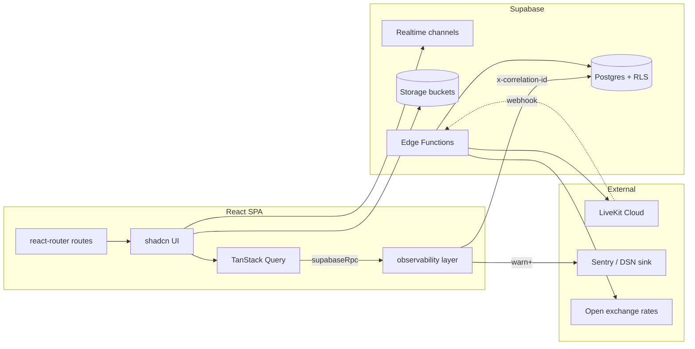

# illuxus

Events platform in the spirit of Lu.ma: organizers create branded event pages, sell
tickets, run check-in/check-out, host live webinars, and grow communities around
their events. Built as a single-page React app on top of Supabase, with a strong bias
toward observability, property-based testing, and shadcn/Linear-flavored UI.

> **For AI agents and vibecoding:** start at
> [`.kiro/steering/project-overview.md`](./.kiro/steering/project-overview.md) for
> architecture and conventions, [`ROADMAP.md`](./ROADMAP.md) for product trajectory,
> then specs under [`.kiro/specs/`](./.kiro/specs) for in-flight work.

---

## Stack at a glance

| Layer            | Choice                                                                                   |
| ---------------- | ---------------------------------------------------------------------------------------- |
| Build / dev      | Vite 5 + SWC, Bun                                                                        |
| Language         | TypeScript 5                                                                             |
| UI               | React 18, Tailwind 3, shadcn/ui (Radix primitives), Framer Motion, Sonner toasts         |
| Routing          | `react-router-dom` v6 with route-level code-splitting                                    |
| Data             | Supabase Postgres (RLS-first), Realtime, Storage, Edge Functions                         |
| Server state     | TanStack Query v5                                                                        |
| Forms            | `react-hook-form` + `zod`                                                                |
| Charts           | Recharts                                                                                 |
| Drag & drop      | `@dnd-kit`                                                                               |
| Live video       | LiveKit (`@livekit/components-react`) for webinar stage                                  |
| QR / badges      | `html5-qrcode`, `qrcode.react`, `jspdf`                                                  |
| Observability    | Sentry (via DSN), unified internal Logger + RPC wrapper, Error Boundaries                |
| Tests            | Vitest, fast-check (property-based), Playwright (e2e + visual)                           |

---

## Getting started

```sh
bun install
cp .env.example .env.local   # fill in Supabase + observability values
bun run dev
```

| Script                | Purpose                                      |
| --------------------- | -------------------------------------------- |
| `bun run dev`         | Vite dev server                              |
| `bun run build`       | Production build                             |
| `bun run build:dev`   | Dev-mode build (sourcemaps, no minification) |
| `bun run preview`     | Preview a production build locally           |
| `bun run lint`        | ESLint over `src/`                           |
| `bun run test`        | Vitest single run (unit + property tests)    |
| `bun run test:watch`  | Vitest watch mode                            |
| `bun run audit:tokens`| Audits design tokens in QuickView surfaces   |

The project uses **bun** as the canonical package manager (see `bun.lock`). A
`package-lock.json` exists for npm fallback. There is no pnpm workspace; ignore the
stray `pnpm-*.yaml` files if you see them.

---

## High-level architecture



Key principles:

- **Every RPC goes through `supabaseRpc`** from `@/lib/observability`, which adds a
  correlation id, logs name/params/duration in dev, and threads errors back into the
  Logger. **Do not** call `supabase.rpc(...)` directly — that is enforced via lint.
- **Every log line goes through `logger`** from `@/lib/observability`. Direct
  `console.*` is banned (`no-console: error`); the only sanctioned exception is the
  contractual `console.warn('UI sync failure')` in `RegistrationsSection.tsx`.
- **Routes are lazy** via `lazyWithLog(...)` so chunk-load failures land in the
  Logger before bubbling up to the Route Error Boundary.
- **Auth + org context wrap every authenticated route**: `AuthProvider` →
  `OrgProvider` → `ProfileGate` → optional role-specific gate (organizer / admin /
  attendee).

---

## Project layout

```
src/
├── App.tsx                     route table + auth gates
├── main.tsx                    entrypoint, boots Logger, mounts <App/>
├── components/
│   ├── ui/                     shadcn primitives (do not edit casually)
│   ├── event/                  event-management surfaces (registrations, settings,
│   │                           sessions, sponsors, speakers, attendance, reports)
│   ├── community/              feed, comments, layout, notifications
│   ├── webinar/                LiveKit stage, sidebar, lobby, controls
│   ├── applications/           speaker / sponsor application dialogs
│   ├── auth/                   password meter, 2FA challenge
│   ├── people/                 PersonFieldsForm
│   └── layout/                 SiteContainer + responsive gutters
├── pages/
│   ├── Index, LoginPage, DiscoverFeed, EventsListingPage,
│   ├── PublicEventPage, PublicOrgPage, EventLivePage, SelfCheckInPage,
│   ├── u/                      attendee surfaces (profile, my events, applications)
│   ├── t/                      ticket detail
│   ├── speaker/, sponsor/      portal pages
│   ├── dashboard/              organizer dashboard (events, attendees, tickets,
│   │   ├── admin/              analytics, marketing, landing-builder, domains,
│   │   ├── community/          reports, help, settings, billing, admin, community)
│   │   └── event/              broadcast + guest list
│   └── dev/                    dev-only preview routes
├── contexts/                   AuthContext, OrgContext, ThemeContext
├── hooks/                      app-wide hooks + community/* feature hooks
├── lib/
│   ├── observability/          logger, sinks (console/remote), redaction,
│   │                           correlation, offline queue, error boundaries,
│   │                           supabaseRpc wrapper
│   ├── attendance/             pure state machine + 13 fast-check property tests
│   ├── community/              rbac + shared types
│   ├── currency.ts, fx.ts      money formatting + 5-min cached FX
│   ├── datetime.ts, timezones  time utilities (event-local time is canonical)
│   ├── ticket-pdf, print-badges, badge-design
│   └── event-routes.ts         canonical /org/:slug/events/:slug builders
├── integrations/supabase/      generated types + browser client
└── types/                      cross-feature TS types

supabase/
├── migrations/                 001_tables → 007_self_check_in_no_out
├── functions/                  edge functions (livekit-*, fx-rates, send-event-email,
│                               recording-*, org-events, create-participant-account,
│                               seed-cities)
└── config.toml

docs/                           observability docs (see below)
.kiro/specs/                    in-flight specs (kiro spec-driven dev)
.kiro/steering/                 always-included project context for AI agents
tests/                          Playwright e2e + visual regression
scripts/                        token audit, slug check
```

---

## Route map (quick reference)

Public:

- `/` — landing (signed-out + admins) or `/discover` feed (signed-in users)
- `/discover` — Lu.ma-style discovery feed
- `/events` — public events listing
- `/events/:id` — single event by id/slug
- `/org/:slug` — org public page
- `/org/:orgSlug/events/:eventSlug` — canonical event URL
- `/o/:slug` and `/o/:orgSlug/:eventSlug` — legacy redirects (preserved forever)

Auth + onboarding:

- `/login`, `/reset-password`, `/complete-profile`, `/onboarding`

Attendee:

- `/u/me`, `/u/me/events`, `/u/me/applications`, `/u/me/settings`
- `/t/:id` — ticket detail
- `/checkin/:eventId` — public self-check-in
- `/e/:id/live` — live event page

Organizer dashboard (gated by `OrganizerRoute` + `OnboardingGuard`):

- `/dashboard/events`, `/dashboard/events/new`, `/dashboard/events/:id`
- `/dashboard/events/:id/guests`, `/dashboard/events/:id/broadcast`
- `/dashboard/attendees`, `/dashboard/tickets`, `/dashboard/analytics`,
  `/dashboard/reports`, `/dashboard/marketing`, `/dashboard/landing-builder`,
  `/dashboard/settings`, `/dashboard/billing`, `/dashboard/help`

Community (per organizer):

- `/dashboard/community`, `/dashboard/community/:slug`, then
  `/feed`, `/members`, `/announcements`, `/calendar`, `/resources`, `/chat`,
  `/leaderboard`, `/moderation`, `/settings` under that.

Portals:

- `/speaker`, `/speaker/events/:eventId`
- `/sponsor`, `/sponsor/events/:eventId`, `/sponsor/accept`

Admin (super-admin only):

- `/dashboard/admin`, `/dashboard/admin/site`, `/dashboard/admin/audit`

---

## Data layer

Migrations in `supabase/migrations/`:

| File                                  | Scope                                               |
| ------------------------------------- | --------------------------------------------------- |
| `001_tables.sql`                      | core tables (events, registrations, orgs, tickets…) |
| `002_functions.sql`                   | RLS-tested SECURITY DEFINER RPCs                    |
| `003_realtime_seeds.sql`              | replication identity + initial seeds                |
| `004_apply_attendance_helper.sql`     | attendance state-machine SQL primitive              |
| `004_community.sql`                   | community tables (phase 1)                          |
| `005_community_complete.sql`          | community tables (phases 2–4)                       |
| `005_set_attendance_rpc.sql`          | `set_attendance` RPC                                |
| `006_bulk_set_attendance_per_row.sql` | per-row bulk attendance                             |
| `007_self_check_in_no_out.sql`        | public self-check-in (no checkout)                  |

Edge functions in `supabase/functions/`:

- LiveKit suite (`livekit-token`, `livekit-room-create`, `livekit-room-end`,
  `livekit-go-live`, `livekit-promote`, `livekit-webhook`)
- `recording-start`, `recording-stop` — Supabase Storage-backed recordings
- `fx-rates` — 5-minute cached currency exchange
- `send-event-email` — transactional email (Resend integration was removed; the
  function is now a UI-driven dispatcher)
- `create-participant-account`, `seed-cities`, `org-events`

Generated database types live at `src/integrations/supabase/types.ts`. Regenerate
after a migration; never edit by hand.

---

## Observability

Single, unified layer at `src/lib/observability/`:

- `logger` — leveled structured logger with PII redaction, correlation ids, offline
  ring buffer + IndexedDB queue, end-of-life flush on `pagehide`.
- `supabaseRpc` — wraps every Supabase RPC with `x-correlation-id`, dev logging,
  duration metrics, and error correlation back into the Logger.
- `boundaries/RootErrorBoundary`, `boundaries/RouteErrorBoundary` — render
  `FallbackView` with the active correlation id; Reload + Go-Home actions.
- `sinks/console`, `sinks/remote` — console for dev, Sentry-compatible remote sink
  for `warn+` in production. Privacy opt-out is honored at both build (`VITE_OBSERVABILITY_OPT_OUT`)
  and per-user (`localStorage:observability:opt-out`) layers.

Read first:

- [`docs/observability.md`](./docs/observability.md) — Logger API, log levels,
  structured-field conventions, correlation ids, adding a new sink.
- [`docs/observability-privacy.md`](./docs/observability-privacy.md) — what is
  collected, retention window, opt-out mechanism.

---

## Testing

| Suite                | Command                                | What it covers                                |
| -------------------- | -------------------------------------- | --------------------------------------------- |
| Unit                 | `bun run test`                         | Vitest specs in `src/**/__tests__/*.test.ts*` |
| Property-based       | included in `bun run test`             | `*.property.test.ts` and `src/lib/attendance/__tests__/property-*.pbt.test.ts` (13 PBT files for the attendance state machine) |
| E2E                  | `npx playwright test`                  | `tests/e2e/*.spec.ts`                         |
| Visual regression    | `npx playwright test tests/visual`     | QuickView surfaces                            |

The attendance state machine (`src/lib/attendance/applyAttendance.ts`) is a TS port
of the SQL helper and is fully property-tested. Any change to one must mirror the
other; use the existing PBTs as the contract.

---

## In-flight specs

`/.kiro/specs/` tracks active feature work using the Kiro spec workflow (Requirements
→ Design → Tasks). Current specs:

- **`observability-foundation`** — Phases A–E shipped (logger, error boundaries, RPC
  wrapper, console.* migration, lint flip to error). Phase F (production Remote
  Sink wiring + canary rollout) is the remaining pending block.
- **`checkin-checkout-tabs`** — DB foundation, TS port + 13 PBTs, client UI, and
  cleanup are done. Outstanding: example/integration tests for `QRScannerDialog`
  and live-update components.

See `tasks.md` inside each spec for the granular task list and acceptance criteria.

---

## Conventions

- **Money** uses `formatMoney` from `@/lib/currency`. The DB stores amounts in the
  event's currency; `useFxRates` (5-minute TTL, refresh on visibility change)
  converts to display currency.
- **Datetimes** are stored UTC and formatted in event-local time using helpers from
  `@/lib/datetime` and the `timezones` whitelist.
- **Routing** to org/event pages goes through `event-routes.ts` builders; never
  string-concat URLs.
- **shadcn primitives** in `components/ui/` are generated. Wrap them in feature
  components rather than editing them.
- **Design tokens** are CSS variables on `:root` — Tailwind classes use
  `bg-card`, `border-border`, `text-foreground`, etc. New colors require a token,
  not a hex value.
- **PBT first** when behavior has a clear invariant (state machines, idempotence,
  ordering, redaction). Use `fast-check` and pattern off the existing PBT files.

---

## Acknowledgements

Public links and bookmarks should remain stable forever — both the legacy
`/o/:slug` URLs and the canonical `/org/:slug` are kept working via redirects in
`App.tsx`.
