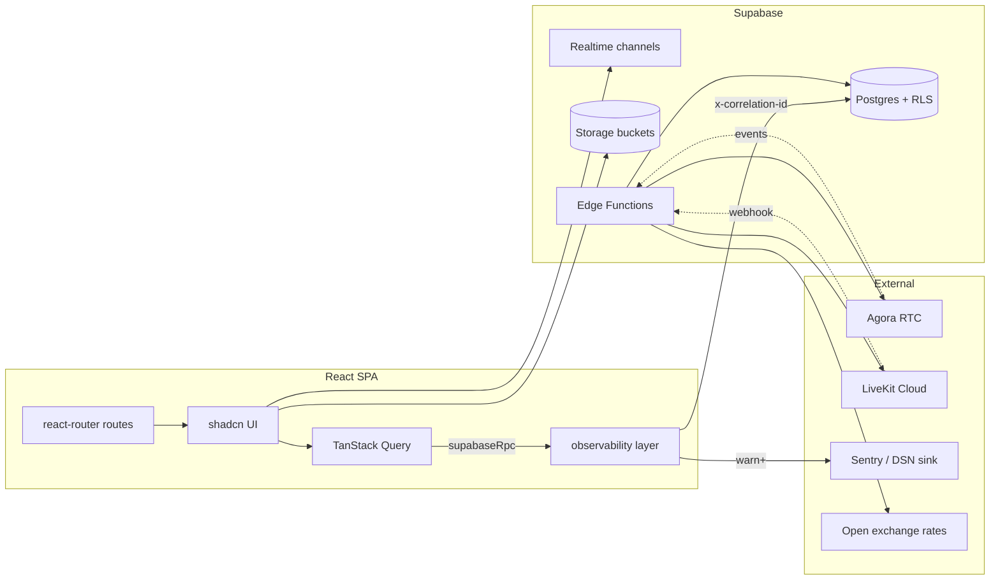

# illuxus

A Lu.ma-style events platform: organizers run branded events, sell tickets, check
attendees in/out via QR, host LiveKit webinars, and grow communities around their
events. Built with a strong bias toward observability, property-based testing,
security-first architecture, and production-grade scalability.

> **For AI agents and vibecoding:** start at
> [`.kiro/steering/project-overview.md`](./.kiro/steering/project-overview.md) for
> architecture and conventions, [`ROADMAP.md`](./ROADMAP.md) for product trajectory,
> then specs under [`.kiro/specs/`](./.kiro/specs) for in-flight work.

---

## Table of Contents

- [Stack at a glance](#stack-at-a-glance)
- [Getting started](#getting-started)
- [High-level architecture](#high-level-architecture)
- [Project layout](#project-layout)
- [Route map](#route-map)
- [Data layer](#data-layer)
- [Features & capabilities](#features--capabilities)
- [Security & observability](#security--observability)
- [Performance & scalability](#performance--scalability)
- [Testing](#testing)
- [Configuration](#configuration)
- [Conventions](#conventions)
- [Acknowledgements](#acknowledgements)

---

## Stack at a glance

### Core Stack

| Layer            | Choice                                                                                   |
| ---------------- | ---------------------------------------------------------------------------------------- |
| Build / dev      | Vite 5 + SWC, Bun (canonical), TypeScript 5                                              |
| UI               | React 18, Tailwind 3, shadcn/ui (Radix primitives), Framer Motion, Sonner toasts         |
| Routing          | `react-router-dom` v6 with route-level code-splitting                                    |
| Data             | Supabase Postgres (RLS-first), Realtime, Storage, Edge Functions                         |
| Server state     | TanStack Query v5                                                                        |
| Forms            | `react-hook-form` + `zod`                                                                |
| Charts           | Recharts                                                                                 |
| Drag & drop      | `@dnd-kit`                                                                               |
| Live video       | Agora (`agora-rtc-sdk-ng`) + LiveKit (`@livekit/components-react`) for webinar stage     |
| QR / badges      | `html5-qrcode`, `qrcode.react`, `jspdf`                                                  |
| PDF generation   | `jspdf`, `jspdf-autotable`, `exceljs`                                                    |
| Observability    | Sentry (via DSN), unified internal Logger + RPC wrapper, Error Boundaries                |
| Tests            | Vitest, fast-check (property-based), Playwright (e2e + visual)                           |
| PWA              | Workbox (vite-plugin-pwa), installable on iOS/Android/Desktop                            |

### Key Dependencies (all exact versions in `bun.lock`)

- `@supabase/supabase-js`: v2.107.0
- `@livekit/components-react`: v2.9.21
- `agora-rtc-sdk-ng`: v4.24.4
- `react-hook-form` + `zod`: v7.61.1 / v3.25.76
- `tanstack/react-query`: v5.83.0
- `@tanstack/react-virtual`: for virtualized registration lists
- `dompurify`: v3.4.11 (XSS protection)
- `fast-check`: v3.23.2 (property-based testing)
- `vite-plugin-pwa`: v1.3.0 (PWA service worker)

---

## Getting started

```sh
bun install
cp .env.example .env.local   # fill in Supabase + observability values
bun run dev
```

### Available Scripts

| Script                | Purpose                                      |
| --------------------- | -------------------------------------------- |
| `bun run dev`         | Vite dev server                              |
| `bun run build`       | Production build (optimized, minified)       |
| `bun run build:dev`   | Dev-mode build (sourcemaps, no minification) |
| `bun run preview`     | Preview a production build locally           |
| `bun run lint`        | ESLint over `src/`                           |
| `bun run test`        | Vitest single run (unit + property tests)    |
| `bun run test:watch`  | Vitest watch mode                            |
| `bun run audit:tokens`| Audits design tokens in QuickView surfaces   |

**Important**: The project uses **bun** as the canonical package manager. See `bun.lock`.
A `package-lock.json` exists for npm fallback. There is no pnpm workspace; ignore the
stray `pnpm-*.yaml` files if you see them.

---

## High-level architecture



### Key Principles

1. **Every RPC goes through `supabaseRpc`** from `@/lib/observability`, which adds a
   correlation id, logs name/params/duration in dev, and threads errors back into the
   Logger. **Do not** call `supabase.rpc(...)` directly — that is enforced via lint.

2. **Every log line goes through `logger`** from `@/lib/observability`. Direct
   `console.*` is banned (`no-console: error`); the only sanctioned exception is the
   contractual `console.warn('UI sync failure')` in `RegistrationsSection.tsx`.

3. **Routes are lazy** via `lazyWithLog(...)` so chunk-load failures land in the
   Logger before bubbling up to the Route Error Boundary.

4. **Auth + org context wrap every authenticated route**: `AuthProvider` →
   `OrgProvider` → `ProfileGate` → optional role-specific gate (organizer / admin /
   attendee).

5. **Public domain resolution**: every share URL uses `publicOrigin()` from
   `src/lib/publicUrl.ts` (env `VITE_PUBLIC_ORIGIN` → `window.location.origin` →
   `https://illuxus.com`). Never inline a host.

---

## Project layout

```
src/
├── App.tsx                     route table + auth gates + GlobalFooter
├── main.tsx                    entrypoint, boots Logger, mounts <App/>
├── components/
│   ├── ui/                     shadcn primitives (do not edit casually)
│   ├── event/                  event-management surfaces (registrations, settings,
│   │                           sessions, sponsors, speakers, attendance, reports,
│   │                           page-form, page-builder, creatives)
│   ├── community/              feed, comments, layout, notifications
│   ├── webinar/                AgoraWebinarStage, LiveKit stage, lobby, controls
│   ├── applications/           speaker / sponsor application dialogs
│   ├── auth/                   password meter, 2FA challenge
│   ├── people/                 PersonFieldsForm
│   └── layout/                 SiteContainer + responsive gutters
├── pages/
│   ├── Index, LoginPage, DiscoverFeed, EventsListingPage,
│   ├── PublicEventPage, PublicOrgPage, EventLivePage, SelfCheckInPage,
│   ├── FeaturesPage, PricingPage, AboutPage, ContactPage, PrivacyPage, TermsPage,
│   ├── u/                      attendee surfaces (profile, my events, applications)
│   ├── t/                      ticket detail
│   ├── speaker/, sponsor/      portal pages
│   ├── dashboard/              organizer dashboard (events, attendees, tickets,
│   │   ├── admin/              analytics, marketing, landing-builder, domains,
│   │   ├── community/          reports, help, settings, billing, admin, community)
│   │   └── event/              broadcast + guest list
│   └── dev/                    dev-only preview routes
├── contexts/                   AuthContext, OrgContext, ThemeContext
├── hooks/                      app-wide hooks + community/* feature hooks
├── lib/
│   ├── observability/          logger, sinks (console/remote), redaction,
│   │                           correlation, offline queue, error boundaries,
│   │                           supabaseRpc wrapper
│   ├── attendance/             pure state machine + 13 fast-check property tests
│   ├── community/              rbac + shared types
│   ├── currency.ts, fx.ts      money formatting + 5-min cached FX
│   ├── datetime.ts, timezones  time utilities (event-local time is canonical)
│   ├── publicUrl.ts            canonical share-URL builder (env-aware)
│   ├── attendee-link.ts        per-attendee tracked join URLs with UTM
│   ├── ticket-pdf, print-badges, badge-design
│   ├── creatives/              social creative generator, badge renderer
│   └── event-routes.ts         canonical /org/:slug/events/:slug builders
├── integrations/supabase/      generated types + browser client
└── types/                      cross-feature TS types

supabase/
├── migrations/
│   └── 000_full_schema.sql     consolidated schema + all incremental migrations
├── functions/                  edge functions (livekit-*, fx-rates,
│                               send-event-email, send-communication-email,
│                               recording-*, org-events,
│                               create-participant-account, seed-cities,
│                               whatsapp-*)
└── config.toml

docs/                           observability + agora setup docs
.kiro/specs/                    in-flight specs (kiro spec-driven dev)
.kiro/steering/                 always-included project context for AI agents
tests/                          Playwright e2e + visual regression
scripts/                        token audit, slug check
```

---

## Route map

### Public Routes

- `/` — landing (signed-out + admins) or `/discover` feed (signed-in users)
- `/discover` — Lu.ma-style discovery feed
- `/events` — public events listing (shows ongoing + future events)
- `/events/:id` — single event by id/slug
- `/org/:slug` — org public page
- `/org/:orgSlug/events/:eventSlug` — canonical event URL
- `/o/:slug` and `/o/:orgSlug/:eventSlug` — legacy redirects (preserved forever)
- `/features`, `/pricing`, `/about`, `/contact`, `/privacy`, `/terms` — marketing/legal
- `/event-management-software`, `/event-ticketing-platform`, etc. — SEO landing pages

### Auth + Onboarding

- `/login`, `/reset-password`, `/complete-profile`, `/onboarding`

### Attendee Portal

- `/u/me`, `/u/me/events`, `/u/me/applications`, `/u/me/settings`
- `/t/:id` — ticket detail
- `/checkin/:eventId` — public self-check-in (check-in only)
- `/checkout/:eventId` — public self-check-out (check-out only)
- `/e/:id/live` — live event page (with optional `?join=` token for unique attendee links)

### Organizer Dashboard (gated by `OrganizerRoute` + `OnboardingGuard`)

- `/dashboard/events`, `/dashboard/events/new`, `/dashboard/events/:id`
- `/dashboard/events/:id/guests`, `/dashboard/events/:id/broadcast`
- `/dashboard/events/:id/registrations` — Check-in / Check-out tabs (mutually exclusive)
- `/dashboard/events/:id/creatives` — Social creative generator
- `/dashboard/tickets`, `/dashboard/reports`, `/dashboard/marketing`,
  `/dashboard/landing-builder`, `/dashboard/billing`, `/dashboard/help`, `/dashboard/settings`

### Community (per organizer)

- `/dashboard/community`, `/dashboard/community/:slug`, then
  `/feed`, `/members`, `/announcements`, `/calendar`, `/resources`, `/chat`,
  `/leaderboard`, `/moderation`, `/settings` under that.

### Portals

- `/speaker`, `/speaker/events/:eventId`
- `/sponsor`, `/sponsor/events/:eventId`, `/sponsor/accept`

### Admin (super-admin only)

- `/dashboard/admin`, `/dashboard/admin/site`, `/dashboard/admin/audit`
- `/dashboard/admin/analytics`, `/dashboard/admin/tickets`, `/dashboard/admin/users`
- `/dashboard/admin/organizations`, `/dashboard/admin/events`, `/dashboard/admin/revenue`
- `/dashboard/admin/system`, `/dashboard/admin/activity`

---

## Data layer

The Supabase schema lives as a single consolidated file:

```
supabase/migrations/000_full_schema.sql
```

This file is the cumulative DDL of the entire platform — every table, RLS
policy, trigger, RPC, and configuration in one place. It replaced 15
historical migration files in June 2026 to keep the schema legible. Apply it
via `supabase db push` or paste into the SQL editor on a fresh project. The
file is idempotent (`DROP POLICY IF EXISTS` and `CREATE OR REPLACE FUNCTION`
throughout) so re-runs are safe.

### Key Tables

- **`events`**: Event metadata, page_config (theme, SEO, sections), branding
- **`registrations`**: Attendee registration with QR, attendance_state, approval_status
- **`sessions`**: Event sessions (agenda) with speakers, start/end times
- **`speakers` + `event_speakers`**: Speaker profiles linked to events
- **`sponsors` + `event_sponsors`**: Sponsor profiles linked to events
- **`webinar_sessions`**: Live webinar sessions with attendance tracking
- **`attendance_events`**: Immutable audit trail of all attendance transitions
- **`community_posts`, `community_comments`, `community_reactions`**: Community feed
- **`event_creatives`**: Generated social graphics (speaker/sponsor/promo images)

### Edge Functions

- LiveKit suite (`livekit-token`, `livekit-room-create`, `livekit-room-end`,
  `livekit-go-live`, `livekit-promote`, `livekit-webhook`)
- Agora-related stage and webhook helpers
- `recording-start`, `recording-stop` — Supabase Storage-backed recordings
- `fx-rates` — 5-minute cached currency exchange
- `send-event-email`, `send-communication-email` — transactional email
- `create-participant-account`, `seed-cities`, `org-events`
- WhatsApp suite (`send-whatsapp`, `whatsapp-sync-templates`, `whatsapp-webhook`)

Generated database types live at `src/integrations/supabase/types.ts`. Regenerate
after a schema change; never edit by hand.

---

## Features & capabilities

### Event Management

- **Event creation**: Slug auto-generation with collision retry, quick-create flow
- **Page builder**: Branded event landing pages with theme editor (title/body scale, colors)
- **Sessions/Agenda**: Multi-day support, speaker linking, display ordering
- **Speakers & Sponsors**: Management, photo/logo upload, tier-based branding
- **Registration system**: QR-based attendance, bulk import, email invitations
- **Check-in/Check-out**: Two distinct scanner modes with strict state isolation
- **Attendance tracking**: State machine with `never`/`inside`/`outside` states
- **Badge printing**: Customizable badges with title/body fonts matching page theme
- **PDF exports**: Tickets, badges, brochures with branded layouts

### Community Features

- **Community hub**: Per-organizer community spaces
- **Feed & comments**: Threaded discussions with likes/reactions
- **Members directory**: Member management with roles and permissions
- **Announcements**: Broadcast to community members
- **Calendar**: Shared community events
- **Resources**: Shared documents and materials
- **Moderation**: Content moderation and user management
- **Leaderboard**: Engagement tracking and rewards

### Webinar & Live Events

- **LiveKit stage**: Production-grade live video streaming
- **Agora integration**: Alternative RTM for reactions and announcements
- **Participant management**: Speaker/sponsor roles, stage requests
- **Chat & Q&A**: Real-time communication
- **Polls**: Live polling and results
- **Reactions**: Emoji-based audience engagement
- **Recording**: Auto-recording to Supabase Storage
- **Waiting lobby**: Pre-event attendee queue
- **Branding**: Event-themed overlays and branding

### Marketing & Analytics

- **Email broadcasts**: Branded email campaigns with templates
- **WhatsApp broadcasts**: Template-based messaging (pending approval flow)
- **Marketing pages**: SEO-targeted landing pages
- **Analytics dashboard**: KPIs, sparklines, charts
- **Revenue tracking**: ticket sales, payouts, analytics
- **UTM attribution**: Track attendee acquisition sources

### Organizational Features

- **Multi-org support**: Switch between workspaces
- **Team management**: Invite members, role-based access
- **Billing & plans**: Different tiers with feature limits
- **Domains**: Custom domain configuration
- **Organization branding**: Logo, colors, theme presets
- **2FA support**: Two-factor authentication

### Admin Platform (Super-Admin)

- **User management**: View and manage all platform users
- **Organization management**: View and manage all organizations
- **Event moderation**: Review and moderate events
- **Revenue dashboard**: Platform-wide revenue analytics
- **System health**: Infrastructure monitoring
- **Audit log**: All platform actions logged
- **Site editor**: Global site configuration

### Advanced Features

- **Social creative generator**: Auto-generate social graphics for speakers/sponsors
  - Multiple template presets (speaker, sponsor, combo)
  - Platform-specific sizing (LinkedIn, Instagram, Twitter, Email)
  - Batch generation with ZIP export
  - Template selection persistence per event
  - Branded with event theme colors

- **Brochure generator**: Multi-page PDF event brochures
  - Agenda, speakers, sponsors, venue sections
  - Reorderable section layout
  - Theme-based color customization
  - QR code for venue map (when configured)

- **PWA support**: Installable Progressive Web App
  - Offline capability with service worker
  - Install prompt on iOS/Android/Desktop
  - Standalone mode splash screens
  - Auto-updates with non-intrusive prompt
  - Safe-area inset support for notched devices

### Developer Features

- **Property-based testing**: 13+ fast-check property tests
- **Structured observability**: Correlation IDs, PII redaction, offline queue
- **Error boundaries**: Route-level + root error handling
- **Code splitting**: Route-level lazy loading
- **Type safety**: Full TypeScript coverage
- **Theme tokens**: Design system with CSS variables

---

## Security & observability

### Security Features

1. **Row-Level Security (RLS)** on every table
2. **SECURITY DEFINER** functions with `SET search_path = public`
3. **Origin allowlist** on edge functions via `ALLOWED_ORIGINS` secret
4. **PII redaction** on all observability data
5. **Correlation IDs** on all RPC calls for traceability
6. **Rate limiting** on edge functions (TODO: implement)
7. **HMAC verification** on webhooks (TODO: implement for Meta)

### Observability Layer

The observability layer at `src/lib/observability/` provides:

- **Structured Logger**: Leveled logging (trace/debug/info/warn/error/fatal)
- **PII Redaction**: Automatic scrubbing of emails, tokens, phone numbers
- **Correlation IDs**: Threaded through all RPC calls
- **Offline Queue**: IndexedDB-backed buffer for offline operation
- **Error Boundaries**: Route-level and root error handling
- **Remote Sink**: Sentry-compatible remote error reporting
- **Privacy Opt-out**: Build-time and runtime opt-out controls

**Usage:**
```ts
import { logger, supabaseRpc } from '@/lib/observability';

logger.info('clicked rsvp', { event_id });
logger.error('rsvp failed', { event_id, error_message: err.message });

const { data, error, correlationId } = await supabaseRpc('set_attendance', { p_reg_id });
```

**Documentation**: See [`docs/observability.md`](./docs/observability.md)

---

## Performance & scalability

### Current Capacity (as of 2026-08-27)

| Surface | Comfortable | Stress point | First failure mode |
|---------|-------------|--------------|-------------------|
| Anonymous landing (Vercel CDN) | ~50,000 RPS | 100,000 RPS | Vercel/Edge function quota |
| Authenticated API (Supabase Pro REST) | ~1,500 RPS | 4,000 RPS | RLS CPU (no `registrations(event_id)` idx) |
| Realtime concurrent connections (Supabase Pro) | 500 | 1,000 | Realtime broadcast quota |
| Single live event page (12 channels/user) | ~500 simultaneous attendees | ~1,000 | WAL volume from REPLICA IDENTITY FULL |
| LiveKit / Agora video | 3,000 viewers / room | 10,000 viewers / room | Bandwidth + license tier |

### Capacity After Critical Fixes (See [Audit Report](.kiro/specs/PLATFORM_AUDIT_2026-06.md))

| Surface | Before | After Critical | After All High |
|---------|--------|----------------|----------------|
| Live event attendees | ~500 | ~2,000 | ~5,000 (Team tier) |
| Concurrent Realtime connections | 500 | 2,000 | 5,000 |
| Daily active users | ~1,000 | ~10,000 | ~50,000 |

### Cost Estimates (10k DAU)

| Service | Estimate |
|---------|----------|
| Supabase Pro + add-ons | $400–$800 |
| Vercel Pro | $70 |
| Agora (RTC) | $300–$2,000 |
| Resend (email) | $20–$200 |
| Meta WhatsApp | $50–$400 |
| Sentry | $50–$200 |
| Cloudflare | $20 |

**Total**: **$1,100–$3,500/month**

### Key Performance Optimizations

1. **Route-level code splitting**: Lazy-loaded route chunks
2. **TanStack Query defaults**: `staleTime: 30s`, `gcTime: 5min`, `refetchOnWindowFocus: false`
3. **IndexedDB offline queue**: For observability data during offline operation
4. **Service worker caching**: App shell + Supabase Storage cache-first
5. **Vite manual chunks**: Vendor bundle splitting
6. **Lazy-loaded heavy dependencies**: ExcelJS, jspdf, Agora SDK
7. **Image lazy loading**: `loading="lazy" decoding="async"` on listing images
8. **Pagination**: Server-side pagination for large result sets

### Known Scalability Constraints

See [`docs/observability.md`](./docs/observability.md) for more details.

---

## Testing

| Suite                | Command                                | What it covers                                |
| -------------------- | -------------------------------------- | --------------------------------------------- |
| Unit                 | `bun run test`                         | Vitest specs in `src/**/__tests__/*.test.ts*` |
| Property-based       | included in `bun run test`             | `*.property.test.ts` and `src/lib/attendance/__tests__/property-*.pbt.test.ts` (13 PBT files for the attendance state machine) |
| E2E                  | `npx playwright test`                  | `tests/e2e/*.spec.ts`                         |
| Visual regression    | `npx playwright test tests/visual`     | QuickView surfaces                            |

### Property-Based Testing

illuxus uses **fast-check** for property-based testing of critical business logic:

- **Attendance state machine**: 13 property tests covering state transitions, ordering invariants, idempotence
- **Sanitization**: XSS protection验证 with fuzzed payloads
- **Redaction**: PII scrubbing completeness and correctness
- **Template resolution**: Theme fallback logic and aspect-ratio reflow
- **PDF generation**: Layout, pagination, and content assembly

**Pattern**: Use `fast-check` with `property()` and `assert()`. See existing PBT files in `src/lib/attendance/__tests__/`.

---

## Configuration

### Environment Variables

| Variable | Purpose | Default |
|----------|---------|---------|
| `VITE_SUPABASE_URL` | Supabase project URL | - |
| `VITE_SUPABASE_ANON_KEY` | Supabase anon key | - |
| `VITE_PUBLIC_ORIGIN` | Public domain for share URLs | `https://illuxus.com` |
| `VITE_PUBLIC_PUBLISHED_HOST` | Published host for events | `events.illuxus.com` |
| `VITE_PUBLIC_DOMAIN` | Public domain | `illuxus.com` |
| `VITE_OBSERVABILITY_DSN` | Sentry DSN for remote error reporting | - |
| `VITE_OBSERVABILITY_OPT_OUT` | Opt-out of observability | - |
| `VITE_BUILD_SHA` | Git commit sha (injected at build) | - |

### Build Configuration

- **Vite config**: `vite.config.ts`
- **ESLint config**: `eslint.config.js`
- **Tailwind config**: `tailwind.config.ts`
- **Vitest config**: `vitest.config.ts`
- **Playwright config**: `playwright.config.ts`

### CI/CD

Source map upload at build time requires these secrets:
- `OBSERVABILITY_AUTH_TOKEN`
- `OBSERVABILITY_ORG`
- `OBSERVABILITY_PROJECT`

---

## Conventions

- **Money** uses `formatMoney` from `@/lib/currency`. The DB stores amounts in the
  event's currency; `useFxRates` (5-minute TTL, refresh on visibility change)
  converts to display currency.

- **Datetimes** are stored UTC and formatted in event-local time using helpers from
  `@/lib/datetime` and the `timezones` whitelist. **Never** call `new Date(iso).getDate()`
  on a stored timestamptz — strip the `T` suffix or use the helpers (the agenda
  Day-N tab bug is a recurring failure mode of doing this wrong).

- **Routing** to org/event pages goes through `event-routes.ts` builders; never
  string-concat URLs. Share URLs go through `publicOrigin()` (see `src/lib/publicUrl.ts`).

- **shadcn primitives** in `components/ui/` are generated. Wrap them in feature
  components rather than editing them.

- **Design tokens** are CSS variables on `:root` — Tailwind classes use
  `bg-card`, `border-border`, `text-foreground`, etc. New colors require a token,
  not a hex value.

- **Person titles** must be one of `('Mr','Ms','Mrs','Prefer not to say')` — the DB
  has a validation trigger. The canonical list lives in `src/lib/phone-country.ts`
  as `TITLE_OPTIONS`.

- **Footer is global**: `<GlobalFooter />` in `App.tsx` renders the shared `Footer`
  on every public route. Don't add per-page `<Footer />` calls.

- **PBT first** when behavior has a clear invariant (state machines, idempotence,
  ordering, redaction). Use `fast-check` and pattern off the existing PBT files.

---

## Recent Updates (2026)

### August 2026

- **Comprehensive codebase audit**: Identified 40+ ESLint errors, 29 npm advisories (11 high, 15 moderate, 3 low)
  including DOMPurify XSS bypasses, lodash prototype pollution, brace-expansion ReDoS
  - See [PLATFORM_AUDIT_2026-06.md](.kiro/specs/PLATFORM_AUDIT_2026-06.md) for full details
- **Audit report updated**: Added remediation roadmap with ~12 hours to fix code quality issues
- **README updated**: Comprehensive feature documentation, security & observability sections

### July 2026

- **PWA polish**: Installable on iOS, Android, and desktop with workbox service worker
- **Schema consolidation**: All migrations into single `000_full_schema.sql`
- **Mobile responsiveness pass**: Full responsive design down to 375px
- **Theme: Title size + Body size sliders**: CSS zoom for rem-based scaling
- **Cover banner standardized**: 1128 x 191 aspect ratio
- **Event landing polish**: Organised-by line, fallback fetch, countdown grid, font scaling
- **Footer unification**: Single `GlobalFooter` in `App.tsx`
- **Agora migration phase 1**: Participant store sync, floating reactions, session-storage auto-rejoin
- **Per-attendee tracked join links with UTM**: `attendee-link.ts` utility
- **Registrations improvements**: Email deduplication, inline role change, QuickView, bulk import
- **Landing pages shipped**: Features, Pricing, About, Contact, Privacy, Terms
- **Admin / super-admin panel**: `/dashboard/admin` with site editor and audit log
- **Password reset URL fix**: Uses `publicOrigin()` for correct domain resolution
- **Timezone correctness**: Fix Day 2 auto-created agenda bug for IST-region events
- **Event creation flow**: Slug collision retry, draft visibility

---

## Acknowledgements

Public links and bookmarks should remain stable forever — both the legacy
`/o/:slug` URLs and the canonical `/org/:slug` are kept working via redirects in
`App.tsx`.

---

## Additional Resources

- **[ROADMAP.md](./ROADMAP.md)**: Product trajectory, Now/Next/Later, epics
- **[`.kiro/specs/`](./.kiro/specs/)**: In-flight feature specs
- **[`docs/`](./docs/)**: Technical documentation (observability, agora setup)
- **[`.kiro/steering/`](./.kiro/steering/)**: AI agent steering rules and conventions
- **[PLATFORM_AUDIT_2026-06.md](.kiro/specs/PLATFORM_AUDIT_2026-06.md)**: Comprehensive platform audit
  with security issues, scalability analysis, and remediation roadmap

---

_End of README._
