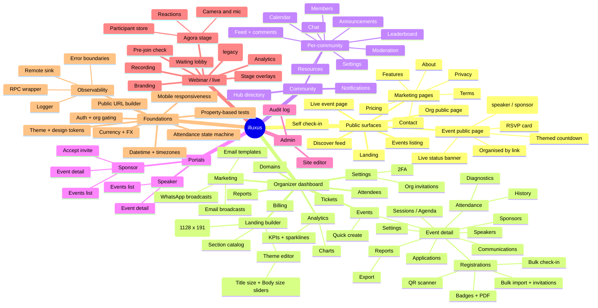
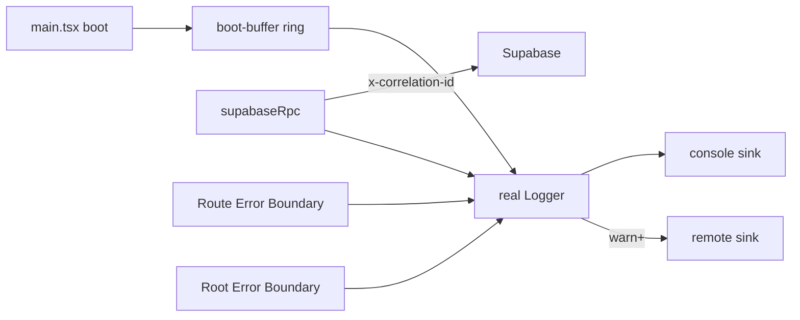

# illuxus roadmap

A living map of where the product is going. Use this when planning new specs, when
asking an AI to scope a feature, or when deciding what to vibecode next.

> Three lenses: a **mindmap** of the product surface, a **Now / Next / Later** timeline,
> and **epics** that link goals to actual code paths.

---

## 1. Product mindmap

---

## 2. Now / Next / Later

### Recently shipped

The cumulative work of the last several weeks. These are not in flight — they
are live in `main`.

- **PWA polish** — installable on iOS, Android, and desktop. Workbox service
  worker (precached app shell + Supabase storage cache-first + Supabase REST
  network-first with 3s timeout + Google Fonts long-lived cache); Sonner-driven
  update prompt that never auto-reloads; capture of `beforeinstallprompt` for
  Chrome/Edge install pill plus a passive Add-to-Home-Screen tip on iOS Safari;
  `useStandaloneMode()` hook; `pt-safe`/`pb-safe`/`px-safe` utilities backed by
  `env(safe-area-inset-*)`; `apple-touch-startup-image` splash entries for
  notched iPhones; `.app-chrome` selection-disable utility on navigation
  surfaces; `overscroll-behavior: none` to kill the iOS rubber-band bounce on
  the app shell.

- **Schema consolidation** — All historical migrations folded into a single
  `supabase/migrations/000_full_schema.sql`. The file is idempotent
  (`DROP ... IF EXISTS` + `CREATE OR REPLACE`); apply via `supabase db push`
  or the SQL editor on a fresh project. Existing production databases are
  unaffected — schema is unchanged, only the local representation collapsed.
  Subsequent post-consolidation migrations (`016_accept_org_invitation`
  through `021_backfill_orphan_event_sponsors`, plus the anon-RLS and
  sponsor-orphan fixes) are appended to the same file under `-- Section:`
  dividers so the project keeps a one-file source of truth.
- **Mobile responsiveness pass** — Public surfaces (event page, listing, discover,
  org, marketing pages), the organizer dashboard (events, settings, reports,
  marketing), and overflow-prone tables (admin, audit, guest list, sponsor) all
  fit cleanly at 375 px. Hover-only mobile actions removed.
- **Theme: Title size + Body size sliders** — `ThemeConfig` gained `titleScale`
  and `bodyScale` fields, applied as CSS `zoom` so rem-based Tailwind classes
  scale correctly. Old `fontScale` is read back as title scale for backward
  compat.
- **Cover banner standardized to 1128 x 191** — Org landing page picker, preview
  pane, and public org cover all use the new aspect ratio. The crop dialog is
  skipped when uploaded images already match the target ratio (within 3 percent
  tolerance).
- **Event landing polish** — Organised-by line below the title with a click-through
  to the org page; fallback fetch to `organizations` when `landing_published` is
  off; clean countdown grid; section font scaling that respects the theme font.
- **Footer unification** — Single `GlobalFooter` in `App.tsx` renders the shared
  `Footer` component on every public route. Per-page `<Footer />` calls removed.
- **Agora migration phase 1** — `AgoraWebinarStage` now drives the live stage,
  with participant store sync, floating reactions, an announcement banner,
  session-storage auto-rejoin on refresh, and proper camera/mic cleanup on
  session end. Camera no longer over-zooms (object-fit fixed).
- **Per-attendee tracked join links with UTM** — `src/lib/attendee-link.ts` builds
  the URL, persists UTM template in `lovable.attendee-link-utm.v1`, and exposes
  Copy / Open / Bulk-export actions in the registrations table.
- **Registrations**:
  - Email-based deduplication so a person registered as both speaker and attendee
    shows up once
  - Inline role change in the table (Attendee / Speaker / Sponsor)
  - QuickView writes through correct table (registration vs speaker vs sponsor)
  - Bulk import with invitation emails
  - Print badges with title and body fonts that match the rest of the page
- **Landing pages** — Features, Pricing, About, Contact, Privacy, Terms shipped
  as full marketing pages with default footer links.
- **Admin / super-admin panel** — Visible at `/dashboard/admin` for users with
  `admin` role in `user_roles`. Site editor and audit log are accessible from
  there.
- **Password reset URL fix** — `resetPasswordForEmail` and signup confirmation
  now use `publicOrigin()` so links resolve to `https://illuxus.com` (or the
  configured `VITE_PUBLIC_ORIGIN`) rather than `localhost`.
- **Timezone correctness** — Several timezone-aware helpers now strip the `T`
  suffix from ISO strings rather than going through `new Date()`, fixing the
  recurring "Day 2 auto-created" agenda bug for IST-region events.
- **Event creation flow** — Slug collisions are retried automatically with a
  random suffix; new events navigate directly to `/dashboard/events/<slug>`;
  drafts are visible in the Upcoming tab so they don't appear to vanish.

### Now (in flight)

| Initiative                     | Status                                                                                  | Code area                                                              |
| ------------------------------ | --------------------------------------------------------------------------------------- | ---------------------------------------------------------------------- |
| Observability Foundation       | Phases A–E shipped; Phase F (prod Remote Sink + canary rollout) pending                 | `src/lib/observability/`, `eslint.config.js`, `docs/observability*.md` |
| Check-in / Check-out tabs      | DB, state machine + 13 PBTs, client UI, cleanup done; component/integration tests open  | `src/components/event/registrations/QRScannerDialog.tsx`, `src/lib/attendance/`, consolidated migration |
| Agora migration                | Phase 1 (stage, reactions, participants, refresh) shipped; recording + edge-function parity with the LiveKit suite still in flight | `src/components/webinar/AgoraWebinarStage.tsx`, edge functions, `.kiro/specs/agora-migration/` |
| Security & scale spec          | Hardening backlog scoped; not yet broken into shipping phases                            | `.kiro/specs/security-and-scale/`                                      |

### Next (clear, scoped follow-ups)

These come from existing code patterns, in-flight specs, and the recent commit
history. They are not full specs yet — write one before vibecoding more than a
day's worth of work.

- **Observability Phase F — production rollout.** Wire `VITE_OBSERVABILITY_DSN`
  per environment, set CI source-map upload secrets (`OBSERVABILITY_AUTH_TOKEN/ORG/PROJECT`),
  do canary-org rollout, smoke-test correlation id surfacing.
- **Check-in/check-out tab tests.** Component test for `QRScannerDialog` (tabs,
  banner per code, retry without camera restart) and live-updates indicator.
- **Agora migration phase 2.** Recording, simulcast / multi-device tolerance,
  parity with the LiveKit feature set so the legacy stage can be retired.
- **PWA — offline scanner queue.** App shell + service-worker caching shipped
  (see Recently shipped). The remaining piece is queueing QR check-in/check-out
  events when the device is offline and draining them on reconnect; the Logger
  already exposes the offline-queue primitives needed.
- **WhatsApp broadcasts.** `send-whatsapp` and `whatsapp-sync-templates` edge
  functions exist; UI surfacing in `MarketingPage` and `EventCommunicate` needs
  template approval flow + delivery surface.
- **Email queue & delivery surface.** `send-event-email` and
  `send-communication-email` are in place; build a unified queue dashboard
  with retry, bounce surfacing, and per-event delivery analytics.
- **Analytics rework.** A drafted plan exists for: 8-card KPI grid with
  sparklines + delta chips, dual-axis revenue/tickets chart, status pie, top-5
  events table, day-of-week heatmap, cumulative revenue.
- **Reports export hardening.** `ReportsSection` + `ExportReportDialog` drive CSV
  export today; column selection, filtering, and large-event pagination need
  property tests for stable ordering and idempotent exports.

### Later (further-out themes)

- **Mobile organizer app.** The check-in flow benefits enormously from native; the
  state machine in `src/lib/attendance` is already pure TS and can ship to RN.
  The mobile responsiveness pass on the web app is a stepping stone.
- **Multi-org admin / agency mode.** Admin panel exists; agencies managing
  multiple orgs would need an org switcher and consolidated billing.
- **Community v2.** Threaded discussions, RSVP-from-feed, member badges and
  roles, cross-community discovery.
- **Sponsor/speaker self-serve onboarding.** Today applications go through
  dialogs in the organizer flow; a public submission form would unlock outreach.
- **Webinar production polish.** Recording chapters, moderator handoff, breakout
  rooms, simulcast. Agora and LiveKit edge functions are the foundation.
- **i18n.** No translation infra today. The `LOCALE_BY_CURRENCY` map in
  `src/lib/currency.ts` is the seed of this work but a real i18n provider is
  needed.
- **Native push notifications** for live event updates and community activity.

---

## 3. Epic detail

### Epic A — Observability

**Goal.** Every error in production is correlated to the RPC that caused it and
visible in Sentry within seconds, with PII scrubbed.

- Code: `src/lib/observability/`
- Specs: `.kiro/specs/observability-foundation/`
- Open work: Phase F (prod DSN + canary), monitoring of the offline queue cap.

### Epic B — Attendance

**Goal.** Make attendance state transitions impossible to silently invert and
provable via property-based tests.

- Code: `src/lib/attendance/` (pure TS state machine + 13 PBT files),
  `src/components/event/registrations/QRScannerDialog.tsx`,
  `src/components/event/attendance/`
- DB: included in `000_full_schema.sql` (apply_attendance helper, set_attendance
  RPC, bulk_set_attendance, self check-in/out)
- Specs: `.kiro/specs/checkin-checkout-tabs/`
- Open work: integration tests for the dialog and live updates.

### Epic C — Community

**Goal.** Per-organizer community space with feed, chat, calendar, resources,
leaderboard, and moderation, gated by RBAC.

- Code: `src/pages/dashboard/community/`, `src/components/community/`,
  `src/hooks/community/`, `src/lib/community/{rbac,types}.ts`
- DB: included in `000_full_schema.sql`
- Open work: settle on v2 themes (threads, member badges, cross-community discovery).

### Epic D — Webinar / live

**Goal.** Run reliable in-product webinars with branded stage, moderation, and
recordings stored in Supabase Storage.

- Code: `src/components/webinar/AgoraWebinarStage.tsx`, other webinar primitives,
  `src/pages/EventLivePage.tsx`
- Edge: `livekit-token`, `livekit-room-create`, `livekit-room-end`,
  `livekit-go-live`, `livekit-promote`, `livekit-webhook`,
  `recording-start`, `recording-stop`, plus Agora helpers
- Specs: `.kiro/specs/agora-migration/`
- Open work: chapters, breakout rooms, simulcast, retire the LiveKit stage once
  Agora reaches feature parity.

### Epic E — Marketing & comms

**Goal.** Organizers can compose, schedule, and ship branded email, WhatsApp,
and landing-page broadcasts.

- Code: `src/pages/dashboard/MarketingPage.tsx`,
  `src/pages/dashboard/event/BroadcastPage.tsx`,
  `src/pages/dashboard/LandingBuilderPage.tsx`,
  `src/components/event/EventCommunicate.tsx`,
  `src/components/event/page-builder/OrgPageForm.tsx`
- Edge: `send-event-email`, `send-communication-email`, `send-whatsapp`,
  `whatsapp-sync-templates`, `whatsapp-webhook`
- Open work: WhatsApp template approval flow, unified delivery dashboard, bounce
  + retry surface.

### Epic F — Analytics & reports

**Goal.** Organizers see the metrics that matter without pulling raw CSVs.

- Code: `src/pages/dashboard/AnalyticsPage.tsx`,
  `src/pages/dashboard/ReportsPage.tsx`,
  `src/components/event/ReportsSection.tsx`,
  `src/components/event/reports/ExportReportDialog.tsx`
- Open work: full Analytics rework (8-card KPI grid, dual-axis charts,
  status pie, top-5 events, weekday heatmap, cumulative revenue), property
  tests for CSV exports.

### Epic G — Public + discovery

**Goal.** Discoverable, fast, SEO-friendly public surfaces with persistent URLs.

- Code: `src/pages/{Index,DiscoverFeed,EventsListingPage,PublicEventPage,PublicOrgPage,EventLivePage,SelfCheckInPage,SelfCheckOutPage}.tsx`,
  `src/components/event/page-form/EventPagePreview.tsx`,
  `src/components/event/page-form/PublicEventRenderer.tsx`,
  `src/lib/event-routes.ts`, `src/lib/publicUrl.ts`
- Open work: render-time perf budget, OG/meta image generation, structured data,
  SEO audit on the new marketing pages.

### Epic H — UX & Mobile

**Goal.** The whole app works at 375 px without horizontal scroll, hover-only
UI, or hidden actions.

- Code touched in the recent pass: `EventPagePreview`, `PublicEventRenderer`,
  `EventsListingPage`, `DiscoverFeed`, `EventCardLuma`, `Dashboard`,
  `EventsPage`, `EventDetailPage`, `ReportsPage`, `MarketingPage`,
  `SettingsPage`, `RegistrationsSection`, `AdminPanelPage`, `AuditLogPage`,
  `GuestListPage`, `SponsorEventDetailPage`, `PrivacyPage`, `TermsPage`
- Open work: a follow-up sweep on the webinar stage and live pages (smaller
  viewports rarely run a webinar, but the lobby and pre-join surfaces still
  benefit).

### Epic I — Foundations / DX

**Goal.** Things that make every other epic faster and safer to ship.

- Currency + FX (`src/lib/currency.ts`, `src/lib/fx.ts`) — refresh cadence and
  crash safety.
- Datetime + timezones (`src/lib/datetime.ts`, `src/lib/timezones.ts`) — strip
  the `T` suffix when reading stored timestamps; never go through `new Date(iso).getDate()`.
- Public URL resolution (`src/lib/publicUrl.ts`) — single source of truth for
  share URLs, password reset emails, and signup confirmations.
- Theme tokens + design system (`src/index.css`, `tailwind.config.ts`).
- Title size + Body size sliders for per-event landing-page typography.
- Property-based testing as a first-class citizen.
- Steering files (`.kiro/steering/`) as the always-on AI context layer.
- Schema consolidation (`supabase/migrations/000_full_schema.sql`) — one
  idempotent file is the canonical schema; new changes are appended in place.

---

## How to use this document with AI

When asking an AI to scope or build something:

1. Point it at the relevant **Epic** so it picks up the correct code paths.
2. If creating a new spec, drop a `.kiro/specs/<feature-name>/` and let the spec
   workflow drive Requirements → Design → Tasks.
3. If vibecoding, prefer additive changes inside the epic's listed files first;
   only widen the surface when the change demands it.
4. Re-read [`README.md`](./README.md) for conventions and
   [`.kiro/steering/project-overview.md`](./.kiro/steering/project-overview.md) for
   architectural guardrails before any non-trivial change.
