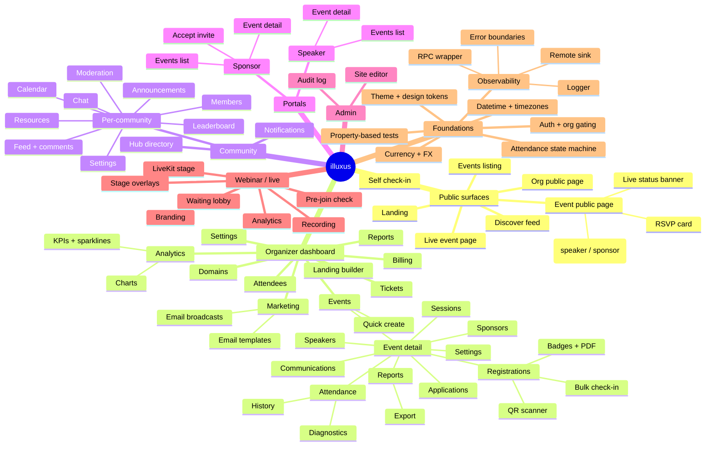
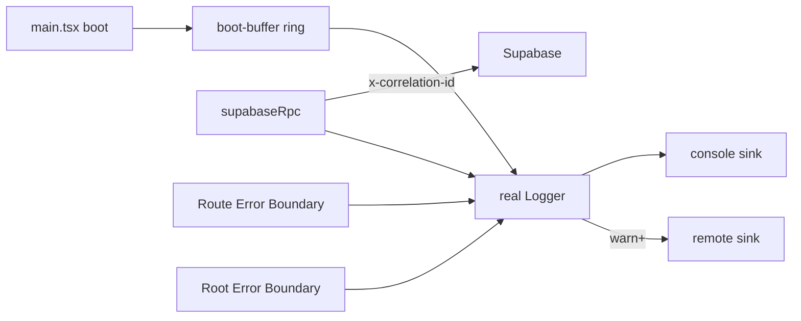

# illuxus roadmap

A living map of where the product is going. Use this when planning new specs, when
asking an AI to scope a feature, or when deciding what to vibecode next.

> Three lenses: a **mindmap** of the product surface, a **Now / Next / Later** timeline,
> and **epics** that link goals to actual code paths.

---

## 1. Product mindmap

---

## 2. Now / Next / Later

### Now (in flight)

| Initiative                     | Status                                                                                  | Code area                                                              |
| ------------------------------ | --------------------------------------------------------------------------------------- | ---------------------------------------------------------------------- |
| Observability Foundation       | Phases A–E shipped; Phase F (prod Remote Sink + canary rollout) pending                 | `src/lib/observability/`, `eslint.config.js`, `docs/observability*.md` |
| Check-in / Check-out tabs      | DB, state machine + 13 PBTs, client UI, cleanup done; component/integration tests open  | `src/components/event/registrations/QRScannerDialog.tsx`, `src/lib/attendance/`, `supabase/migrations/004_apply_attendance_helper.sql`, `005_set_attendance_rpc.sql`, `006_bulk_set_attendance_per_row.sql` |
| Community v1 (phases 1–4)      | Tables, feed, comments, chat, polls, calendar, leaderboard, moderation shipped         | `src/pages/dashboard/community/`, `src/components/community/`, `src/hooks/community/`, `supabase/migrations/004_community.sql`, `005_community_complete.sql` |
| Recent fixes (Jun 2026)        | Header logo fallback, header on event details, tickets currency crash                   | `src/components/SiteHeader.tsx`, `src/pages/PublicEventPage.tsx`, `src/lib/currency.ts` |

### Next (clear, scoped follow-ups)

These come from existing code patterns, in-flight specs, and the recent commit
history. They are not full specs yet — write one before vibecoding more than a
day's worth of work.

- **Observability Phase F — production rollout.** Wire `VITE_OBSERVABILITY_DSN` per
  environment, set CI source-map upload secrets (`OBSERVABILITY_AUTH_TOKEN/ORG/PROJECT`),
  do canary-org rollout, smoke-test correlation id surfacing.
- **Check-in/check-out tab tests.** Component test for `QRScannerDialog` (tabs,
  banner per code, retry without camera restart) and live-updates indicator. Files
  expected under `src/components/event/__tests__/`.
- **TypeScript debt cleanup on dashboard.** The codebase currently has a stable set
  of TypeScript errors in `MarketingPage.tsx` (`event_emails` table not in generated
  types), `ReportsPage.tsx` (Recharts tooltip formatter), and `PublicEventPage.tsx`
  (`event.status`). These are tracked to be unrelated to recent fixes; resolve by
  regenerating Supabase types and tightening Recharts props.
- **PWA shell + offline scanner queue.** Called out in observability requirements as
  the next dependency layers. Logger already exposes the offline queue primitives
  needed.
- **Email sender re-platform.** Resend was removed from `send-event-email` (commit
  `14a8b06`). Decide replacement (SES / Postmark / direct Resend re-add) and
  redesign the queue + delivery surface in `MarketingPage.tsx`.
- **Analytics rework.** A drafted plan exists for: 8-card KPI grid with
  sparklines + delta chips, dual-axis revenue/tickets chart, status pie, top-5
  events table, day-of-week heatmap, cumulative revenue.
- **Reports export hardening.** `ReportsSection` + `ExportReportDialog` drive CSV
  export today; column selection, filtering, and large-event pagination need
  property tests for stable ordering and idempotent exports.

### Later (further-out themes)

- **Mobile organizer app.** The check-in flow benefits enormously from native; the
  state machine in `src/lib/attendance` is already pure TS and can ship to RN.
- **Multi-org admin / agency mode.** Admin panel exists; agencies managing multiple
  orgs would need an org switcher and consolidated billing.
- **Community v2.** Threaded discussions, RSVP-from-feed, member badges and roles,
  cross-community discovery.
- **Sponsor/speaker self-serve onboarding.** Today applications go through dialogs
  in the organizer flow; a public submission form would unlock outreach.
- **Webinar production polish.** Recording chapters, moderator handoff, breakout
  rooms, simulcast. LiveKit edge functions are the foundation.
- **i18n.** No translation infra today. The `LOCALE_BY_CURRENCY` map in
  `src/lib/currency.ts` is the seed of this work but a real i18n provider is needed.

---

## 3. Epic detail

### Epic A — Observability

**Goal.** Every error in production is correlated to the RPC that caused it and
visible in Sentry within seconds, with PII scrubbed.

- Code: `src/lib/observability/`
- Specs: `.kiro/specs/observability-foundation/`
- Open work: Phase F (prod DSN + canary), monitoring of the offline queue cap.

### Epic B — Attendance

**Goal.** Make attendance state transitions impossible to silently invert and
provable via property-based tests.

- Code: `src/lib/attendance/` (pure TS state machine + 13 PBT files),
  `src/components/event/registrations/QRScannerDialog.tsx`,
  `src/components/event/attendance/`
- DB: `004_apply_attendance_helper.sql`, `005_set_attendance_rpc.sql`,
  `006_bulk_set_attendance_per_row.sql`, `007_self_check_in_no_out.sql`
- Specs: `.kiro/specs/checkin-checkout-tabs/`
- Open work: integration tests for the dialog and live updates.

### Epic C — Community

**Goal.** Per-organizer community space with feed, chat, calendar, resources,
leaderboard, and moderation, gated by RBAC.

- Code: `src/pages/dashboard/community/`, `src/components/community/`,
  `src/hooks/community/`, `src/lib/community/{rbac,types}.ts`
- DB: `004_community.sql`, `005_community_complete.sql`
- Open work: settle on v2 themes (threads, member badges, cross-community discovery).

### Epic D — Webinar / live

**Goal.** Run reliable in-product webinars with branded stage, moderation, and
recordings stored in Supabase Storage.

- Code: `src/components/webinar/`, `src/pages/EventLivePage.tsx`
- Edge: `livekit-token`, `livekit-room-create`, `livekit-room-end`,
  `livekit-go-live`, `livekit-promote`, `livekit-webhook`,
  `recording-start`, `recording-stop`
- Open work: chapters, breakout rooms, simulcast.

### Epic E — Marketing & comms

**Goal.** Organizers can compose, schedule, and ship branded email broadcasts and
landing pages.

- Code: `src/pages/dashboard/MarketingPage.tsx`, `src/pages/dashboard/event/BroadcastPage.tsx`,
  `src/pages/dashboard/LandingBuilderPage.tsx`,
  `src/components/event/CommunicationSection.tsx`
- Edge: `send-event-email` (Resend removed; needs a sender)
- Open work: pick email transport, fix `event_emails` types, harden domain
  verification.

### Epic F — Analytics & reports

**Goal.** Organizers see the metrics that matter without pulling raw CSVs.

- Code: `src/pages/dashboard/AnalyticsPage.tsx`,
  `src/pages/dashboard/ReportsPage.tsx`,
  `src/components/event/ReportsSection.tsx`,
  `src/components/event/reports/ExportReportDialog.tsx`
- Open work: full Analytics rework (8-card KPI grid, dual-axis charts,
  status pie, top-5 events, weekday heatmap, cumulative revenue), property
  tests for CSV exports.

### Epic G — Public + discovery

**Goal.** Discoverable, fast, SEO-friendly public surfaces with persistent URLs.

- Code: `src/pages/{Index,DiscoverFeed,EventsListingPage,PublicEventPage,PublicOrgPage,EventLivePage,SelfCheckInPage}.tsx`,
  `src/lib/event-routes.ts`
- Open work: render-time perf budget, OG/meta image generation, structured data.

### Epic H — Foundations / DX

**Goal.** Things that make every other epic faster and safer to ship.

- Currency + FX (`src/lib/currency.ts`, `src/lib/fx.ts`) — refresh cadence and crash safety.
- Datetime + timezones (`src/lib/datetime.ts`, `src/lib/timezones.ts`).
- Theme tokens + design system (`src/index.css`, `tailwind.config.ts`).
- Property-based testing as a first-class citizen.
- Steering files (`.kiro/steering/`) as the always-on AI context layer.

---

## How to use this document with AI

When asking an AI to scope or build something:

1. Point it at the relevant **Epic** so it picks up the correct code paths.
2. If creating a new spec, drop a `.kiro/specs/<feature-name>/` and let the spec
   workflow drive Requirements → Design → Tasks.
3. If vibecoding, prefer additive changes inside the epic's listed files first;
   only widen the surface when the change demands it.
4. Re-read [`README.md`](./README.md) for conventions and
   [`.kiro/steering/project-overview.md`](./.kiro/steering/project-overview.md) for
   architectural guardrails before any non-trivial change.
